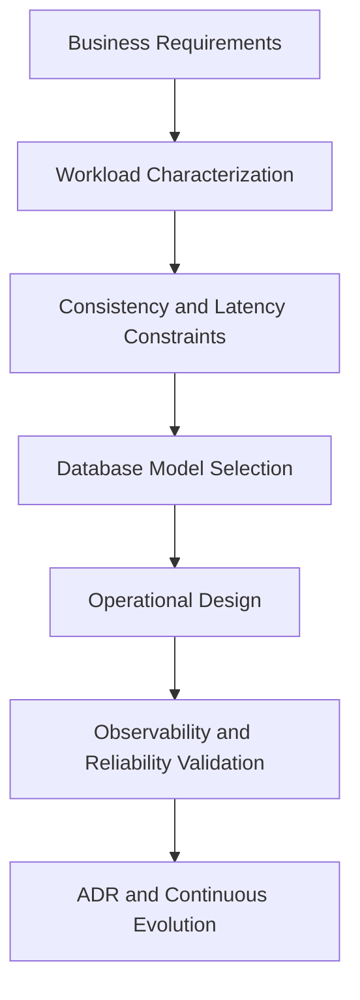

# Senior Software Architect

> A practical, production-grade knowledge repository for mastering software architecture with deep focus on database engineering and distributed systems decisions.


---

## What This Repository Is

This repository is a structured architecture masterclass designed to help engineers transition into **Senior Software Architect / Senior Data Architect** roles.

It is not a simple notes collection. It is an opinionated, decision-driven knowledge base that emphasizes:

- distributed systems trade-offs
- database internals and selection criteria
- operational excellence and reliability engineering
- architecture communication through clear technical documentation

---

## What You Will Learn

- How to reason about **CAP vs PACELC** under real failure conditions.
- How to choose between **ACID and BASE** models using business invariants.
- How major engines work internally (**PostgreSQL**, **MySQL InnoDB**, **MongoDB**, and more).
- How to evaluate **NoSQL paradigms** (key-value, document, wide-column, graph, columnar) by workload.
- How to design **polyglot persistence** architectures with explicit boundaries.
- How to make architecture decisions with measurable criteria (latency, consistency, scalability, operational cost).

---

## Repository Map

```text
.
├── AGENTS.md
├── ARCHITECTURE.md
├── README.md
├── database/
│   └── database-masterclass/
│       ├── 01-theory-and-foundations/
│       ├── 02-relational-engines/
│       ├── 03-nosql-paradigms/
│       └── 04-architectural-decision-framework/
└── docs/
    └── ai-knowledge-base/
```

---

## Database Masterclass (Core Content)

Main index:

- [`database/database-masterclass/README.md`](./database/database-masterclass/README.md)

Key domains:

- **Theory and Foundations:** CAP, PACELC, ACID/BASE, consensus, 2PC.
- **Relational Engines:** PostgreSQL internals, InnoDB architecture, direct comparison.
- **NoSQL Paradigms:** taxonomy, MongoDB, columnar, key-value, graph.
- **Decision Framework:** selection playbooks, operational excellence, production readiness.

---

## Suggested Learning Path

1. Start with `01-theory-and-foundations`.
2. Move to `02-relational-engines` to build implementation depth.
3. Study `03-nosql-paradigms` to understand non-relational trade-offs.
4. Consolidate with `04-architectural-decision-framework`.
5. Revisit earlier sections and build your own ADR-style decisions from real scenarios.

---

## Architecture Mindset (Visual)



---

## Who This Is For

- Software Engineers moving from implementation to architecture.
- Tech Leads defining platform/data standards.
- Architects building resilient, scalable, and auditable distributed systems.

---

## Contribution Principles

- Prefer depth over superficial summaries.
- Document the **why** behind every architectural choice.
- Keep trade-offs explicit and testable.
- Use visuals (Mermaid and references) when they materially improve understanding.

---

## Current Status

- Foundational architecture blueprint available.
- Database masterclass documentation actively maintained.
- Repository is designed to evolve into a broader architecture curriculum over time.
