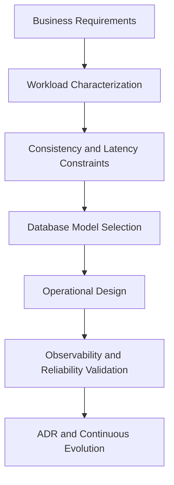

# Senior Software Architect

> A practical, production-grade knowledge repository for mastering the full software engineering journey, one concept at a time, with architecture-level depth.


---

## What This Repository Is

This repository is a structured masterclass designed to help engineers transition into **Senior Software Architect / Senior Engineer** roles.

It is not a simple notes collection. It is an evolving, decision-driven knowledge base that emphasizes:

- architecture and distributed systems trade-offs
- database internals and selection criteria
- platform fundamentals (Linux, cloud, networking, reliability)
- operational excellence and engineering decision-making
- architecture communication through clear technical documentation

---

## What You Will Learn

- How to reason about architecture decisions using trade-offs, constraints, and measurable outcomes.
- How to deeply understand database and distributed systems concepts (current focus).
- How to connect low-level platform topics (Linux, cloud infrastructure, networking) to architecture outcomes (next phases).
- How to build a long-term senior engineering mental model across domains, not only one stack.

---

## Repository Map

```text
.
├── AGENTS.md
├── ARCHITECTURE.md
├── README.md
├── database/
│   └── database-masterclass/
│       ├── 01-theory-and-foundations/
│       ├── 02-relational-engines/
│       ├── 03-nosql-paradigms/
│       └── 04-architectural-decision-framework/
└── docs/
    └── ai-knowledge-base/
```

---

## Current Focus: Database Masterclass

Main index:

- [`database/database-masterclass/README.md`](./database/database-masterclass/README.md)

Key domains:

- **Theory and Foundations:** CAP, PACELC, ACID/BASE, consensus, 2PC.
- **Relational Engines:** PostgreSQL internals, InnoDB architecture, direct comparison.
- **NoSQL Paradigms:** taxonomy, MongoDB, columnar, key-value, graph.
- **Decision Framework:** selection playbooks, operational excellence, production readiness.

This is the current primary learning track. New tracks will be added incrementally.

Depth profile for this and future tracks:

- theory-heavy writing with explicit mechanism-level explanations
- deliberate repetition of critical concepts when it improves understanding
- clear trade-offs, failure domains, and operational implications
- visual support (Mermaid and high-quality references) for complex ideas

---

## Planned Next Tracks

- **Linux and Operating Systems for Engineers:** processes, memory, filesystems, networking, performance.
- **Cloud Architecture:** compute, storage, networking, IAM, resilience, cost and governance.
- **Platform and DevOps Foundations:** CI/CD, observability, incident response, security hardening.

The repository follows a one-step-at-a-time strategy: deep focus on one domain, then expansion to the next.

---

## Suggested Learning Path

1. Start with `01-theory-and-foundations`.
2. Move to `02-relational-engines` to build implementation depth.
3. Study `03-nosql-paradigms` to understand non-relational trade-offs.
4. Consolidate with `04-architectural-decision-framework`.
5. Revisit earlier sections and build your own ADR-style decisions from real scenarios.

---

## Architecture Mindset (Visual)



---

## Who This Is For

- Software Engineers moving from implementation to architecture.
- Tech Leads defining platform/data standards.
- Architects building resilient, scalable, and auditable distributed systems.

---

## Contribution Principles

- Prefer depth over superficial summaries.
- Document the **why** behind every architectural choice.
- Keep trade-offs explicit and testable.
- Use visuals (Mermaid and references) when they materially improve understanding.

---

## Current Status

- Foundational architecture blueprint available.
- Database masterclass documentation actively maintained.
- Repository scope expanded to cover the complete software engineering path over time (including Linux and cloud).
