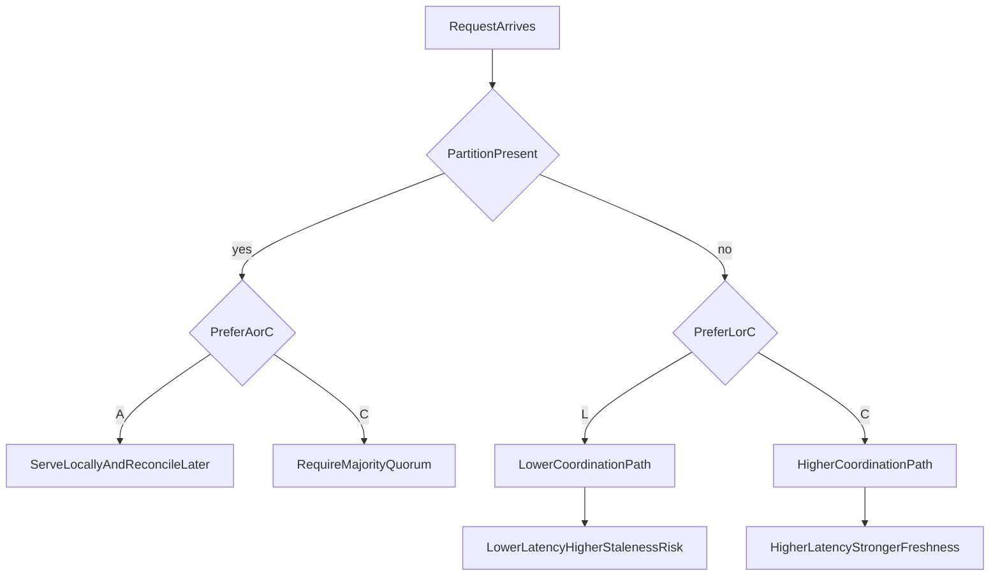

# CAP and PACELC Theorems for Database Architecture

## Why This Document Exists

CAP and PACELC are frequently quoted as labels, but senior architecture decisions require treating them as **constraint systems** rather than slogans. A constraint system means each design move (replication mode, quorum level, topology, timeout, failover policy) shifts one or more outcomes in measurable ways: stale-read probability, write availability under partition, and p99 latency under healthy traffic.

This document therefore goes beyond naming trade-offs and explains the mechanism-level reality behind those trade-offs.

---

## 1. CAP Theorem: Exact Scope and Misinterpretations

### 1.1 Formal Scope

CAP applies to **distributed storage systems under network partition**. It does not claim that consistency and availability can never coexist; it claims they cannot both be guaranteed during a partition.

- **Consistency (CAP-C):** every read returns the latest committed value for that object under the selected consistency model.
- **Availability (CAP-A):** every non-failing node eventually returns a non-error response for requests targeting data it serves.
- **Partition Tolerance (CAP-P):** system continues operating despite communication loss between node subsets.

#### In-Line Glossary: Partition

**What it is:** a communication split where nodes remain alive but cannot exchange messages reliably.  
**Why here:** CAP is activated by this condition; without it, many systems appear both available and consistent.  
**Systemic implication:** partition is not rare at scale; it is a design-time assumption, not an exceptional edge case.

### 1.2 Why “Choose Any Two” Is Incomplete

The phrase “choose two of three” is pedagogically useful but operationally shallow. In real systems, P is mandatory once you run multi-node infrastructure. The real question is:

- during partition, do you accept stale/divergent behavior to continue serving (**AP posture**) or reject operations to preserve stronger correctness (**CP posture**)?

### 1.3 Minimal Counterexample

Assume two partitions `P1` and `P2` each with clients and a replicated key `K`.

1. Client A writes `K=10` through `P1`.
2. Client B writes `K=20` through `P2` concurrently.
3. Partition blocks cross-communication.

If both sides must always answer reads/writes (A) and no coordination is possible, both sides can diverge. If you require a single latest value (C), at least one side must refuse some operations.

This is the non-negotiable core of CAP.

---

## 2. CAP Through Operational Lenses

### 2.1 CP-Oriented Behavior

Typical mechanism:

- majority quorum required for writes
- minority partition rejects writes (and often strict reads)

Benefits:

- accepted writes retain strong ordering semantics
- simpler reconciliation burden

Costs:

- user-facing errors increase in affected regions
- careful retry/backoff and failover UX become mandatory

### 2.2 AP-Oriented Behavior

Typical mechanism:

- local writes accepted under partition
- conflict resolution deferred to repair/merge

Benefits:

- high serving continuity
- lower apparent outage rate

Costs:

- stale reads, conflict merges, monotonicity violations
- application semantics must define conflict policy explicitly

#### In-Line Glossary: Monotonic Reads

**What it is:** guarantee that once a client sees version `v`, later reads by that client do not return older versions.  
**Why here:** AP systems with replica switching can violate this guarantee unless session metadata or routing constraints are enforced.  
**Systemic implication:** user trust can degrade when UI appears to “go back in time.”

---

## 3. PACELC: Extending CAP to Normal Operation

### 3.1 Statement

PACELC says:

- **If Partition (P):** trade **Availability (A)** vs **Consistency (C)**
- **Else (E):** trade **Latency (L)** vs **Consistency (C)**

This second branch matters because many workloads spend most of their life *without* active partition, where coordination cost still affects p95/p99 behavior.

### 3.2 Latency-Consistency Mechanics with Quorums

For replication factor `N`, write quorum `W`, read quorum `R`:

- freshness intersection often requires `R + W > N`
- increasing `W` or `R` improves freshness confidence but raises coordination delay and timeout surface

Queueing effect:

- service time increase from cross-zone round trips raises utilization `rho = lambda / mu`
- as `rho` approaches 1, tail latency rises disproportionately

Even without partition, stronger consistency can push systems into unhealthy tail behavior under bursts.

#### In-Line Glossary: Tail Latency Amplification

**What it is:** nonlinear growth in high percentiles due to coordination delays and queue buildup.  
**Why here:** architecture decisions are usually broken by p99 and timeout cascades, not average latency.  
**Systemic implication:** database consistency policy must be validated against percentile SLOs, not mean benchmarks.

---

## 4. Visual Model

---

## 5. PACELC Mapping for Common Databases

These are default tendencies, not immutable truths. Configuration and workload can shift practical behavior.

| Database | Partition Tendency (P) | Else Tendency (E) | Typical Interpretation | Notes |
|---|---|---|---|---|
| Spanner | C over A | C over L | PC/EC | prioritizes external consistency with coordination cost |
| CockroachDB | C over A | C over L | PC/EC | Raft ranges, serializable-first design |
| Cassandra | A over C (tunable) | L over C (tunable) | PA/EL | per-operation CL can move behavior toward C |
| DynamoDB | Tunable | Tunable | often PA/EL in default read paths | strong reads available per request |
| MongoDB replica set | C over A for majority writes | mixed (C on primary, L on secondaries) | often PC/EC | read preference changes practical behavior |
| PostgreSQL primary+replicas | C on primary writes | C/L depends on read routing | topology-dependent | not a native symmetric multi-primary design |
| Redis (sentinel + async replicas) | A-leaning continuity options | L-leaning serving | often PA/EL for cache use | depends heavily on durability requirements |

### 5.1 Why This Table Must Be Read with Caution

A table is a guide, not a substitute for workload modeling. A system can behave differently per endpoint:

- feed endpoints may tolerate eventual consistency
- financial balance endpoints may require strict freshness

Therefore, architecture quality comes from *operation-level consistency policy*, not a global label.

---

## 6. Failure Scenarios and Consequence Chains

### Scenario A: Fintech Transfer Path

- Partition occurs between writer and one replica subset.
- AP posture: write acknowledged locally; stale reads elsewhere may permit invalid downstream action.
- CP posture: minority rejects requests; users see errors but invariant safety is preserved.

Decision: correctness-critical money movement usually favors CP behavior.

### Scenario B: Social Reactions Path

- Partition occurs during like/comment writes.
- AP posture keeps UX responsive; delayed convergence is acceptable.
- CP posture may create unnecessary user-visible failures.

Decision: AP-style behavior is often acceptable for low-criticality interactions.

---

## 7. Architect Checklist (Deep Version)

1. Classify data by invariant criticality (catastrophic, material, cosmetic).
2. Define consistency requirement per operation class, not per database brand.
3. Set p95/p99 SLO budgets and test quorum/coordination choices against them.
4. Run partition drills to measure error modes, stale windows, and recovery convergence.
5. Confirm client behavior: retries, idempotency keys, monotonic session routing.
6. Document chosen posture in ADR form with explicit rejected alternatives.

---

## 8. External References

- [Brewer CAP Notes (historical context)](https://people.eecs.berkeley.edu/~brewer/cs262b-2004/PODC-keynote.pdf)
- [PACELC by Daniel Abadi](https://dbmsmusings.blogspot.com/2010/04/problems-with-cap-and-yahoos-little.html)
- [Jepsen Analyses](https://jepsen.io/analyses)
