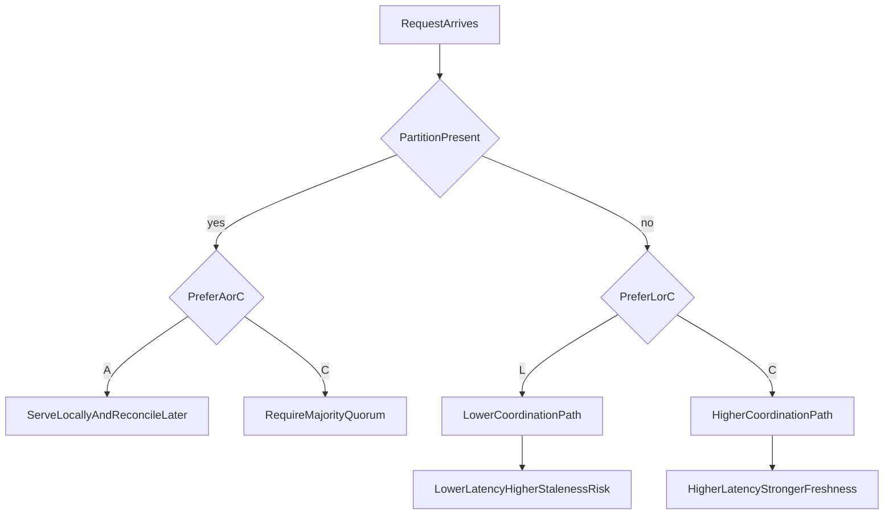
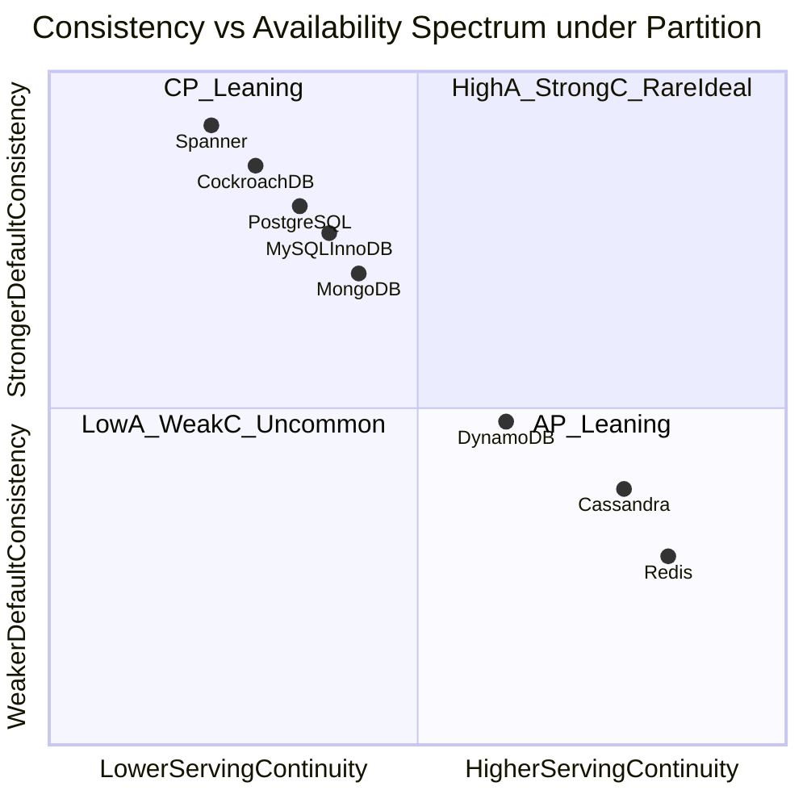

# CAP and PACELC Theorems for Database Architecture

## Why This Document Exists

CAP and PACELC are frequently quoted as labels, but senior architecture decisions require treating them as **constraint systems** rather than slogans. A constraint system means each design move (replication mode, quorum level, topology, timeout, failover policy) shifts one or more outcomes in measurable ways: stale-read probability, write availability under partition, and p99 latency under healthy traffic.

This document therefore goes beyond naming trade-offs and explains the mechanism-level reality behind those trade-offs. The goal is that a reader can predict, for a given posture, what users experience during partition and what latency they pay during normal operation.

---

## 1. CAP Theorem: Exact Scope and Misinterpretations

### 1.1 Formal Scope

CAP applies to **distributed storage systems under network partition**. It does not claim that consistency and availability can never coexist; it claims they cannot both be guaranteed during a partition.

Consistency in the CAP sense means every read returns the latest committed value for that object under the selected consistency model. Availability means every non-failing node eventually returns a non-error response for requests targeting data it serves. Partition tolerance means the system continues operating despite communication loss between node subsets. Once multi-node infrastructure is in production, partition tolerance is not optional; networks fail, and the system must choose behavior under that failure.

#### In-Line Glossary: Partition

**What it is:** a communication split where nodes remain alive but cannot exchange messages reliably.  
**Why here:** CAP is activated by this condition; without it, many systems appear both available and consistent.  
**Systemic implication:** partition is not rare at scale; it is a design-time assumption, not an exceptional edge case.

### 1.2 Why “Choose Any Two” Is Incomplete

The phrase “choose two of three” is pedagogically useful but operationally shallow. In real systems, partition tolerance is mandatory once you run multi-node infrastructure. The real question is therefore narrower and more actionable: during partition, do you accept stale or divergent behavior to continue serving (AP posture), or do you reject operations to preserve stronger correctness (CP posture)?

### 1.3 Minimal Counterexample

Assume two partitions `P1` and `P2` each with clients and a replicated key `K`. Client A writes `K=10` through `P1`. Client B writes `K=20` through `P2` concurrently. Partition blocks cross-communication.

If both sides must always answer reads and writes (availability), and no coordination is possible, both sides can diverge into conflicting histories. If you require a single latest value (consistency), at least one side must refuse some operations until communication restores ordering or consensus. This is the non-negotiable core of CAP.

---

## 2. CAP Through Operational Lenses

### 2.1 CP-Oriented Behavior

In CP-oriented designs, a majority quorum is typically required for writes, and a minority partition rejects writes and often also rejects strict reads. The system prefers to return errors rather than invent divergent truth.

The benefit of this posture is that accepted writes retain stronger ordering semantics and reconciliation burden remains simpler, because the system refused unsafe progress. The cost is that user-facing errors increase in affected regions, so clients must implement careful retry, backoff, and failover UX. CP systems do not eliminate failure; they convert silent inconsistency into explicit unavailability for the minority side.

### 2.2 AP-Oriented Behavior

In AP-oriented designs, local writes are accepted under partition and conflict resolution is deferred to repair or merge. The system prefers continuity of service over immediate global agreement.

The benefit is high serving continuity and a lower apparent outage rate. The cost is stale reads, conflict merges, and possible monotonicity violations. Application semantics must therefore define conflict policy explicitly; otherwise the system converges to an arbitrary winner that may destroy business meaning.

#### In-Line Glossary: Monotonic Reads

**What it is:** guarantee that once a client sees version `v`, later reads by that client do not return older versions.  
**Why here:** AP systems with replica switching can violate this guarantee unless session metadata or routing constraints are enforced.  
**Systemic implication:** user trust can degrade when UI appears to “go back in time.”

---

## 3. PACELC: Extending CAP to Normal Operation

### 3.1 Statement

PACELC says that if a partition exists, the system trades availability against consistency, and else (during healthy operation) the system trades latency against consistency. This second branch matters because many workloads spend most of their life without an active partition, where coordination cost still affects p95 and p99 behavior.

### 3.2 Latency-Consistency Mechanics with Quorums

For replication factor `N`, write quorum `W`, and read quorum `R`, freshness intersection often requires `R + W > N`. Increasing `W` or `R` improves freshness confidence because successful reads are more likely to overlap recent successful writes. That same increase raises coordination delay and expands the timeout surface, because more nodes must respond before the operation completes.

Queueing effects amplify this cost. Service time increases from cross-zone round trips raise utilization `rho = lambda / mu`. As `rho` approaches 1, wait time and tail latency rise disproportionately. Even without partition, stronger consistency can push systems into unhealthy tail behavior under bursts.

#### In-Line Glossary: Tail Latency Amplification

**What it is:** nonlinear growth in high percentiles due to coordination delays and queue buildup.  
**Why here:** architecture decisions are usually broken by p99 and timeout cascades, not average latency.  
**Systemic implication:** database consistency policy must be validated against percentile SLOs, not mean benchmarks.

---

## 4. Visual Model

---

## 5. PACELC Mapping for Common Databases

These are default tendencies, not immutable truths. Configuration and workload can shift practical behavior.

### 5.0 Consistency–Availability Spectrum

The chart below places major SQL and NoSQL systems on a partition-time spectrum: horizontal position reflects how readily the common default posture keeps serving under partition (availability-leaning continuity), and vertical position reflects how strongly that default posture prioritizes linearizable or majority-coordinated freshness (consistency). Positions are pedagogical defaults for orientation, not immutable brand laws. Tunable engines can move: Cassandra consistency level (CL), DynamoDB strong versus eventual reads, MongoDB read preference, and PostgreSQL/MySQL primary-versus-replica routing all shift practical placement. The CAP axes apply under partition; healthy-path latency versus consistency remains the PACELC else-branch already covered in sections 3 and 4. Read the table in this section and the caution in section 5.1 before treating any marker as a selection verdict.

Spanner and CockroachDB sit in the CP-leaning region because default designs prefer majority coordination and refuse unsafe progress under partition. PostgreSQL and MySQL/InnoDB primary-write topologies likewise prefer consistency on the write owner, with availability for a given key depending on whether that primary remains reachable. MongoDB with majority writes follows a similar CP-leaning replica-set posture. DynamoDB sits toward the middle because strong and eventual read paths are both first-class and move the effective point per request. Cassandra and Redis sit further toward AP-leaning continuity in common default or cache-oriented deployments, while still remaining tunable or topology-dependent in production.

| Database | Partition Tendency (P) | Else Tendency (E) | Typical Interpretation | Notes |
|---|---|---|---|---|
| Spanner | C over A | C over L | PC/EC | prioritizes external consistency with coordination cost |
| CockroachDB | C over A | C over L | PC/EC | Raft ranges, serializable-first design |
| Cassandra | A over C (tunable) | L over C (tunable) | PA/EL | per-operation CL can move behavior toward C |
| DynamoDB | Tunable | Tunable | often PA/EL in default read paths | strong reads available per request |
| MongoDB replica set | C over A for majority writes | mixed (C on primary, L on secondaries) | often PC/EC | read preference changes practical behavior |
| PostgreSQL primary+replicas | C on primary writes | C/L depends on read routing | topology-dependent | not a native symmetric multi-primary design |
| MySQL/InnoDB primary+replicas | C on primary writes | C/L depends on read routing and replication mode | topology-dependent | semi-sync or group replication can shift durability and failover posture |
| Redis (sentinel + async replicas) | A-leaning continuity options | L-leaning serving | often PA/EL for cache use | depends heavily on durability requirements |

### 5.1 Why This Table Must Be Read with Caution

A table is a guide, not a substitute for workload modeling. A system can behave differently per endpoint. Feed endpoints may tolerate eventual consistency because delayed reaction counts usually do not corrupt money or inventory. Financial balance endpoints may require strict freshness because stale reads can enable invalid transfers. Architecture quality therefore comes from operation-level consistency policy, not from a global database brand label.

---

## 6. Failure Scenarios and Consequence Chains

### Scenario A: Fintech Transfer Path

When a partition occurs between a writer and one replica subset, AP posture acknowledges the write locally and allows other regions to continue reading stale balances, which may permit invalid downstream action. CP posture causes the minority side to reject requests; users see errors, but invariant safety is preserved. Correctness-critical money movement usually favors CP behavior because the cost of temporary unavailability is lower than the cost of double-spend or incorrect ledgers.

### Scenario B: Social Reactions Path

When a partition occurs during like or comment writes, AP posture keeps UX responsive and accepts delayed convergence as tolerable. CP posture may create unnecessary user-visible failures for low-criticality interactions. In that domain, AP-style behavior is often acceptable because availability and responsiveness dominate over immediate global agreement.

---

## 7. Architect Checklist (Deep Version)

Classify data by invariant criticality into catastrophic, material, and cosmetic classes before selecting engines. Define consistency requirements per operation class, not per database brand. Set p95 and p99 SLO budgets and test quorum or coordination choices against those budgets under realistic load. Run partition drills to measure error modes, stale windows, and recovery convergence. Confirm client behavior around retries, idempotency keys, and monotonic session routing. Document the chosen posture in ADR form with explicit rejected alternatives so future teams understand the decision boundary.

---

## 8. External References

- [Brewer CAP Notes (historical context)](https://people.eecs.berkeley.edu/~brewer/cs262b-2004/PODC-keynote.pdf)
- [PACELC by Daniel Abadi](https://dbmsmusings.blogspot.com/2010/04/problems-with-cap-and-yahoos-little.html)
- [Jepsen Analyses](https://jepsen.io/analyses)
