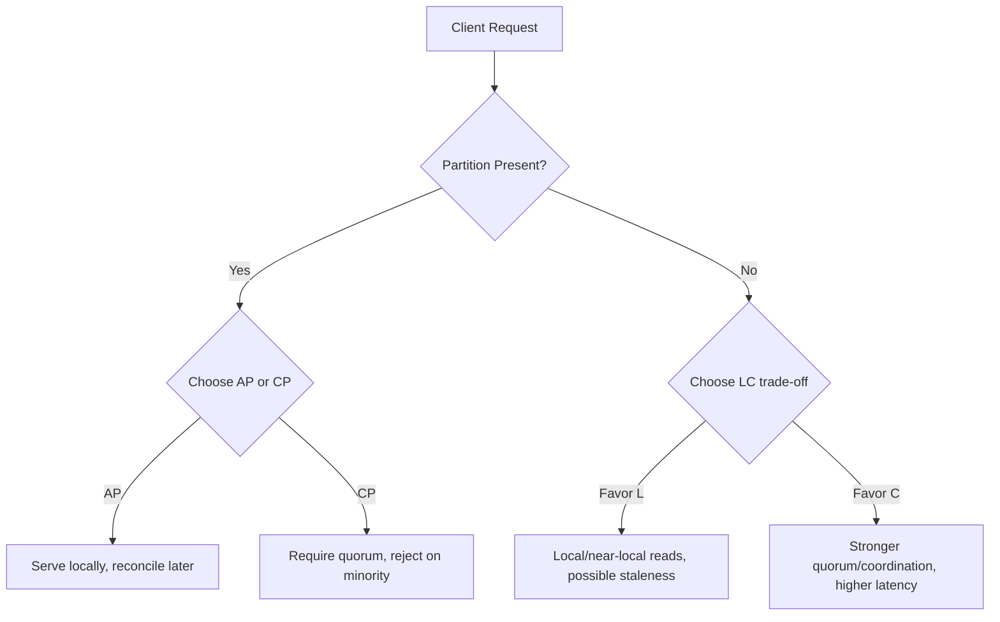

# CAP and PACELC Theorems for Database Architecture

## Why This Document Exists

CAP and PACELC are not slogan-level labels. They are decision constraints that shape quorum design, replication topology, timeout behavior, conflict resolution, and user-visible latency under both failure and normal conditions.

---

## 1. CAP Theorem: Formal Framing

### 1.1 Definition

In a distributed datastore, when a **network partition** exists, you cannot guarantee both:

- **C (Consistency)**: every read returns the latest committed write (single-system-image behavior).
- **A (Availability)**: every request receives a non-error response in finite time.

Partition tolerance (**P**) is non-negotiable in real networks, so practical design chooses **CP** or **AP** behavior during partition windows.

### 1.2 Fundamental Model

Let replicas be split into partitions `P1` and `P2`. A client can reach only one side.  
If writes are accepted on both sides and reads succeed everywhere, divergent histories are possible.  
To preserve single-copy consistency, at least one side must reject operations until communication restores causal ordering or consensus.

### 1.3 CAP Is About Partition Regime, Not Normal Regime

A common error is labeling a database “always CP” or “always AP.”  
Correct interpretation:

- Under healthy network: many systems provide both low errors and strong semantics.
- Under partition: the system’s protocol chooses either to reject/timeout operations (favor C) or continue serving potentially stale/conflicting data (favor A).

---

## 2. CAP in Operational Terms

### 2.1 CP Behavior

During partition, nodes that cannot establish required quorum reject reads/writes.

Operational consequences:

- Higher error rate in affected shards/regions.
- Stronger correctness for accepted operations.
- Requires robust retry semantics and client-side degradation strategy.

### 2.2 AP Behavior

During partition, nodes continue serving requests with local state; consistency is reconciled later.

Operational consequences:

- Better uptime from client perspective.
- Potential read staleness, write conflicts, or monotonicity violations.
- Requires conflict-resolution policies (LWW, CRDT merge, app-level reconciliation).

#### In-Line Glossary: CRDT

**What it is:** Conflict-free Replicated Data Type; mathematically designed mergeable state or operation structure where concurrent updates converge deterministically.  
**Why here:** AP systems need deterministic reconciliation under concurrent writes.  
**Systemic impact:** CRDTs improve convergence guarantees but increase metadata and data-model constraints.

---

## 3. PACELC: The Missing Half of CAP

### 3.1 The Statement

**PACELC** extends CAP:

- **If Partition (P)**: choose between **Availability (A)** and **Consistency (C)**.
- **Else (E)** (normal operation): choose between **Latency (L)** and **Consistency (C)**.

This explains why two systems can both be CP under partition yet differ sharply in normal latency and read freshness.

### 3.2 Latency-Consistency Mechanics

For synchronous replication to `N` nodes with quorum `Qw` for writes and `Qr` for reads:

- Strong read-after-write often needs `Qw + Qr > N`.
- Higher quorum sizes improve freshness confidence but increase tail latency and timeout probability.

Queueing perspective:

- End-to-end latency `W` grows nonlinearly as utilization `rho` approaches 1.
- In an M/M/1 approximation, `W = 1 / (mu - lambda)`.
- Cross-region quorum increases service time variance and raises P99 tail risk.

#### In-Line Glossary: Tail Latency

**What it is:** High-percentile response time (P95/P99/P99.9), not average latency.  
**Why here:** User-perceived instability in distributed databases is usually dominated by tail events, not mean performance.  
**Systemic impact:** Protocol choices that add coordination hops heavily influence tail behavior.

---

## 4. Visual Model

---

## 5. Real Database Mapping on PACELC

These labels are workload and configuration sensitive; treat them as default tendencies.

| Database | Partition Mode Tendency | Else Mode Tendency | Typical Interpretation |
|---|---|---|---|
| Google Spanner | C over A | C over L | **PC/EC** with TrueTime-backed external consistency |
| Cassandra | A over C (tunable) | L over C (tunable) | Often **PA/EL** in low-latency deployments |
| DynamoDB | A/C configurable per operation | L/C configurable by consistency mode | Pragmatically tunable; many workloads run near **PA/EL** |
| MongoDB (Replica Set) | Usually C on majority writes | Mix: primary reads favor C, secondary reads favor L | Often **PC/EC** for majority-write + primary-read |
| PostgreSQL (single primary + replicas) | C on primary writes, A reduced on failover events | C for primary, L for async replicas | Not a symmetric multi-primary design; trade-off is topology-driven |
| CockroachDB | C over A | C over L | **PC/EC** via per-range Raft consensus |
| Redis (Sentinel/async replicas) | Config-dependent; often A-leaning for serving continuity | L over C for local/cache paths | Speed-layer posture; not default strict SoR |

### 5.1 Spanner

- Consensus replication across zones/regions.
- Strong external consistency using bounded clock uncertainty.
- Higher coordination cost accepted for correctness.

#### In-Line Glossary: External Consistency

**What it is:** Serializable execution aligned with real-time order across transactions.  
**Why here:** Spanner’s claim to correctness relies on commit-wait informed by clock uncertainty bounds.  
**Systemic impact:** Better global ordering semantics at the cost of commit latency overhead.

### 5.2 Cassandra

- Tunable consistency (`ONE`, `QUORUM`, `ALL` for reads/writes).
- Default operational posture often favors availability and latency.
- Requires anti-entropy repair and data-model discipline.

### 5.3 DynamoDB

- Single-digit millisecond targets prioritize low latency.
- Eventually consistent reads by default; strong reads available with throughput implications.
- Partition behavior and adaptive capacity mechanics favor continuity.

### 5.4 MongoDB

- Primary handles writes; majority write concern gives stronger guarantees.
- Secondary reads can reduce latency but accept replica lag.
- Elections trade temporary availability dips for safety semantics.

### 5.5 PostgreSQL

- Strong local ACID semantics on the primary.
- Read scaling through replicas introduces consistency-latency options.
- During failover, availability depends on orchestration maturity and replication state.

---

## 6. Architect’s Decision Checklist

Use CAP/PACELC to answer concrete questions:

1. During partition, is stale data safer than rejecting requests?
2. In normal operation, what is the hard P99 latency budget?
3. Which entities need linearizable/serializable behavior vs convergent behavior?
4. What reconciliation model exists for conflicting writes?
5. What is the operational budget for consensus, multi-region links, and failover tooling?

If these are unanswered, database selection is premature regardless of benchmark throughput.
