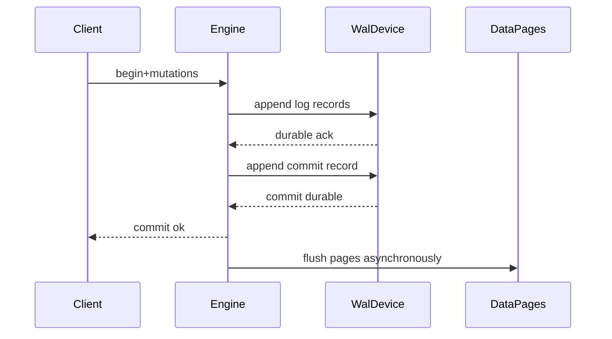
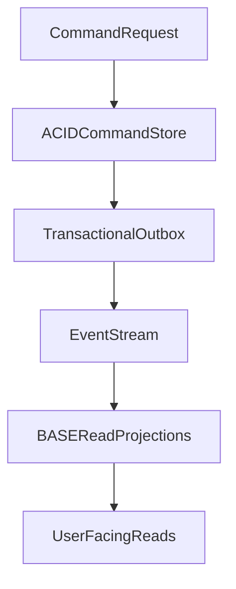

# ACID vs BASE Models: Internal Mechanics, Isolation Theory, and Operational Trade-offs

## 1. Purpose

This document explains ACID and BASE as **complementary operating models**. In modern distributed architecture, ACID usually protects local invariants while BASE governs cross-service propagation and eventual convergence.

The objective is not ideology. The objective is assigning the right consistency contract to each business risk class.

---

## 2. ACID in Mechanistic Terms

### 2.1 Atomicity

Atomicity guarantees that a transaction is either fully committed or fully rolled back.

Engine primitives usually include:

- undo records for rollback
- redo/WAL records for crash replay
- a durable commit marker that defines success boundary

Atomicity is therefore implemented by log protocol and recovery logic, not by a single runtime flag.

#### In-Line Glossary: Commit Record

**What it is:** the durable log event marking transaction success.  
**Why here:** without durable commit evidence, crash recovery cannot distinguish committed from in-flight transactions safely.  
**Systemic implication:** durability policy on commit path directly affects correctness, not just performance.

### 2.2 Consistency (ACID-C)

ACID consistency means transaction execution preserves declared invariants.

Examples:

- referential integrity
- uniqueness constraints
- domain constraints (balance cannot drop below allowed limit)

Important distinction:

- ACID-C is invariant preservation
- CAP-C is distributed visibility ordering under partition conditions

Treating these as identical creates design errors.

### 2.3 Isolation

Isolation defines how concurrent transactions observe and interfere with one another.

| Level | DirtyRead | NonRepeatableRead | Phantom | WriteSkew |
|---|---|---|---|---|
| ReadUncommitted | possible | possible | possible | possible |
| ReadCommitted | prevented | possible | possible | possible |
| RepeatableRead | prevented | prevented | engine-dependent | possible in snapshot models |
| Serializable | prevented | prevented | prevented | prevented |

#### In-Line Glossary: Write Skew

**What it is:** concurrent transactions each read a shared predicate and write disjoint rows, violating a global invariant.  
**Why here:** many teams assume “no direct row conflict” implies safety; that assumption is false.  
**Systemic implication:** invariant safety may require true serializable isolation or explicit locking strategy.

### 2.4 Durability

Durability means committed effects survive accepted fault model (process crash, node reboot, storage jitter within assumptions).

Durability controls include:

- fsync policy
- group commit behavior
- synchronous replica acknowledgment modes
- storage subsystem guarantees

Durability is a probability envelope conditioned by infrastructure quality and configuration.

---

## 3. WAL, Checkpointing, and Recovery Lifecycle

Recovery generally runs:

1. **analysis:** reconstruct active tx and dirty structures
2. **redo:** replay committed intent after checkpoint point
3. **undo:** rollback uncommitted losers

#### In-Line Glossary: Checkpoint

**What it is:** controlled persistence point reducing future redo window.  
**Why here:** checkpoint tuning controls restart time and background IO pressure.  
**Systemic implication:** poor checkpoint cadence can create latency spikes and slow recovery.

---

## 4. Serializable vs Strict Serializable vs Snapshot

- **Serializable:** equivalent to some serial order.
- **Strict serializable:** serializable plus real-time order constraints.
- **Snapshot isolation:** stable snapshot reads, but may allow write skew.

Why this matters:

- financial and inventory invariants often need stronger semantics than default snapshot/RC modes
- stronger semantics increase coordination and latency cost

Architecture must price correctness against latency and throughput explicitly.

---

## 5. BASE as Distributed Operating Model

### 5.1 Basically Available

System aims to keep serving under partial failures whenever possible.

### 5.2 Soft State

Replica state can be transiently inconsistent and evolve with background propagation.

### 5.3 Eventual Consistency

If writes stop, replicas converge eventually to a compatible value set under the system’s merge/repair model.

#### In-Line Glossary: Anti-Entropy

**What it is:** background repair mechanism (Merkle trees, hint replay, read repair, compaction-based reconciliation).  
**Why here:** eventual consistency requires active convergence work.  
**Systemic implication:** repair lag and IO budget define staleness windows and cost profile.

---

## 6. Failure Mode Analysis: ACID vs BASE

### 6.1 ACID-Centric Failure Pressure

- lock waits and deadlocks on hotspots
- commit stalls from storage jitter
- replica lag causing stale follower reads

### 6.2 BASE-Centric Failure Pressure

- conflicting concurrent updates needing merge policy
- monotonic read violations after client rerouting
- convergence delays during heavy repair backlog

#### In-Line Glossary: Causal Consistency

**What it is:** guarantee that causally related operations are observed in causal order.  
**Why here:** many user flows require stronger semantics than eventual consistency but weaker than full linearizability.  
**Systemic implication:** session/context propagation metadata becomes part of application contract.

---

## 7. Quantitative Decision Heuristics

Use ACID-first when:

- invariant breach cost is catastrophic
- compensation is expensive or legally constrained
- transaction scope is naturally bounded and modelable

Use BASE-first when:

- uptime continuity is dominant objective
- cross-region write throughput is high
- domain tolerates bounded staleness and has explicit reconciliation policy

Latency and contention diagnostics:

- if lock wait dominates p99, fix data model/access pattern first
- if coordination RTT dominates p99, evaluate bounded-staleness read paths or ownership partitioning

---

## 8. Practical Hybrid Architecture Pattern

A durable enterprise pattern:

1. ACID command store per bounded context
2. transactional outbox event publication
3. BASE read models and integrations
4. explicit staleness budgets per user workflow

This pattern makes consistency boundaries explicit and auditable.

---

## 9. External References

- [ARIES Recovery Paper (historical)](https://research.ibm.com/publications/aries-a-transaction-recovery-method-supporting-fine-granularity-locking-and-partial-rollbacks-using-write-ahead-logging)
- [Designing Data-Intensive Applications (consistency models)](https://dataintensive.net/)
