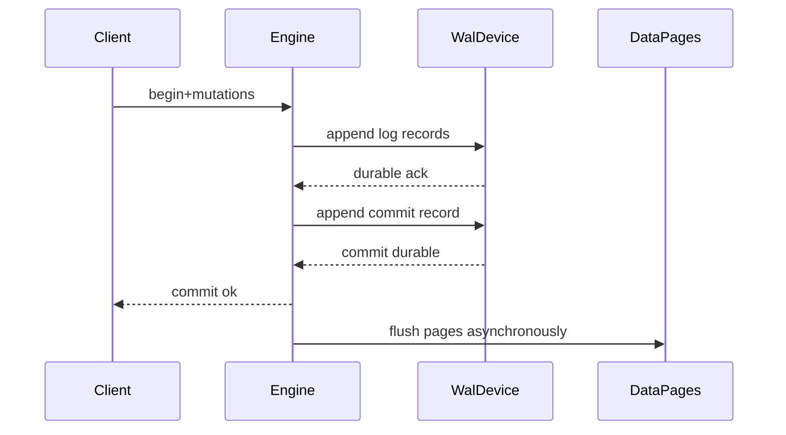
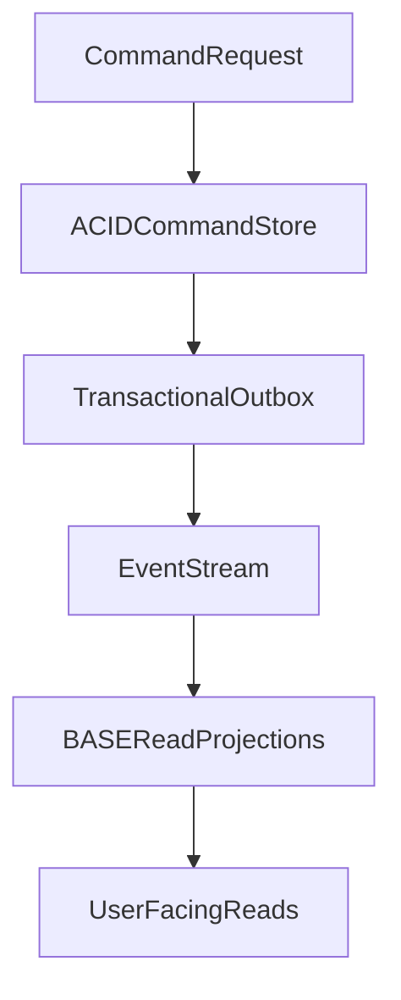

# ACID vs BASE Models: Internal Mechanics, Isolation Theory, and Operational Trade-offs

## 1. Purpose

This document explains ACID and BASE as **complementary operating models**. In modern distributed architecture, ACID usually protects local invariants while BASE governs cross-service propagation and eventual convergence.

The objective is not ideology. The objective is assigning the right consistency contract to each business risk class. When architects choose the wrong contract, they either create outages by over-coordinating or create silent corruption by under-coordinating.

---

## 2. ACID in Mechanistic Terms

### 2.1 Atomicity

Atomicity guarantees that a transaction is either fully committed or fully rolled back. From the client's perspective, there is no intermediate visible state in which only some of the intended mutations exist.

Atomicity is implemented by recovery and logging primitives, not by a single runtime flag. The engine typically records undo information so incomplete work can be reversed, records redo or WAL information so committed work can be reconstructed after crash, and writes a durable commit marker that defines the success boundary. Without that durable commit evidence, crash recovery cannot safely decide whether a transaction finished or failed.

If atomicity is violated, dependent systems may observe partial side effects, compensate incorrectly, or permanently diverge from the intended business state.

#### In-Line Glossary: Commit Record

**What it is:** the durable log event marking transaction success.  
**Why here:** without durable commit evidence, crash recovery cannot distinguish committed from in-flight transactions safely.  
**Systemic implication:** durability policy on commit path directly affects correctness, not just performance.

### 2.2 Consistency (ACID-C)

ACID consistency means transaction execution preserves declared invariants of the data model. A successful commit must leave the database in a state that still satisfies those rules.

Referential integrity is one such invariant: a foreign key must continue to point to a valid primary key after the transaction completes. If a parent record is removed while child records remain, the system has accepted an illegal relationship and downstream joins, cascades, or business workflows become unreliable.

Uniqueness constraints are another invariant: values that must be unique (account numbers, emails, order IDs) must remain unique after concurrent inserts and updates. If uniqueness is only checked loosely, two concurrent transactions can create duplicate identities and break accounting, authentication, or idempotent processing.

Domain constraints encode business rules that go beyond schema shape, such as a balance that cannot fall below an allowed limit. The database (or transactional application logic) must reject transitions that violate those rules, even when each individual write looks syntactically valid.

It is critical to distinguish ACID consistency from CAP consistency. ACID-C means invariant preservation inside a transactional boundary. CAP-C means distributed visibility ordering under partition conditions: whether every read returns the latest committed value across replicas when communication is impaired. Treating these as identical creates design errors, because a locally ACID system can still serve stale replica reads, and a CAP-oriented distributed store may not enforce relational domain invariants.

### 2.3 Isolation

Isolation defines how concurrent transactions observe and interfere with one another. Without isolation guarantees, transactions can interleave in ways that produce results no serial execution would have produced.

| Level | DirtyRead | NonRepeatableRead | Phantom | WriteSkew |
|---|---|---|---|---|
| ReadUncommitted | possible | possible | possible | possible |
| ReadCommitted | prevented | possible | possible | possible |
| RepeatableRead | prevented | prevented | engine-dependent | possible in snapshot models |
| Serializable | prevented | prevented | prevented | prevented |

Dirty reads occur when one transaction observes uncommitted writes from another. Non-repeatable reads occur when the same row changes between reads inside one transaction. Phantom reads occur when the set of rows matching a predicate changes because concurrent inserts or deletes alter membership. Write skew occurs when concurrent transactions each read overlapping predicate state and write disjoint rows that together violate a global invariant.

#### In-Line Glossary: Write Skew

**What it is:** concurrent transactions each read a shared predicate and write disjoint rows, violating a global invariant.  
**Why here:** many teams assume “no direct row conflict” implies safety; that assumption is false.  
**Systemic implication:** invariant safety may require true serializable isolation or explicit locking strategy.

### 2.4 Durability

Durability means committed effects survive the accepted fault model, such as process crash, node reboot, or storage jitter within assumed bounds. A commit acknowledgment is only meaningful if the system can reconstruct that commit after failure.

Durability is controlled by several interacting mechanisms. The fsync policy determines when log records are forced to durable media. Group commit behavior batches multiple commits to amortize sync cost, improving throughput but changing latency distribution. Synchronous replica acknowledgment modes decide whether commit waits for remote durability. Storage subsystem guarantees (controller caches, battery-backed write caches, filesystem barriers) determine whether the hardware and OS layers actually honor durability assumptions.

Durability is therefore a probability envelope conditioned by infrastructure quality and configuration, not an absolute property independent of operations.

---

## 3. WAL, Checkpointing, and Recovery Lifecycle

Crash recovery generally proceeds in ordered phases. Analysis reconstructs which transactions were active and which pages may be dirty. Redo replays committed intent after the checkpoint point so durable commits are not lost. Undo rolls back uncommitted losers so incomplete work does not remain visible. These phases exist because engines deliberately flush data pages asynchronously for performance while relying on the log as the authoritative recovery timeline.

#### In-Line Glossary: Checkpoint

**What it is:** controlled persistence point reducing future redo window.  
**Why here:** checkpoint tuning controls restart time and background IO pressure.  
**Systemic implication:** poor checkpoint cadence can create latency spikes and slow recovery.

---

## 4. Serializable vs Strict Serializable vs Snapshot

Serializable execution means the concurrent history is equivalent to some serial order of the same transactions. Strict serializability strengthens that guarantee by also respecting real-time order: if transaction A fully completes before B begins, A appears before B in the serial order. Snapshot isolation gives each transaction a stable snapshot for reads and often improves concurrency, but it can still allow write skew and therefore may not preserve all business invariants.

This distinction matters because financial and inventory invariants often need stronger semantics than default snapshot or read-committed modes. Stronger semantics increase coordination and latency cost. Architecture must explicitly price correctness against latency and throughput rather than assuming a default isolation level is “good enough.”

---

## 5. BASE as Distributed Operating Model

### 5.1 Basically Available

A BASE-oriented system aims to keep serving under partial failures whenever possible. Instead of refusing requests until global agreement is restored, it prefers non-error responses with potentially weaker freshness guarantees. This does not eliminate failure; it shifts failure from hard outage into temporary inconsistency and later reconciliation.

### 5.2 Soft State

Soft state means replica state can be transiently inconsistent and continues to evolve because of asynchronous propagation, retries, and repair. The system does not pretend that every replica is always identical at every moment. Architects must therefore design clients and workflows that tolerate temporary disagreement.

### 5.3 Eventual Consistency

Eventual consistency means that if writes stop, replicas converge eventually to a compatible value set under the system’s merge and repair model. Convergence is not automatic magic; it depends on anti-entropy, conflict resolution policy, and operational health. If repair lags or conflict policy is incomplete, “eventual” can become “never in practice.”

#### In-Line Glossary: Anti-Entropy

**What it is:** background repair mechanism (Merkle trees, hint replay, read repair, compaction-based reconciliation).  
**Why here:** eventual consistency requires active convergence work.  
**Systemic implication:** repair lag and IO budget define staleness windows and cost profile.

---

## 6. Failure Mode Analysis: ACID vs BASE

### 6.1 ACID-Centric Failure Pressure

ACID systems often fail through contention and durability path pressure. Lock waits and deadlocks appear when hotspot keys are updated concurrently and isolation requires mutual exclusion. Commit stalls appear when storage jitter or fsync latency slows the durable commit path. Replica lag causes stale follower reads even when the primary remains strongly consistent, which becomes a user-visible consistency issue when read routing is naive.

### 6.2 BASE-Centric Failure Pressure

BASE systems often fail through semantic ambiguity rather than hard refusal. Concurrent updates may conflict and require an explicit merge policy; without one, last-write-wins can silently discard meaningful updates. Clients that switch replicas can observe monotonic-read violations and appear to move backward in time. Heavy repair backlogs delay convergence and expand the window in which stale or conflicting state remains visible.

#### In-Line Glossary: Causal Consistency

**What it is:** guarantee that causally related operations are observed in causal order.  
**Why here:** many user flows require stronger semantics than eventual consistency but weaker than full linearizability.  
**Systemic implication:** session/context propagation metadata becomes part of application contract.

---

## 7. Quantitative Decision Heuristics

Use ACID-first when invariant breach cost is catastrophic, when compensation is expensive or legally constrained, and when the transaction scope is naturally bounded and modelable inside one ownership boundary. In those cases, the cost of coordination is usually lower than the cost of incorrect state.

Use BASE-first when uptime continuity is the dominant objective, when cross-region write throughput is high, and when the domain tolerates bounded staleness with an explicit reconciliation policy. In those cases, forcing global transactional coordination can create worse outages than temporary inconsistency.

Latency and contention diagnostics should drive local remediation before paradigm abandonment. If lock wait dominates p99, fix the data model and access pattern first. If coordination round-trip time dominates p99, evaluate bounded-staleness read paths or ownership partitioning before declaring the store unfit.

---

## 8. Practical Hybrid Architecture Pattern

A durable enterprise pattern keeps both models in their strongest roles. Keep an ACID command store per bounded context for invariant-critical mutations. Publish domain events through a transactional outbox so event emission cannot diverge from committed state. Build BASE read models and integrations for scale, fan-out, and eventual projection. Define explicit staleness budgets per user workflow so product behavior matches consistency reality.

This pattern makes consistency boundaries explicit and auditable. It also prevents the false choice of forcing every workflow into either pure ACID or pure BASE.

---

## 9. External References

- [ARIES Recovery Paper (historical)](https://research.ibm.com/publications/aries-a-transaction-recovery-method-supporting-fine-granularity-locking-and-partial-rollbacks-using-write-ahead-logging)
- [Designing Data-Intensive Applications (consistency models)](https://dataintensive.net/)
