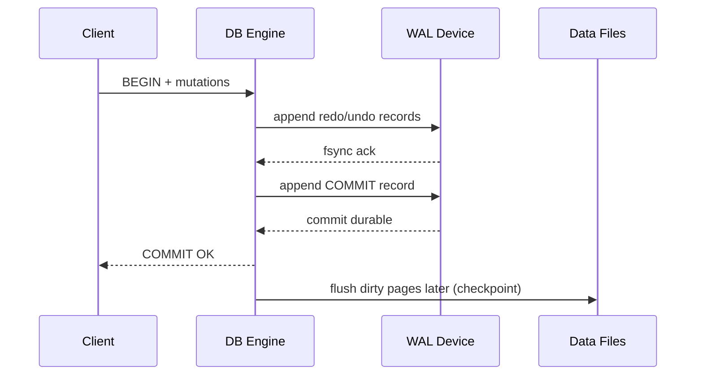

# ACID vs BASE Models: Internal Mechanics and Trade-offs

## 1. Problem Statement

Database architecture is often framed as ACID versus BASE, but enterprise systems usually combine both:

- ACID inside local transactional boundaries.
- BASE across service boundaries and asynchronous integration.

The senior architect’s task is not choosing ideology, but assigning the correct consistency contract per business invariant.

---

## 2. ACID: Mechanistic Deep Dive

## 2.1 Atomicity

Atomicity ensures all-or-nothing transaction visibility.

Implementation primitives:

- Undo segments (rollback local changes before commit).
- Redo/WAL records (replay committed updates after crash).
- Commit marker durability as the binary boundary.

#### In-Line Glossary: Write-Ahead Logging (WAL)

**What it is:** A persistence discipline where log records are flushed before data pages are written.  
**Why here:** Guarantees crash recovery can reconstruct committed state and rollback incomplete operations.  
**Failure domain impact:** Torn page or process crash after commit does not lose logical transaction intent if WAL reached durable media.

## 2.2 Consistency

Consistency means transactions preserve declared invariants:

- Primary/foreign keys
- Check constraints
- Application-level invariants encoded in transaction logic

Important distinction:

- ACID “C” is invariant preservation, not CAP “C” (distributed linearizability).

## 2.3 Isolation

Isolation defines interaction rules among concurrent transactions.

### Isolation Levels and Typical Anomalies

| Level | Dirty Read | Non-Repeatable Read | Phantom | Write Skew |
|---|---|---|---|---|
| Read Uncommitted | Possible | Possible | Possible | Possible |
| Read Committed | Prevented | Possible | Possible | Possible |
| Repeatable Read | Prevented | Prevented | Engine-dependent | Possible in MVCC snapshots |
| Serializable | Prevented | Prevented | Prevented | Prevented |

#### In-Line Glossary: Write Skew

**What it is:** Two concurrent transactions read overlapping predicate state and write disjoint rows, violating a global invariant.  
**Why here:** Snapshot-based isolation without predicate conflict detection is vulnerable.  
**Systemic impact:** “No row conflict” does not imply “no invariant conflict.”

## 2.4 Durability

Durability means committed transactions survive process/node crashes under the assumed failure model.

Controls:

- fsync policy and group commit
- RAID/volume durability profile
- synchronous/asynchronous replica acknowledgment

---

## 3. Logging and Recovery Internals

Crash recovery phases:

1. **Analysis:** rebuild active transaction table and dirty page table.
2. **Redo:** replay committed idempotent log records after checkpoint LSN.
3. **Undo:** rollback loser transactions using compensation records.

#### In-Line Glossary: LSN (Log Sequence Number)

**What it is:** Monotonic log position used to order WAL records and checkpoint progress.  
**Why here:** Recovery correctness depends on deterministic ordering and page-LSN comparisons.  
**Systemic impact:** Replica synchronization, point-in-time restore, and backup consistency all hinge on LSN continuity.

---

## 4. Strict Serializability, Serializability, and Snapshot Semantics

- **Serializability:** equivalent to some serial execution order.
- **Strict serializability (linearizable transactions):** serializability + real-time order.
- **Snapshot isolation:** each transaction reads a stable snapshot; avoids many anomalies but not all invariant conflicts.

For cross-region systems, strict serializability usually requires coordination with clock or quorum cost.

---

## 5. BASE Model in Distributed Systems

### 5.1 Basically Available

System prioritizes non-error responses under partial failures where possible.

### 5.2 Soft State

Replicated state may be temporarily inconsistent and evolve due to asynchronous propagation.

### 5.3 Eventual Consistency

If no new updates occur, replicas converge to the same value after bounded/unbounded delay.

#### In-Line Glossary: Anti-Entropy

**What it is:** Background reconciliation process (Merkle trees, hinted handoff replay, read repair) to converge divergent replicas.  
**Why here:** BASE systems require periodic repair beyond foreground requests.  
**Systemic impact:** Convergence speed and repair IO load directly affect storage cost and consistency staleness windows.

---

## 6. Failure Modes: ACID and BASE

### 6.1 ACID-Centric Systems

- Lock contention and deadlocks under hotspot keys.
- Replica lag impacting read-your-write from followers.
- fsync stalls affecting tail commit latency.

### 6.2 BASE-Centric Systems

- Lost updates if conflict policy is weak.
- Monotonic-read violations on client route changes.
- Causal anomalies without session tokens/vector metadata.

#### In-Line Glossary: Vector Clocks

**What it is:** Version vectors that encode partial causal order among replicas/writers.  
**Why here:** Detects concurrency vs overwrite ordering in eventually consistent systems.  
**Systemic impact:** Increased metadata overhead and merge logic complexity for high-writer-cardinality domains.

---

## 7. Quantitative Selection Heuristics

Use ACID-first when:

- Invariants are strict and cross-row/cross-entity correctness is mandatory.
- Compensation cost is materially higher than synchronous coordination cost.
- Regulatory auditability requires deterministic transaction logs.

Use BASE-first when:

- Availability SLA dominates, and bounded inconsistency is tolerable.
- Workloads are write-heavy at geo scale with partitioned ownership.
- Domain has robust reconciliation semantics.

Queueing and contention signals:

- If lock wait time dominates response time, reevaluate schema/index/hot keys before abandoning ACID.
- If quorum/coordination latency dominates global writes, evaluate bounded-staleness reads or local-write ownership models.

---

## 8. Hybrid Pattern for Modern Architectures

A practical enterprise pattern:

1. Keep command side ACID inside service-owned store.
2. Publish domain events via outbox.
3. Build distributed read models and integrations with BASE semantics.
4. Define explicit staleness budgets and user-facing consistency guarantees.

This hybrid model captures the strongest properties of both worlds while controlling complexity via clear boundaries.
