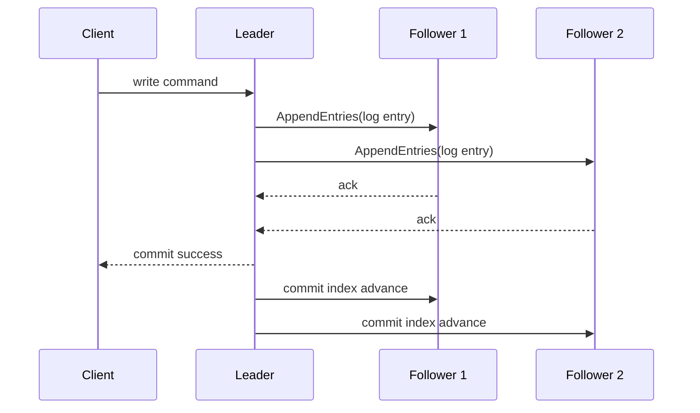
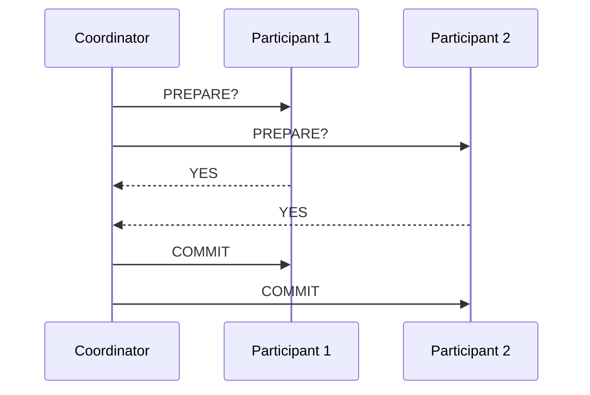

# Consensus, 2PC, and Distributed Transaction Semantics

## 1. Why This Topic Is Non-Optional for Senior Architects

Any multi-node database decision eventually encounters the coordination problem: how to keep replicated or partitioned state coherent under failures, delays, and split-brain risks.

This document covers:

- consensus safety/liveness mechanics
- Two-Phase Commit (2PC) limits
- practical alternatives (sagas, idempotency, escrow patterns)

---

## 2. Consensus Algorithms (Raft-Oriented View)

Consensus solves replicated state machine agreement:

1. nodes must agree on ordered log entries
2. committed entries become durable system history
3. all healthy nodes eventually apply the same committed sequence

### 2.1 Raft Mechanics

- **Leader election** via randomized timeouts.
- **Log replication** from leader to followers.
- **Commit rule** via majority acknowledgments.
- **Term-based safety** prevents stale leader overwrite.

#### In-Line Glossary: Raft Safety

**What it is:** The guarantee that committed log entries are never lost or reordered in a way that violates linear history.  
**Why here:** Database correctness under leader failover depends on this safety property.  
**Systemic impact:** Majority quorum reduces split-brain risk but increases sensitivity to partition and latency.

---

## 3. Two-Phase Commit (2PC)

2PC coordinates atomic commit across multiple participants.

Phase 1 (prepare):

- coordinator asks each participant if it can commit.

Phase 2 (commit/abort):

- if all voted yes, coordinator instructs commit; otherwise abort.

### 3.1 Failure Domain of 2PC

- Coordinator crash after prepare can block participants.
- Network partitions can leave uncertain outcomes.
- Locks may be held while waiting, harming throughput.

#### In-Line Glossary: Blocking Protocol

**What it is:** A protocol where participants can remain in uncertain state waiting for coordinator recovery.  
**Why here:** 2PC is not partition-resilient in the same way quorum-based consensus protocols are.  
**Systemic impact:** Operational recovery complexity and lock hold times can be unacceptable for high-scale OLTP.

---

## 4. 2PC vs Consensus

Key distinction:

- 2PC provides atomicity coordination but not by itself replicated fault-tolerant consensus over coordinator decision.
- Consensus protocols replicate decisions and leader state, improving fault tolerance.

In practice:

- Distributed SQL systems combine transaction protocols with consensus-backed logs.
- Microservice architectures often avoid cross-service 2PC and use sagas/outbox patterns.

---

## 5. Alternatives for Enterprise Architectures

1. **Transactional outbox + idempotent consumers** for integration consistency.
2. **Sagas** for long-running business workflows.
3. **Escrow/accounting partitioning** to reduce cross-partition atomic writes.
4. **Compensating transactions** with explicit business semantics.

---

## 6. Decision Guidance

Use strict distributed transactions when:

- invariant violation cost is catastrophic
- throughput budget can absorb coordination overhead
- organizational maturity can operate consensus systems reliably

Prefer eventually consistent coordination when:

- business can tolerate bounded convergence windows
- global availability is prioritized
- compensation and reconciliation are well-defined

---

## 7. External Visual References

- [Raft Consensus Visualization (The Secret Lives of Data)](https://thesecretlivesofdata.com/raft/)
- [Google Spanner Paper Landing Page](https://research.google/pubs/pub39966/)
- [Jepsen Analyses Index](https://jepsen.io/analyses)
