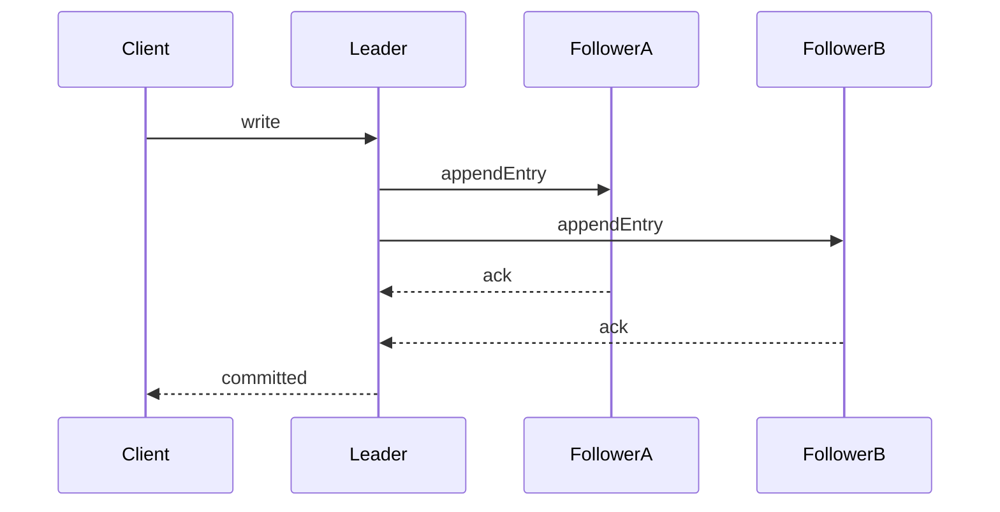
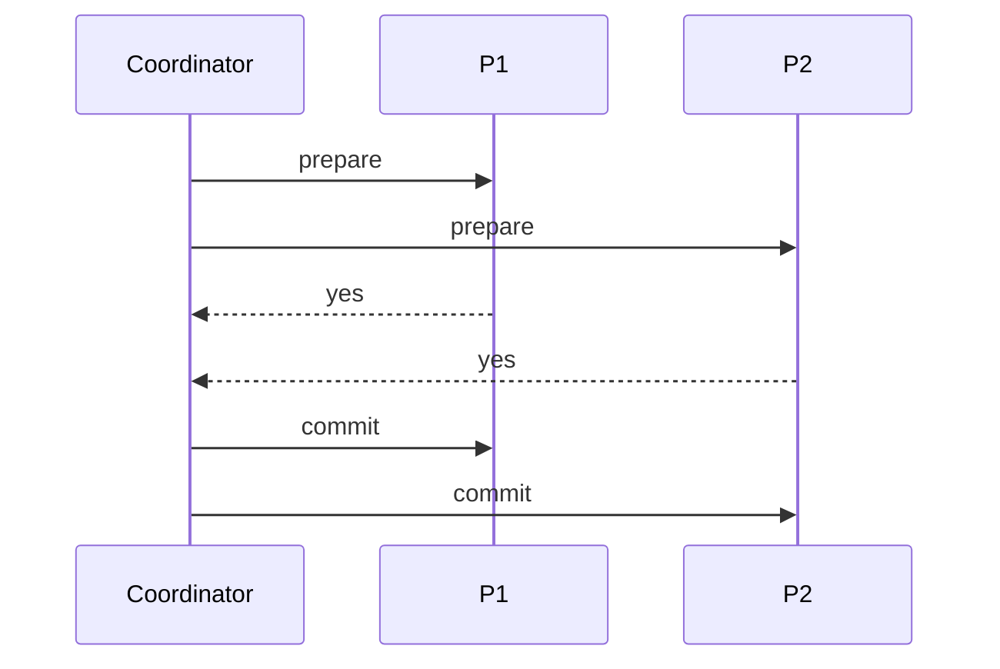

# Consensus, 2PC, and Distributed Transaction Semantics

## 1. Why This Topic Is Foundational

Distributed architecture fails at scale when teams treat coordination as an implementation detail. Coordination is a first-class architecture decision because it determines:

- correctness envelope under faults
- write availability under partition
- p99 latency under load
- operational recovery complexity

---

## 2. Consensus: Replicated State Machine Contract

Consensus ensures nodes agree on a single ordered log of decisions.

Core guarantees:

1. one committed order for each log index
2. no committed value is silently replaced
3. healthy replicas eventually apply committed entries

These guarantees are the substrate for strong distributed database semantics.

### 2.1 Safety vs Liveness

- **Safety:** never commit contradictory history.
- **Liveness:** system eventually makes progress.

In real systems, safety is usually prioritized; liveness can be delayed by partitions or unstable leadership.

#### In-Line Glossary: Split Brain

**What it is:** simultaneous conflicting leaders accepting writes for the same logical timeline.  
**Why here:** preventing split brain is the central correctness challenge in distributed writes.  
**Systemic implication:** leader election and quorum enforcement are mandatory, not optional hardening.

---

## 3. Raft Mechanics with Failure Paths

Raft uses leader-based log replication.

Lifecycle:

1. leader election by randomized timeouts
2. append entries from leader to followers
3. commit on majority ack
4. apply in order to state machine

Failure nuances:

- leader crash before commit: entry may be overwritten by later leader
- leader crash after commit: new leader must preserve committed prefix
- unstable network: election churn increases write unavailability windows

---

## 4. Two-Phase Commit (2PC)

2PC coordinates atomic commit across participants.

Phases:

1. **Prepare:** participants vote yes/no and lock intent.
2. **Commit/Abort:** coordinator issues final decision.

#### In-Line Glossary: In-Doubt Transaction

**What it is:** participant state after prepare where final outcome is unknown due to coordinator or network failure.  
**Why here:** this is the blocking pain point of 2PC.  
**Systemic implication:** lock retention and operational intervention risk increase under faults.

### 4.1 2PC Failure Domains

- coordinator crash after prepare can block progress
- partition can isolate participants in uncertain state
- long lock hold times reduce throughput

2PC provides atomicity coordination but not full partition-tolerant progress guarantees.

---

## 5. 2PC vs Consensus-Backed Transactions

Key distinction:

- 2PC: atomic agreement step across participants; can block
- consensus-backed systems: replicate decision authority itself, improving crash tolerance

Modern distributed SQL systems frequently combine:

- transaction protocol for atomicity
- consensus log for replicated durability and failover correctness

---

## 6. Alternatives in Microservice Architectures

When cross-service global transactions are too costly:

1. transactional outbox + idempotent consumers
2. saga orchestration/choreography with compensations
3. ownership partitioning to reduce cross-boundary writes
4. escrow-like designs to avoid high-contention global counters

#### In-Line Glossary: Compensation

**What it is:** semantically meaningful inverse action used when a downstream step fails in a multi-step workflow.  
**Why here:** eventually consistent workflows need business-level rollback semantics.  
**Systemic implication:** compensation is not technical undo; it must preserve real business correctness.

---

## 7. Decision Framework for Architects

Use strict distributed transactional coordination when:

- invariant breaches are unacceptable
- legal/compliance demands strict auditable ordering
- throughput and latency budget can absorb coordination overhead

Prefer eventual consistency with compensations when:

- bounded inconsistency is acceptable
- availability and autonomy are higher priorities
- domain provides robust reconciliation logic

---

## 8. Testing and Verification Requirements

Mandatory pre-production tests:

- leader crash during write commit
- partition during prepare/commit phases
- duplicate delivery and retry storms
- prolonged node unavailability with catch-up replay

Success criteria must include correctness assertions, not only uptime.

---

## 9. External References

- [Raft Visualization](https://thesecretlivesofdata.com/raft/)
- [Spanner Paper](https://research.google/pubs/pub39966/)
- [Jepsen Analyses](https://jepsen.io/analyses)
