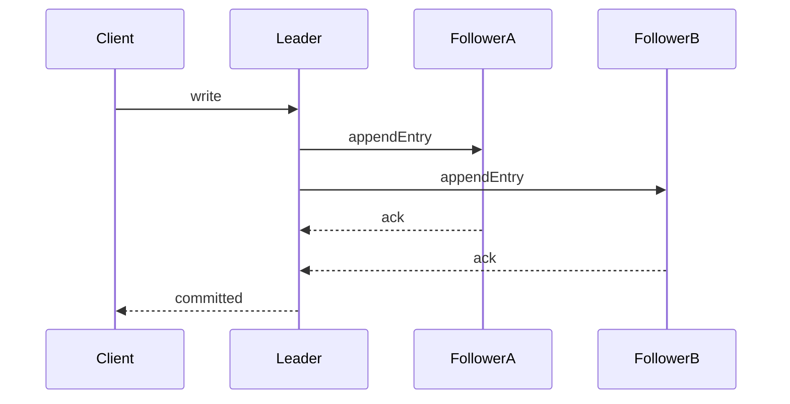
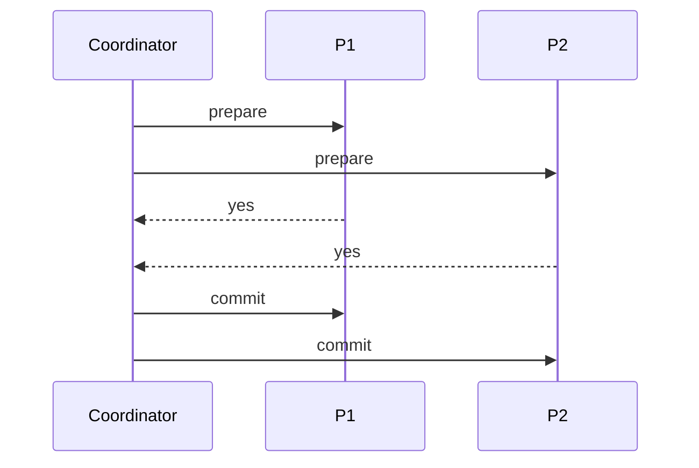

# Consensus, 2PC, and Distributed Transaction Semantics

## 1. Why This Topic Is Foundational

Distributed architecture fails at scale when teams treat coordination as an implementation detail. Coordination is a first-class architecture decision because it determines the correctness envelope under faults, write availability under partition, p99 latency under load, and operational recovery complexity after leadership or network failure.

If these dimensions are not designed deliberately, systems appear healthy in demos and then lose either correctness or availability under realistic failure.

---

## 2. Consensus: Replicated State Machine Contract

Consensus ensures nodes agree on a single ordered log of decisions. That ordered log becomes the authoritative history that replicas apply to their state machines.

Core guarantees are strict. For each log index there is one committed order. No committed value is silently replaced after it has been agreed. Healthy replicas eventually apply committed entries. These guarantees are the substrate for strong distributed database semantics; without them, failover can rewrite history and clients can observe contradictory outcomes.

### 2.1 Safety vs Liveness

Safety means the system never commits contradictory history. Liveness means the system eventually makes progress. In real systems, safety is usually prioritized; liveness can be delayed by partitions or unstable leadership. A system that remains live while committing conflicting leaders has failed more severely than a system that temporarily stops accepting writes.

#### In-Line Glossary: Split Brain

**What it is:** simultaneous conflicting leaders accepting writes for the same logical timeline.  
**Why here:** preventing split brain is the central correctness challenge in distributed writes.  
**Systemic implication:** leader election and quorum enforcement are mandatory, not optional hardening.

---

## 3. Raft Mechanics with Failure Paths

Raft uses leader-based log replication. The lifecycle starts with leader election driven by randomized timeouts, continues with append-entry replication from leader to followers, commits when a majority acknowledges the entry, and then applies committed entries in order to the state machine.

Failure nuances matter as much as the happy path. If a leader crashes before commit, the uncommitted entry may be overwritten by a later leader and clients must retry safely. If a leader crashes after commit, the new leader must preserve the committed prefix or correctness is broken. Under unstable networks, election churn increases write unavailability windows even when data remains intact.

---

## 4. Two-Phase Commit (2PC)

2PC coordinates atomic commit across participants that do not share a single local transactional store. In the prepare phase, participants vote yes or no and lock intent so they can later honor the decision. In the commit or abort phase, the coordinator issues the final decision and participants finalize accordingly.

#### In-Line Glossary: In-Doubt Transaction

**What it is:** participant state after prepare where final outcome is unknown due to coordinator or network failure.  
**Why here:** this is the blocking pain point of 2PC.  
**Systemic implication:** lock retention and operational intervention risk increase under faults.

### 4.1 2PC Failure Domains

If the coordinator crashes after prepare, participants can remain blocked in an uncertain state while holding locks. Network partitions can isolate participants so they cannot learn the final decision. Long lock hold times reduce throughput and amplify contention for unrelated work. For these reasons, 2PC provides atomicity coordination but not full partition-tolerant progress guarantees.

---

## 5. 2PC vs Consensus-Backed Transactions

The key distinction is where decision authority lives. 2PC provides an atomic agreement step across participants, but that agreement can block when the coordinator or network fails. Consensus-backed systems replicate decision authority itself, improving crash tolerance because a new leader can continue from an agreed log rather than waiting for a single coordinator to return.

Modern distributed SQL systems frequently combine a transaction protocol for atomicity with a consensus log for replicated durability and failover correctness. That combination is why they can offer stronger distributed guarantees than classic 2PC alone, at the cost of coordination latency.

---

## 6. Alternatives in Microservice Architectures

When cross-service global transactions are too costly, architects shift from atomic multi-service commit to explicitly designed eventual workflows. A transactional outbox with idempotent consumers ensures that events are published if and only if local state changed, and that retries do not create duplicate side effects. Saga orchestration or choreography with compensations allows long-running business workflows to progress without holding distributed locks for the entire lifetime. Ownership partitioning reduces the need for cross-boundary writes by placing related mutations under one service and store. Escrow-like designs avoid high-contention global counters by reserving capacity in advance and settling asynchronously.

#### In-Line Glossary: Compensation

**What it is:** semantically meaningful inverse action used when a downstream step fails in a multi-step workflow.  
**Why here:** eventually consistent workflows need business-level rollback semantics.  
**Systemic implication:** compensation is not technical undo; it must preserve real business correctness.

---

## 7. Decision Framework for Architects

Use strict distributed transactional coordination when invariant breaches are unacceptable, when legal or compliance demands require strict auditable ordering, and when throughput and latency budgets can absorb coordination overhead. Prefer eventual consistency with compensations when bounded inconsistency is acceptable, when availability and autonomy are higher priorities, and when the domain provides robust reconciliation logic that operations and product teams understand.

The wrong choice is not merely inefficient; it either creates avoidable outages or creates hard-to-detect integrity failures.

---

## 8. Testing and Verification Requirements

Mandatory pre-production tests must include leader crash during write commit, partition during prepare and commit phases, duplicate delivery and retry storms, and prolonged node unavailability with catch-up replay. Success criteria must include correctness assertions, not only uptime. A system that remains available while losing committed history has failed the architecture test.

---

## 9. External References

- [Raft Visualization](https://thesecretlivesofdata.com/raft/)
- [Spanner Paper](https://research.google/pubs/pub39966/)
- [Jepsen Analyses](https://jepsen.io/analyses)
