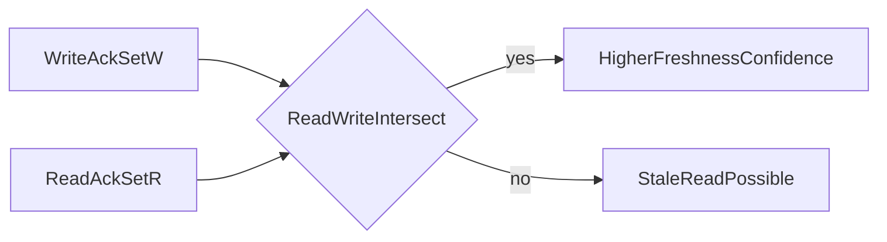
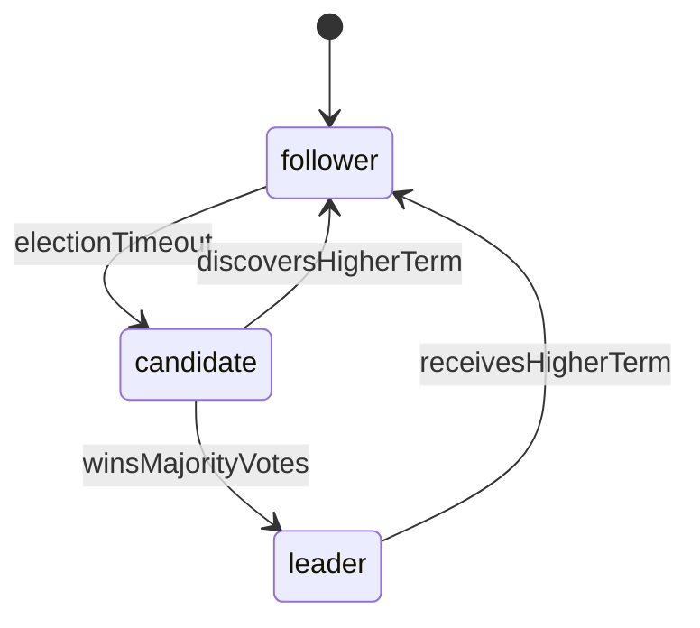

# Quorum, Raft, and Paxos Internals for Database Selection

## 1. Purpose

This document provides a theory-heavy explanation of the coordination primitives that directly shape PACELC posture, failure behavior, and operational performance. Quorum size, leader election, and consensus protocol choice are not tuning knobs after the fact; they are architecture decisions that determine what users experience under both healthy and partitioned conditions.

---

## 2. Quorum Mathematics and Semantics

Given replication factor `N`, write quorum `W`, and read quorum `R`, the freshness intersection condition is `R + W > N`. Majority threshold is `Q = floor(N / 2) + 1`.

Interpretation is direct. Lower quorum reduces latency because fewer acknowledgments are required before success, but it increases stale-read and conflict risk because successful reads may not intersect recent writes. Higher quorum improves freshness confidence because intersection becomes more likely, but it increases coordination cost and timeout probability because more replicas must respond.

#### In-Line Glossary: Quorum Intersection

**What it is:** overlap between successful read and write acknowledgment sets.  
**Why here:** overlap is the mechanism that carries freshness evidence.  
**Systemic implication:** tuning quorum is equivalent to tuning consistency-latency-risk balance.

### 2.1 Consistency Levels and Behavior

Consistency level ONE acknowledges from one replica, which minimizes latency and maximizes stale-read risk. QUORUM requires a majority, balancing latency against consistency for many operational workloads. ALL requires every replica, which maximizes freshness confidence but weakens fault tolerance because any single replica failure can block the operation. LOCAL_QUORUM requires majority inside the local data center, preserving regional consistency while reducing cross-region round-trip cost.

These levels are not decorative settings. Each one encodes a different PACELC posture for that specific operation.

---

## 3. Raft Deep Mechanics

Raft decomposes consensus into understandable stages: leader election, log replication, and a safety-preserving commit rule. Critical safety facts follow from those stages. Committed entries from previous terms are preserved by election restrictions that prevent stale leaders from overwriting agreed history. Only entries replicated to a majority are considered committed. Followers apply entries in log order so state machines remain deterministic.

Failure behavior is equally important. Election storms can degrade write liveness when nodes repeatedly fail to stabilize leadership. Network jitter can mimic failures and trigger unnecessary leadership churn. Poorly tuned timeouts increase instability by either waiting too long to recover or reacting too aggressively to transient delay.

#### In-Line Glossary: Term Monotonicity

**What it is:** terms only increase and identify fresher authority epochs.  
**Why here:** stale leaders must be prevented from committing divergent history.  
**Systemic implication:** term handling correctness is fundamental to preventing split brain.

---

## 4. Paxos Deep Mechanics

Paxos operates through proposal ballots. A proposer issues prepare with ballot `b`. Acceptors promise to ignore lower ballots. The proposer then sends accept with a selected value. A chosen value emerges once a majority accepts. This process provides a strong safety foundation and remains the conceptual basis for many production systems and Multi-Paxos variants.

Compared with Raft, both protocols can provide equivalent safety classes under their assumptions. Raft is often easier to reason about operationally because leadership and log replication are explicit and continuous rather than proposal-centric. Ballot contention in Paxos increases retries and round trips, which raises latency and reduces write throughput under unstable leadership.

#### In-Line Glossary: Ballot Contention

**What it is:** repeated competing proposals with higher ballot numbers.  
**Why here:** contention increases retries and round trips.  
**Systemic implication:** latency spikes and reduced write throughput under unstable leadership.

---

## 5. Decision Impact: Before and After Partition

| Mechanism | Healthy Network Preference | Partition Preference | Typical Use |
|---|---|---|---|
| Quorum ONE | latency | availability continuity | feed/cache-like low-criticality paths |
| Quorum QUORUM | moderate consistency | consistency on majority side | mixed-criticality operational paths |
| Raft majority | consistency | consistency (minority reject) | distributed SQL/control planes |
| Paxos majority | consistency | consistency (minority reject) | globally coordinated systems |

This table should be read as a mapping from mechanism to expected user-visible behavior. Quorum ONE prefers low latency when healthy and continuity when partitioned, accepting stale risk. Majority Raft or Paxos prefers consistency in both regimes and therefore rejects minority progress during partition.

---

## 6. Operation-Level Policy Pattern

A mature architecture often mixes policies by endpoint rather than forcing one global knob. Balance-transfer paths use high write and read quorum with strict ordering because incorrect balances are catastrophic. Social-reaction paths use low quorum for write and read because delayed convergence is usually acceptable. Inventory-reserve paths often use majority write with a bounded-staleness read policy that matches product tolerance for temporary visibility lag.

This operation-level approach is more correct than selecting one global consistency setting for all workloads, because different endpoints have different invariant costs.

---

## 7. Verification Checklist

Validate partition behavior on both minority and majority sides, because those sides experience different correctness and availability outcomes. Measure p95 and p99 shift across ONE, QUORUM, and ALL levels under realistic traffic, not synthetic microbenchmarks. Simulate leader crash before and after the commit boundary to verify retry correctness and committed-prefix preservation. Verify that client retries are idempotent so repeated delivery does not create duplicate business effects. Verify that stale-read tolerances are explicitly documented per endpoint so product behavior matches system behavior.

---

## 8. External References

- [Raft Visualization](https://thesecretlivesofdata.com/raft/)
- [Paxos Made Simple](https://lamport.azurewebsites.net/pubs/paxos-simple.pdf)
- [Cassandra Consistency Levels](https://cassandra.apache.org/doc/latest/cassandra/dml/dmlConfigConsistency.html)
