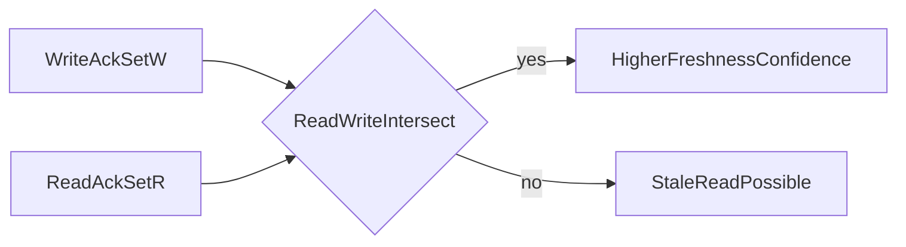
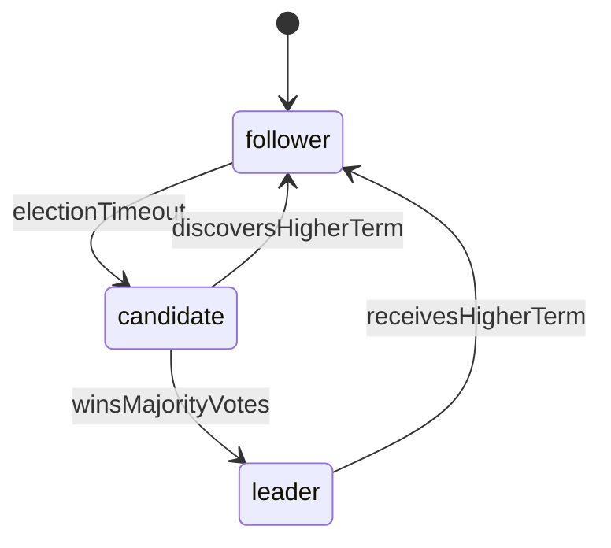

# Quorum, Raft, and Paxos Internals for Database Selection

## 1. Purpose

This document provides a theory-heavy explanation of the coordination primitives that directly shape PACELC posture, failure behavior, and operational performance.

---

## 2. Quorum Mathematics and Semantics

Given replication factor `N`:

- write quorum `W`
- read quorum `R`

Freshness intersection condition:

`R + W > N`

Majority threshold:

`Q = floor(N / 2) + 1`

Interpretation:

- lower quorum reduces latency and increases stale/conflict risk
- higher quorum improves freshness confidence and increases coordination cost

#### In-Line Glossary: Quorum Intersection

**What it is:** overlap between successful read and write acknowledgment sets.  
**Why here:** overlap is the mechanism that carries freshness evidence.  
**Systemic implication:** tuning quorum is equivalent to tuning consistency-latency-risk balance.

### 2.1 Consistency Levels and Behavior

| Level | Acknowledgment Requirement | Typical Effect |
|---|---|---|
| ONE | one replica | lowest latency, highest stale risk |
| QUORUM | majority | balanced latency vs consistency |
| ALL | all replicas | strongest freshness, weakest fault tolerance |
| LOCAL_QUORUM | majority in local DC | regional consistency with reduced WAN cost |

---

## 3. Raft Deep Mechanics

Raft decomposes consensus into understandable stages:

1. leader election
2. log replication
3. safety-preserving commit rule

Critical safety facts:

- committed entries from previous terms are preserved by election restrictions
- only entries replicated to majority are considered committed
- followers apply entries in log order

Failure behavior:

- election storms can degrade write liveness
- network jitter can mimic failures and trigger unnecessary leadership churn
- poorly tuned timeouts increase instability

#### In-Line Glossary: Term Monotonicity

**What it is:** terms only increase and identify fresher authority epochs.  
**Why here:** stale leaders must be prevented from committing divergent history.  
**Systemic implication:** term handling correctness is fundamental to preventing split brain.

---

## 4. Paxos Deep Mechanics

Paxos operates through proposal ballots:

1. proposer issues prepare with ballot `b`
2. acceptors promise to ignore lower ballots
3. proposer sends accept with selected value
4. chosen value emerges once majority accepts

Why Paxos remains relevant:

- strong safety foundation
- basis for many production systems and Multi-Paxos variants

Trade-off vs Raft:

- equivalent safety class under assumptions
- Raft often easier to reason about operationally

#### In-Line Glossary: Ballot Contention

**What it is:** repeated competing proposals with higher ballot numbers.  
**Why here:** contention increases retries and round trips.  
**Systemic implication:** latency spikes and reduced write throughput under unstable leadership.

---

## 5. Decision Impact: Before and After Partition

| Mechanism | Healthy Network Preference | Partition Preference | Typical Use |
|---|---|---|---|
| Quorum ONE | latency | availability continuity | feed/cache-like low-criticality paths |
| Quorum QUORUM | moderate consistency | consistency on majority side | mixed-criticality operational paths |
| Raft majority | consistency | consistency (minority reject) | distributed SQL/control planes |
| Paxos majority | consistency | consistency (minority reject) | globally coordinated systems |

---

## 6. Operation-Level Policy Pattern

A mature architecture often mixes policies by endpoint:

- balance transfer: write/read quorum high, strict ordering
- social reaction: low quorum for write/read
- inventory reserve: majority write, bounded-staleness read policy

This operation-level approach is more correct than selecting one global knob for all workloads.

---

## 7. Verification Checklist

1. Validate partition behavior on minority and majority sides.
2. Measure p95/p99 shift across ONE/QUORUM/ALL levels.
3. Simulate leader crash before and after commit boundary.
4. Verify client retries are idempotent.
5. Verify stale-read tolerances are explicitly documented per endpoint.

---

## 8. External References

- [Raft Visualization](https://thesecretlivesofdata.com/raft/)
- [Paxos Made Simple](https://lamport.azurewebsites.net/pubs/paxos-simple.pdf)
- [Cassandra Consistency Levels](https://cassandra.apache.org/doc/latest/cassandra/dml/dmlConfigConsistency.html)
