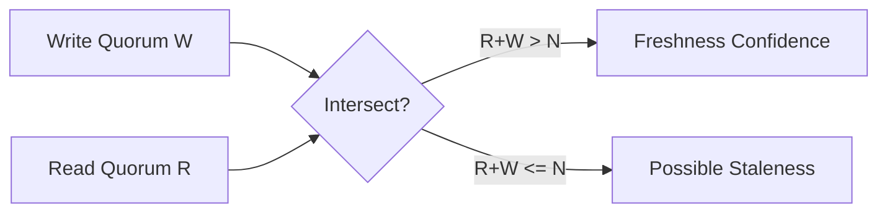
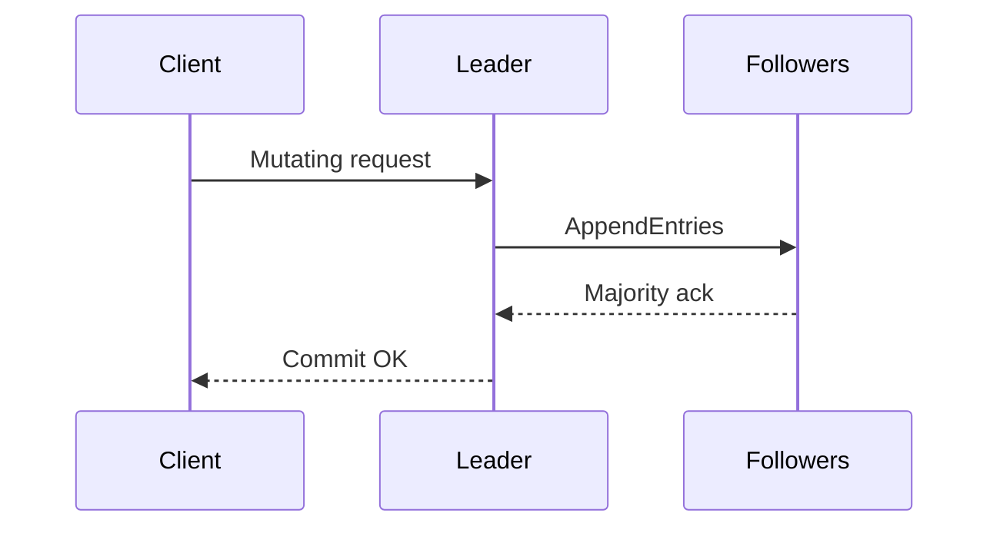

# Quorum, Raft, and Paxos Internals for Database Selection

## 1. Purpose

This document explains the coordination primitives that determine whether a database favors consistency, availability, or latency under partition and healthy-network conditions.

---

## 2. Quorum Mathematics

For a replication factor `N`:

- Write quorum: `W`
- Read quorum: `R`

Strong read-after-write intersection typically requires:

`R + W > N`

Majority quorum:

`Q = floor(N / 2) + 1`

Examples:

- `N=3`, majority = 2
- `N=5`, majority = 3
- `N=10`, majority = 6

#### In-Line Glossary: Quorum Intersection

**What it is:** The property that every successful read set overlaps every successful write set, ensuring at least one replica carries the latest acknowledged write.  
**Why here:** This is the core mechanism behind tunable consistency in systems like Cassandra and Dynamo-style stores.  
**Systemic impact:** Higher `W`/`R` improves consistency confidence and increases latency and timeout risk.

### 2.1 Consistency Levels in Practice

| Mode | Typical Meaning | Decision Impact |
|---|---|---|
| ONE | Ack from one replica | Lowest latency, highest stale-read risk |
| QUORUM | Majority of replicas | Balanced consistency and latency |
| ALL | All replicas | Strongest freshness, highest availability risk under faults |
| LOCAL_QUORUM | Majority in local DC | Regional consistency with lower cross-region latency |

---

## 3. Raft (Leader-Based Consensus)

Raft elects a leader and replicates an ordered log.

Safety properties:

- at most one leader per term
- committed entries are durable under majority failure assumptions
- followers apply committed entries in order

Operational consequences:

- brief write unavailability during leader election
- strong ordering and simpler mental model than classic Paxos

#### In-Line Glossary: Raft Term

**What it is:** A monotonic epoch used to invalidate stale leaders and order elections.  
**Why here:** Prevents split-brain writes after network healing.  
**Systemic impact:** Election storms under unstable networks can increase latency and reduce write availability.

External visual:

- [The Secret Lives of Data: Raft Visualization](https://thesecretlivesofdata.com/raft/)

---

## 4. Paxos (Proposal-Based Consensus)

Paxos reaches agreement through proposer/acceptor/learner roles.

Classic phases:

1. Prepare/Promise (ballot reservation)
2. Accept/Accepted (value commitment)

Compared with Raft:

- both provide safety under majority failure models
- Raft emphasizes understandability and leader-driven replication
- Paxos is historically foundational and appears in systems like Spanner-derived designs

#### In-Line Glossary: Ballot Number

**What it is:** A unique proposal identifier used to order competing proposals.  
**Why here:** Ensures only one value can be chosen for a consensus instance.  
**Systemic impact:** High contention on ballots can increase round-trips and latency.

External reference:

- [Paxos Made Simple (Lamport)](https://lamport.azurewebsites.net/pubs/paxos-simple.pdf)

---

## 5. Decision Impact Table (Before/After Partition)

| Mechanism | Healthy Network Preference | During Partition Preference | Typical Database Context |
|---|---|---|---|
| Quorum ONE | Latency | Availability | Cassandra/Dynamo-style tunable workloads |
| Quorum QUORUM | Consistency with moderate latency | Consistency over minority | Cassandra/Dynamo-style critical keys |
| Raft majority | Consistency | Consistency (reject minority writes) | MongoDB replica sets, CockroachDB, etcd-like control planes |
| Multi-Paxos / TrueTime-assisted consensus | Consistency | Consistency | Spanner-class systems |

---

## 6. Architect Selection Guidance

1. If business invariants require no stale critical reads, choose majority/Raft/Paxos-backed paths.
2. If uptime and low latency dominate non-critical data, prefer tunable quorum with `ONE`/`LOCAL_ONE`.
3. Encode consistency level by operation class, not as a global constant.
4. Validate under partition drills: timeout behavior, election duration, and stale-read windows.
