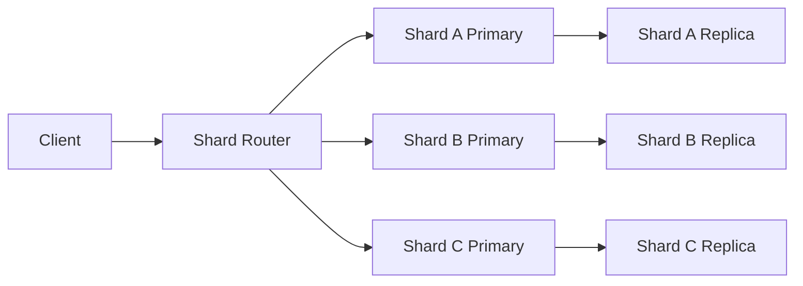
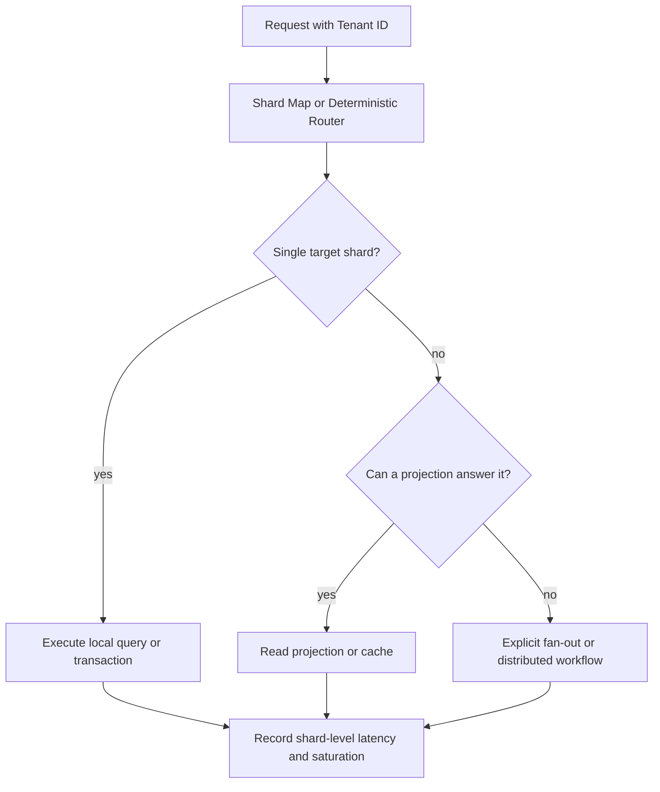
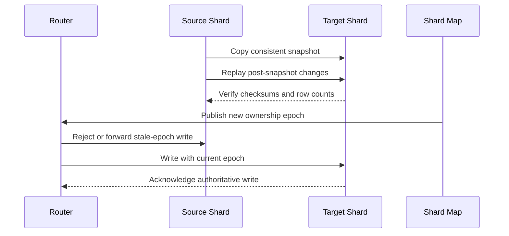

# Sharding, Data Partitioning, and Horizontal Database Scale

## 1. Purpose and Decision Context

Sharding is the deliberate placement of different subsets of a logical dataset on independent database nodes or groups of nodes. It raises the ceiling for storage and write throughput because a request is no longer constrained by one machine's CPU, memory, storage IO, network, or lock manager. It also turns a previously local database into a distributed system with routing, migration, partial-failure, and correctness obligations.

This chapter establishes when that complexity is justified, how a partitioning strategy determines the system's long-term behavior, and how to operate the resulting system safely. It treats sharding as an architectural decision rather than a generic performance optimization. The central question is not "how can more database servers be added?" It is "which requests and invariants can be made local to one data partition, and what happens when they cannot?"

The source video that motivated this chapter is [Database Sharding / Fragmentation](https://www.youtube.com/watch?v=xJllDyCIyws). Its examples are useful introductory intuition, but this document corrects several oversimplifications: sharding is not always the next step after vertical scaling, hash functions do not need to be reversible, Sagas are not automatic rollbacks, and microservices are not a prerequisite for sharding.

---

## 2. Sharding Is a Later Optimization, Not a Default Topology

A growing service should first identify the saturated resource and the request path causing it. An index may remove unnecessary storage reads, query redesign may eliminate an accidental full scan, a cache may absorb repeatable read traffic, and a read replica may offload stale-tolerant reads. Vertical scaling can be the lowest-risk capacity response when the workload still fits a single-node failure and recovery envelope. None of these options distributes the primary write ownership of the data, but each can defer a costly distributed-data transition.

Sharding becomes a serious option when a single primary cannot satisfy storage or sustained write throughput requirements within an acceptable cost, recovery, and latency budget, or when a workload can be naturally partitioned into mostly independent ownership groups. It is not required to exhaust every preceding technique first. A tenant-isolated SaaS system with a clear tenant boundary may choose partitioning early for blast-radius and data-residency reasons even if one large machine could temporarily carry the load.

#### In-Line Glossary: Partition

**What it is:** an independently placed subset of a logical dataset. A shard is normally a data partition plus the replication group, storage, and operational controls that serve it.

**Why here:** horizontal scale only follows when incoming work can be divided among partitions rather than sent to the same write owner.

**Systemic implication:** every partition boundary changes the cost and failure semantics of queries and transactions that cross it.

### 2.1 Replication and Sharding Solve Different Bottlenecks

Replication copies the same logical records to several nodes. Read replicas can improve read capacity and resilience, but writes commonly remain serialized through a leader or a coordinated replication group. Sharding assigns different records to different owners, so independent writes can proceed on different shards. A production topology frequently combines both: each shard is itself replicated for availability and durability.

The diagram highlights two independent dimensions. Adding a replica can make one shard more durable or improve its read throughput. Adding a shard can distribute data and writes only if the routing scheme sends a meaningful share of future work to it. Adding nodes without changing either replication or routing does not create useful database scale.

---

## 3. The Locality Invariant

The primary invariant of a sharded design is that its dominant read and write paths include enough partitioning information to reach one shard. For a tenant-centric application, requests for a tenant's users, settings, invoices, and permissions should normally carry `tenant_id`; the router can then send the request directly to that tenant's shard. A query missing that value may require contacting every shard, which is called a scatter-gather operation.

Data that is commonly mutated or read together should be co-located when doing so does not create unacceptable skew. In a social product, placing a user's profile and authored posts by `user_id` can make profile views local. It does not automatically make a global popularity ranking local. The design must therefore start with actual access patterns, not an entity-relationship diagram alone.

### 3.1 Shard Key Selection

A shard key is the attribute or composite attributes used to determine partition placement. A good candidate has high cardinality, is present in dominant requests, creates useful data locality, and has a distribution that remains acceptable as user behavior evolves. High cardinality alone is not sufficient: a unique but monotonically increasing identifier can still concentrate new writes on one range partition, while a celebrity tenant can dominate traffic despite a uniformly distributed identifier.

The key must be stable for the lifetime of the routed record or the system must support an explicit move operation. A mutable shard key silently creates duplicate, missing, or stale data if different writers route the same record based on different values. The routing function and shard-map version are part of the data contract and must be deployed with the same discipline as a schema migration.

#### In-Line Glossary: Data Locality

**What it is:** the property that records required by a common operation are held by the same shard or replication group.

**Why here:** locality avoids network fan-out, cross-shard joins, distributed locking, and application-side result assembly.

**Systemic implication:** it lowers latency and cost on the dominant path, while operations that violate locality require separate read models or explicit workflow design.

### 3.2 Key Evaluation Questions

Before choosing a key, measure the candidate rather than relying on its name. A decision should establish the number of active values, write rate per value, read fan-out, record-size distribution, growth rate, retention period, and the p99 request concentration of the largest values. A tenant key can be excellent for most tenants and still fail under one enterprise customer that produces 40% of all writes.

The key must also be evaluated against domain invariants. If all mutations that must be atomic carry the same `account_id`, account-based placement may protect the invariant locally. If money transfers commonly span unrelated accounts, a simple account key does not remove the distributed transaction problem; it merely makes it visible.

### 3.3 Secondary Access Paths, Uniqueness, and Referential Integrity

Every important lookup must be classified as either shard-local, globally indexed, intentionally fan-out, or served from a projection. A primary access path such as `GET /tenants/{tenant_id}/orders/{order_id}` can route locally by `tenant_id`. A lookup by globally supplied `order_id` cannot use that route unless the identifier embeds a trustworthy location, the system maintains a global directory from `order_id` to `tenant_id`, or the request fans out. Adding a secondary index independently on every shard does not make that index globally searchable; it creates many local indexes that must still be queried or coordinated.

Uniqueness constraints also become scope-dependent. A local database constraint can prove that an email is unique within one tenant shard, but it cannot prove uniqueness across shards. If global uniqueness is a business invariant, the system needs a single authority, a strongly coordinated global index, a deterministic ownership rule, or a product-level constraint such as tenant-scoped usernames. Each alternative has availability and latency costs. Pretending that independent local unique indexes enforce a global invariant creates rare but permanent duplicates under concurrent writes.

Relational foreign keys behave similarly. Co-located parent and child records can retain local referential integrity. References across shards require application validation, asynchronous validation with repair, or a deliberately chosen distributed transaction protocol. Deleting a global parent is especially dangerous because a local cascade cannot discover dependent records on other shards without a directory or fan-out. The data model must make the referential boundary explicit instead of assuming that a pre-sharding schema contract still holds.

---

## 4. Partitioning Strategies

### 4.1 Range Partitioning

Range partitioning assigns contiguous key intervals to shards, such as tenant identifiers `0-9999` on one shard and `10000-19999` on another. It supports range scans and time-bounded retention efficiently because adjacent values remain adjacent in storage. Its primary risk is skew: sequential IDs, timestamps, and "latest activity" queries often direct new writes and reads to the same final range.

Range partitioning is valid when ranges correspond to real operational boundaries, such as regional residency, time-based archival, or carefully measured tenant cohorts. It requires split points, capacity headroom, and active rebalancing policies. Treating a timestamp as a universally bad shard key is too simplistic; it can be correct for immutable, time-windowed event data when the current-write hotspot is intentionally isolated and provisioned.

### 4.2 Hash Partitioning

Hash partitioning computes a deterministic hash of the shard key and uses it to select a partition. In a fixed set of `N` shards, a simplified form is:

`shard_id = hash(shard_key) mod N`

The hash must be deterministic: the same canonical input and algorithm version must produce the same result on reads, writes, retries, and all services. It does **not** need to be cryptographic or reversible. The database record stores its business identifier normally; the hash is routing metadata or a routing calculation, not an encoding that must be decoded later.

Hashing usually gives better statistical spread than range partitioning, but it sacrifices efficient range scans. It also cannot eliminate business skew: a single key receiving millions of requests still maps to exactly one destination unless the application deliberately splits that key's workload.

### 4.3 Directory-Based Partitioning

A directory, or shard map, stores an explicit mapping from a routing key or key range to a shard. This supports tenant moves, unevenly sized shards, data residency, and exceptional placement without changing the routing function globally. The price is a metadata dependency: routers need a strongly managed, versioned mapping and safe cache invalidation when a move begins or ends.

Directory-based routing is often more operationally flexible than a bare modulo calculation. It also supports a controlled migration path, where reads can consult both source and target during a cutover and writes are fenced to one authoritative owner.

### 4.4 Consistent Hashing

Consistent hashing maps keys and shard nodes onto a logical ring, so adding or removing a node moves only a subset of keys rather than remapping nearly all keys as `mod N` would. Virtual nodes improve balance by giving each physical node multiple positions on the ring. The technique reduces movement; it does not remove the need for data-copy verification, dual-read or forwarding rules, capacity control, and recovery plans during a rebalance.

### 4.5 List, Geographic, and Composite Partitioning

List partitioning assigns a discrete category, such as a country, regulatory zone, or tenant tier, to a specific shard group. Geographic placement can reduce user latency and satisfy residency requirements, but it must account for where writers, readers, backups, support staff, and disaster-recovery regions are permitted to operate. Geographic affinity is not equivalent to high availability: a region-local shard still needs a documented replica and failover policy.

Composite partitioning uses more than one dimension, for example `region + hash(tenant_id)` or `tenant_id + time_window`. It can preserve a regulatory or locality boundary while spreading load within it. The order of composite fields matters because it determines routing and pruning behavior. It should only be introduced after proving that a single dimension cannot satisfy the relevant locality, balance, and query constraints; more dimensions make routing, migration, and query contracts harder to reason about.

---

## 5. Routing, Identity, and Placement Changes

Application-managed sharding places routing logic in a data-access layer, proxy, or dedicated router. Native sharded databases provide the router and metadata plane, but the application still owns query shapes and shard-key choices. Queries that omit the shard key should be treated as an explicit exception because they can multiply latency, connections, and load by the number of shards.

Globally unique identity generation is necessary when independently writable shards create records. Options include UUIDs, ULIDs, Snowflake-style identifiers, database sequences allocated in disjoint ranges, or a dedicated ID service. Auto-incrementing identifiers are not inherently forbidden, but one uncoordinated sequence per shard creates collisions unless the allocation scheme provides global uniqueness. Identifier choice must also consider index locality and insertion patterns; random identifiers can distribute writes while increasing B-tree page churn.

### 5.1 The Control Plane Is a Production Dependency

The routing function, shard map, topology membership, credentials, schema version, and migration state form the control plane. The shard databases and their replicas form the data plane. Treating the control plane as a small configuration table is a common failure: if routers cannot obtain a valid map or credentials, otherwise healthy data shards can become unavailable to clients.

The control plane therefore needs its own availability, consistency, backup, access-control, and rollout design. Routers may cache a shard map to survive short metadata outages, but every cache entry needs an epoch or version and a bounded refresh policy. During a move, a router that uses an old epoch must be rejected, forwarded safely, or temporarily served by the former owner; silently accepting writes at both locations risks split ownership.

### 5.2 Rebalancing Is a Migration, Not a Configuration Toggle

Changing from three shards to five makes `hash(key) mod N` point many existing keys to new destinations. The safe response is not to update `N` and hope routers converge. A rebalance needs a plan that copies a bounded data unit, verifies its checksum and row count, defines an authoritative writer during transfer, updates routing metadata atomically or with version fencing, and retains the source until rollback risk has expired.

A common sequence is: create the target capacity; copy a consistent snapshot; replay changes after that snapshot; validate data and application reads; fence or briefly pause writes for the moved range; switch the directory mapping; then remove the old copy only after audit and recovery windows. The exact mechanics depend on the engine, but the invariant is constant: no successful write may be lost or accepted by two independent owners.

#### In-Line Glossary: Write Fence

**What it is:** a version, lease, epoch, or other mechanism that rejects writes sent to a former partition owner after ownership moves.

**Why here:** copying data alone cannot prevent source and target from accepting conflicting concurrent updates.

**Systemic implication:** ownership transfer must be observable and recoverable, not merely a bulk-export operation.

---

## 6. Failure Modes and Workload Pathologies

### 6.1 Hot Partitions and Hot Keys

A hot partition is a shard with disproportionate CPU, IO, connection, lock, or network use. A hot key is a single logical key causing concentrated traffic inside an otherwise balanced shard. The "celebrity problem" is a hot-key variant: one creator, tenant, product, or account receives enough activity to exhaust the resources of its assigned partition while cluster averages look healthy.

Potential mitigations depend on the operation. Cached immutable reads, rate limits, asynchronous fan-out, precomputed counters, key salting for independently aggregable writes, isolated high-volume tenants, and dedicated capacity can all help. Splitting a key is unsafe when the operation needs a single serializable counter or strict aggregate invariant; in that case the design must introduce reservations, batching, or a different ownership model rather than merely adding shards.

### 6.2 Cross-Shard Queries

Global queries such as "the ten most popular posts" can force a query against every shard followed by a merge, sort, and limit. Caching the result can reduce repeated load, but it does not make the first computation cheap or solve freshness requirements. Better long-term designs emit changes to a dedicated search, analytics, or materialized-view system that owns the global query path with an explicit lag and correctness contract.

Scatter-gather latency tends to approach the slowest involved shard plus aggregation overhead. As shard count grows, the probability of one slow or failing participant rises, so tail latency and partial-result policy must be designed deliberately. A global dashboard may accept partial results labeled with a freshness timestamp; a financial limit check generally may not.

### 6.3 Reference and Global Data

Small, slowly changing reference data can be replicated to each shard to preserve local reads. The replication channel must define ordering, versioning, stale-read behavior, and recovery after a shard misses updates. A central global database can simplify a low-write administrative table, but it also becomes a dependency and potential bottleneck for the paths that require it. Neither choice is free; the right decision follows the data's update rate, size, access pattern, and correctness requirement.

### 6.4 Replication, Failover, and Data Loss Boundaries

Each shard needs an explicit durability contract. With asynchronous replication, a primary can acknowledge a write and fail before a replica receives it; promotion can then lose an acknowledged write. Synchronous or quorum acknowledgment narrows that loss window but increases write latency and can reject writes when too few replicas are reachable. The right choice must be made per data class and reflected in client retry semantics, not inferred from the number of machines in the cluster.

Failover can also expose stale routing and stale replicas. A router may reach the correct shard but an old replica, or it may reach a former leader that has not learned it lost authority. Leader election, replica read policy, fencing, and idempotency keys work together to prevent this from becoming duplicate or lost business work. See [CAP and PACELC Theorems](./01-cap-pacelc-theorems.md) and [Quorum, Raft, and Paxos Internals](./04-quorum-raft-paxos-internals.md) for the coordination trade-offs behind those policies.

### 6.5 Noisy Neighbors and Tenant Isolation

Multi-tenant sharding has two independent concerns: data placement and resource fairness. A hash may place tenants evenly by count while one tenant consumes most CPU through expensive queries, large records, long transactions, or bursty writes. Per-shard quotas, query timeouts, connection pools, admission control, rate limits, and workload classes are required to stop one tenant from exhausting a shared partition.

Dedicated shards can isolate a large tenant, but they increase fleet size, migration work, and uneven capacity utilization. The decision should use observed tenant resource consumption, contractual isolation requirements, and growth forecasts rather than customer count alone. Isolation also includes security: shard-aware authorization must prevent a caller from choosing another tenant's routing key and accessing its data through a valid connection.

---

## 7. Cross-Shard Transactions and Business Correctness

Sharding does not make distributed transactions impossible. Some databases provide atomic multi-shard transactions through coordination protocols, and classic two-phase commit can coordinate participating resource managers. Their cost includes extra network round trips, lock retention, failure blocking, and a wider availability dependency. See [Consensus, 2PC, and Distributed Transaction Semantics](./03-consensus-2pc-and-distributed-transactions.md) for the failure mechanics.

Many service architectures instead reduce cross-shard atomicity through ownership design. A Saga coordinates a sequence of local transactions and uses semantically meaningful compensating actions when later work fails. A compensation is not an automatic SQL rollback: debiting an account may require a separate reversal record, authorization may have expired, and an externally delivered item may not be safely "undelivered." Each participant must be idempotent, observable, and capable of reconciliation after duplicate delivery or prolonged partial failure.

For money movement and other irreversible invariants, a ledger or strongly coordinated transactional system may be a better primary design than scattering account balances across independently managed application shards. The architecture must name the invariant, the authority that enforces it, the retry behavior, and the operator recovery procedure before declaring the workflow safe.

---

## 8. Domain Boundaries and Service Boundaries

Domain-driven design can help identify cohesive aggregates and ownership boundaries, which can improve sharding locality. It does not imply that an application must become microservices before it may shard data. A modular monolith can route tenant data to partitions successfully; conversely, a microservice architecture can still create expensive cross-service and cross-shard workflows.

Decomposing a monolith only to introduce sharding adds deployment, consistency, and operational complexity at the same time. First establish the workload boundary, the aggregate ownership, and the query contracts. Then decide separately whether an in-process module, a service boundary, a shard boundary, or a native distributed database best serves those constraints.

---

## 9. Operational Readiness and SLOs

Sharding converts capacity planning from a cluster-average problem into a worst-partition problem. Alerting must track per-shard read and write throughput, CPU, memory, storage headroom, connection saturation, replication lag, error rate, p95 and p99 latency, largest-key traffic share, and data-movement backlog. A healthy average is not evidence of a healthy system when one shard is near saturation.

Capacity planning must retain headroom for replication, anti-entropy or repair, backup, restore, index creation, and concurrent migration. If a shard is healthy only when serving 90% of its theoretical resource limit, a failover or rebalance can push the receiving shard into collapse. A practical target is derived from measured safe throughput and the failure model: the remaining placement after one shard, replica, or availability zone fails must still have enough capacity to meet the degraded-mode SLO.

Recovery planning must include the loss or lag of one shard, router or metadata-plane unavailability, stale routing caches, failed migration rollback, and a hot partition during an incident. Backups must be restorable with routing metadata and compatible schema versions; restoring data alone without knowing its ownership map may make it inaccessible or incorrectly routed.

Pre-production testing should use production-shaped skew rather than only uniform synthetic keys. Test a shard move while writes continue, a retry storm during one shard's failover, a router with stale metadata, a global query when one participant is slow, a global uniqueness race, and a duplicate event during compensation. Success criteria must include invariant preservation, controlled degradation, recovery time, recovery point, and p99 behavior, not only average throughput.

---

## 10. Architect Decision Checklist

Use sharding only after documenting the limiting resource, projected growth, and why lower-complexity alternatives cannot meet the required SLOs. Define dominant request paths and demonstrate that they route to one shard through a stable key. Quantify expected and worst-case skew, including tenant and hot-key behavior. Specify the routing owner, shard-map consistency model, migration protocol, and rollback procedure before storing production data.

For every cross-shard path, decide whether it uses a bounded fan-out, a materialized read model, a coordinated transaction, or an eventual workflow with compensation. State the allowed staleness, duplicate-delivery behavior, reconciliation owner, and user-visible failure mode. Define whether identifiers, unique values, and foreign-key-like relationships are local or global, then select an enforcement mechanism that matches that scope. Finally, prove through drills that the team can detect an overloaded partition, move data safely, restore routing metadata, and recover from a partial migration.

---

## 11. Related Documents

- [CAP and PACELC Theorems](./01-cap-pacelc-theorems.md) explains why coordination and availability trade-offs remain relevant after data is partitioned.
- [Consensus, 2PC, and Distributed Transaction Semantics](./03-consensus-2pc-and-distributed-transactions.md) explains coordinated commit and eventual workflow failure behavior.
- [MongoDB Architecture](../03-nosql-paradigms/02-mongodb-architecture.md) describes a native sharded database topology with routers, config servers, chunks, and balancing.
- [Key-Value Architecture and Design Decisions](../03-nosql-paradigms/04-key-value-architecture-and-design-decisions.md) discusses key routing and hot-key behavior.
- [Cassandra, CockroachDB, Redis, and PACELC Mapping](../03-nosql-paradigms/06-cassandra-cockroachdb-redis-and-pacelc-mapping.md) contrasts native distributed storage trade-offs.

## 12. External References

- [MongoDB Sharding Documentation](https://www.mongodb.com/docs/manual/sharding/)
- [Apache Cassandra Data Modeling](https://cassandra.apache.org/doc/latest/cassandra/developing/data-modeling/index.html)
- [Vitess Documentation](https://vitess.io/docs/)
- [Google SRE Book: Addressing Cascading Failures](https://sre.google/sre-book/addressing-cascading-failures/)
