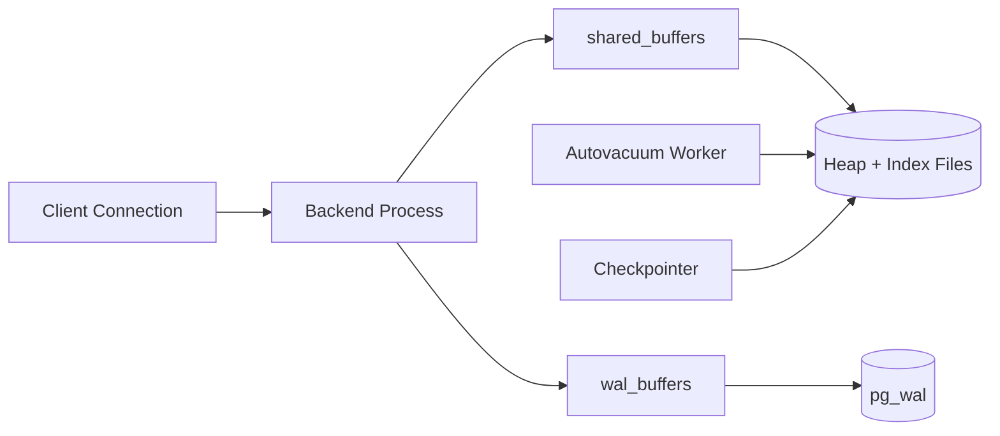

# PostgreSQL Deep Dive: Internals, Indexing, and Scale Patterns

## 1. Process and Memory Architecture

PostgreSQL uses a process-per-connection model:

- **postmaster** supervises lifecycle.
- **backend processes** handle client sessions.
- **background workers**: checkpointer, writer, walwriter, autovacuum launcher/workers, archiver.

Core shared memory regions:

- `shared_buffers`: page cache inside PostgreSQL.
- `wal_buffers`: WAL staging before fsync.
- lock and proc arrays for concurrency control.

---

## 2. MVCC Internals

Each tuple version carries metadata:

- `xmin`: creating transaction id
- `xmax`: deleting/updating transaction id
- visibility depends on snapshot xid horizons

Readers do not block writers under MVCC snapshot rules; readers choose visible tuple versions.

#### In-Line Glossary: MVCC

**What it is:** Multi-Version Concurrency Control stores multiple row versions so readers access a consistent snapshot without waiting on writers.  
**Why here:** Enables high read concurrency and reduced lock blocking in mixed workloads.  
**Systemic impact:** Version churn creates dead tuples; maintenance (VACUUM) is mandatory for space and planner health.

### 2.1 HOT Updates

Heap-Only Tuple (HOT) updates can avoid index rewrites if indexed columns remain unchanged, lowering write amplification.

### 2.2 Freeze and Transaction ID Wraparound

Transaction IDs are finite; old tuples must be frozen before wraparound horizon.

Operational risk:

- Neglected vacuum can trigger anti-wraparound emergency behavior and severe throughput degradation.

---

## 3. VACUUM Mechanics

Autovacuum process:

1. Identifies tables with dead tuples/statistics thresholds exceeded.
2. Reclaims visibility map bits and dead row space reuse.
3. Updates planner stats (often via autoanalyze).
4. Performs freeze operations for old tuples.

Key tuning dimensions:

- `autovacuum_vacuum_scale_factor`
- `autovacuum_analyze_scale_factor`
- `autovacuum_vacuum_cost_limit` / delay
- per-table overrides for hot partitions

Failure mode:

- Aggressive write workloads without tuned autovacuum cause table/index bloat and query regression.

---

## 4. Indexing Internals and Selection Criteria

## 4.1 B-Tree

Default general-purpose index with balanced tree pages and logarithmic lookup.

Best for:

- Equality, range predicates, ordered scans, unique constraints.

## 4.2 GIN

Inverted index for composite values (arrays, JSONB, full-text tokens).

Trade-off:

- Fast containment membership queries; heavier write/update cost due to posting list maintenance.

## 4.3 GiST

Generalized Search Tree for extensible operator classes (geometric, range, nearest-neighbor).

Best for:

- Spatial/range similarity and non-total-order domains.

## 4.4 BRIN

Block Range Index stores summary metadata per block range.

Best for:

- Very large append-heavy tables with naturally correlated ordering (for example, timestamp).

## 4.5 Hash Index

Hash-based equality lookup; generally less versatile than B-Tree and less commonly preferred in modern PostgreSQL.

---

## 5. JSONB and Hybrid Workloads

JSONB enables semi-structured data with relational controls:

- binary parsed representation
- operators for path queries
- GIN indexing for containment/search

Design guidance:

- Keep stable, highly filtered attributes as typed columns.
- Use JSONB for optional/extensible fields.
- Avoid unbounded nested documents for high-selectivity joins.

---

## 6. FDW, Extensions, and Ecosystem Leverage

### FDW (Foreign Data Wrapper)

Allows query federation to external systems with planner pushdown constraints.

Use cases:

- controlled cross-system joins for migration or data virtualization.

Limits:

- Remote latency and partial pushdown can create misleading query plans.

### Extensions

Key examples:

- `pg_stat_statements` for workload profiling
- `postgis` for GIS
- `timescaledb` for time-series

---

## 7. Partitioning and Sharding

Native partitioning strategies:

- Range partitioning (time windows)
- List partitioning (tenant, region)
- Hash partitioning (distribution evenness)

Benefits:

- Partition pruning reduces scanned data.
- Maintenance isolation (vacuum/reindex by partition).

When to shard:

- Single-node write throughput, storage, or maintenance windows become non-viable.
- Requires cross-shard routing, rebalancing strategy, and global ID semantics.

---

## 8. Performance and Reliability Playbook

1. Baseline with `pg_stat_statements` and wait event analysis.
2. Fix schema/index and query plans before hardware scaling.
3. Cap connection fan-out via pooling (`pgBouncer`).
4. Tune checkpoint/WAL and autovacuum for workload profile.
5. Define replication lag SLO and read-routing policies.

#### In-Line Glossary: Checkpoint

**What it is:** Controlled flushing process that ensures dirty pages are persisted so crash recovery redo window remains bounded.  
**Why here:** Balances recovery time, write burst behavior, and background IO pressure.  
**Systemic impact:** Poor checkpoint tuning causes latency spikes and WAL pressure.
