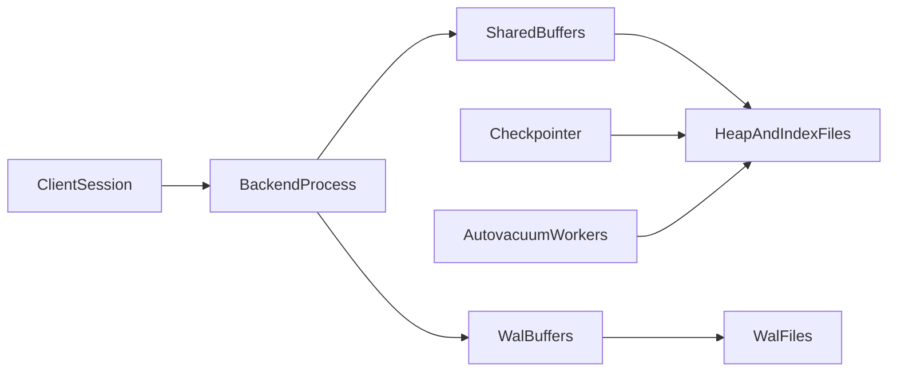
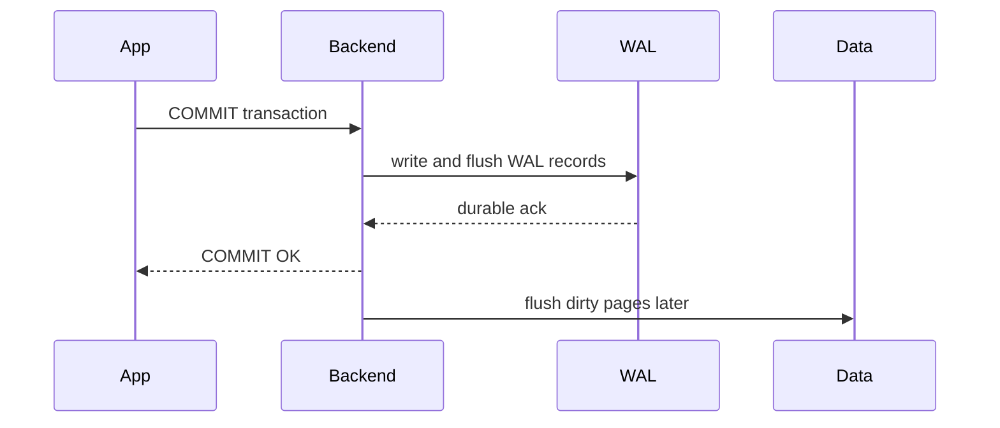

# PostgreSQL Deep Dive: Process Model, MVCC Internals, Indexing Physics, and Scale Patterns

## 1. Why PostgreSQL Still Matters in Modern Architectures

PostgreSQL remains strategically relevant because it combines strict transactional semantics, mature query planning, and extensibility in one engine. For senior architects, the value is not only SQL capability; it is predictable correctness under pressure, rich introspection, and the ability to encode complex invariants close to data.

---

## 2. Process and Memory Architecture

PostgreSQL uses a process-per-connection model. Each client session is handled by a dedicated OS process rather than a shared thread pool inside the database binary, which strengthens isolation and fault containment while increasing per-connection memory and scheduling cost.

The `postmaster` is the parent supervisor: it starts auxiliary processes, accepts new connections, and manages process lifecycle when backends crash or shut down. Each `backend process` owns one client connection and executes that session’s queries against shared memory and on-disk structures. The `checkpointer` coordinates durable page flushing so that recovery has a known consistent point. The `background writer` continuously writes dirty pages in the background to smooth IO spikes that would otherwise appear only at checkpoint time. The `walwriter` drains WAL buffers to durable log files so commit latency and crash recovery stay aligned with durability policy. The `autovacuum launcher` and its workers reclaim dead tuples, freeze old transaction metadata, and refresh planner statistics so MVCC cleanup does not fall indefinitely behind write traffic.

Memory is split between shared and per-backend domains. `shared_buffers` is PostgreSQL’s internal page cache for heap and index pages. `wal_buffers` stages WAL records before they are written to durable log files. Lock and process arrays live in shared memory so backends can coordinate concurrency. Each backend also has local working memory (`work_mem` and related temp allocations) used for sorts, hashes, and other query-local structures that must not inflate the shared cache unbounded.

#### In-Line Glossary: Process-per-Connection

**What it is:** each active session maps to a dedicated OS process.  
**Why here:** isolation and fault containment are strong, but process overhead affects high-connection workloads.  
**Systemic implication:** connection pooling is mandatory at scale to avoid context-switch and memory pressure.

---

## 3. MVCC Internal Lifecycle

Each row version carries transactional metadata that drives visibility. `xmin` records the transaction ID that created the version, and `xmax` records the transaction ID that deleted or superseded it. A reader’s snapshot defines which versions are visible for that statement or transaction, which allows readers to avoid waiting on most writers even while updates create new versions.

### 3.1 Write Path with MVCC

When a transaction updates a row, PostgreSQL writes a new tuple version rather than overwriting the live row in place. The old tuple remains until vacuum cleanup can prove no snapshot still needs it. Index pointers are updated when the indexed key changes or when a non-HOT update forces new index entries.

This design reduces reader/writer blocking because concurrent readers can still see a snapshot-consistent prior version. The cost is dead tuple accumulation: if vacuum lags, tables and indexes bloat, planner estimates drift, and both sequential and index scans pay more IO for the same logical data set.

### 3.2 HOT Updates

Heap-only tuple (HOT) updates avoid index churn when indexed columns do not change. The new version stays on the same heap page and can be reached through the existing index entry via a heap chain. The impact is lower write amplification and slower growth of index bloat on hot update paths where only non-indexed columns change.

### 3.3 Freeze and Wraparound Safety

Transaction ID space is finite. Old tuple metadata must be frozen before wraparound horizons so visibility checks remain unambiguous after XIDs recycle. If autovacuum falls behind severely, anti-wraparound emergency vacuum can seize resources and disrupt throughput until freeze work catches up—making proactive vacuum health a capacity and availability concern, not only a storage concern.

#### In-Line Glossary: Visibility Map

**What it is:** metadata bitmap indicating pages with all-visible/all-frozen tuples.  
**Why here:** it allows index-only scans and reduces vacuum work.  
**Systemic implication:** healthy visibility map state improves read performance and maintenance efficiency.

---

## 4. WAL, Checkpoints, and Crash Recovery

PostgreSQL durability follows WAL-first discipline. Changes are logged in WAL before the corresponding data pages are required to be durable. Commit success depends on the configured WAL durability policy (for example, whether the commit record must hit disk). Data page flush can occur later under checkpoint and background-writer control.

Checkpoint frequency is an explicit trade-off. Frequent checkpoints shrink the crash-replay window and therefore recovery time, but they increase write pressure as dirty pages are forced out more often. Infrequent checkpoints reduce immediate write amplification and checkpoint spikes, but they enlarge the volume of WAL that must be replayed after a crash.

---

## 5. Indexing Internals and Selection

### 5.1 B-Tree

B-tree is the general-purpose, balanced default. Use it for equality and range predicates, for ORDER BY support that can avoid explicit sorts, and for unique constraints that need both enforcement and lookup efficiency. It is usually the first correct choice unless the access pattern clearly matches a specialized index type.

### 5.2 GIN

GIN is an inverted index for composite or containment-heavy data such as JSONB arrays and full-text tokens. Membership and containment reads are typically fast because posting lists map values to matching rows. The trade-off is heavier writes and maintenance: each insert or update may touch many posting list entries, so write-heavy workloads with large GIN indexes need explicit capacity planning.

### 5.3 GiST

GiST is an extensible tree framework for geometric, range, and proximity operator classes. It is the right tool when predicates are not well expressed as simple scalar equality or contiguous ranges on a single ordered key, and when operator classes already exist for the domain.

### 5.4 BRIN

BRIN stores block-range summaries rather than per-row keys. It fits very large, naturally ordered tables (for example, time-series append patterns) where pages contain correlated values. The benefit is tiny index size and low maintenance; the cost is that disordered data or poorly correlated columns make summaries unselective and scans expensive.

### 5.5 Hash

Hash indexes serve niche equality lookups. They are usually less flexible than B-tree because they do not support range scans or ordering, so B-tree remains preferred unless a measured equality-only workload and operational constraints justify hash.

#### In-Line Glossary: Index Write Amplification

**What it is:** additional IO/CPU cost on writes caused by maintaining index structures.  
**Why here:** every extra index taxes insert/update performance.  
**Systemic implication:** index count and design should be justified by measured query benefits.

---

## 6. JSONB and Hybrid Modeling

JSONB enables semi-structured fields while retaining a relational backbone. The practical pattern is to keep stable, high-selectivity fields as typed columns for joins, constraints, and planner-friendly predicates; put variable or sparse attributes in JSONB; and add GIN only where containment or search-heavy predicates dominate. The anti-pattern is burying core relational join keys deep inside JSONB and then expecting the same ergonomics and performance as first-class columns.

---

## 7. Partitioning, Replication, and Sharding

### 7.1 Native Partitioning

Range partitions fit time windows and retention policies by isolating old and new data. List partitions fit tenant or region keys where discrete values define clear ownership boundaries. Hash partitions spread load when there is no natural ordered key but even distribution across children matters.

Partitioning pays off through partition pruning (queries touch fewer children) and maintenance isolation (vacuum, reindex, or detach can target a subset of data). Poor key choice or overly fine partitions reverse those gains by multiplying planning overhead and empty or tiny segments.

### 7.2 Replication

Physical streaming replicas provide read scaling and failover with a nearly identical on-disk state. Logical replication supports selective publication of tables or subsets and is often used for migrations, fan-out, or heterogeneous targets. Choice of mode should follow whether you need byte-level standby fidelity or table-level flexibility.

### 7.3 Sharding Decision Point

When single-node constraints dominate—write throughput ceilings, maintenance windows that cannot finish, or storage growth that outpaces vertical options—external sharding or distributed Postgres variants become relevant. That step changes operational model and cross-shard transaction semantics, so it should follow measured single-node limits rather than premature scale-out fashion.

---

## 8. Contention and Performance Diagnostics

Critical observability starts with `pg_stat_statements` for query frequency and cumulative cost, wait-event sampling for lock and IO bottlenecks, autovacuum lag and dead-tuple growth for MVCC health, and replica lag plus replay delay for read-routing safety. Together these surfaces separate “CPU is busy” from “cleanup, locking, or durability is the real constraint.”

The performance approach is ordered: fix schema and query plan path first; then reduce lock scope and transaction duration; then optimize indexes and maintenance; only after model-level fixes scale compute and storage. Scaling hardware on a bloated or lock-heavy design usually buys temporary relief and a larger bill.

---

## 9. Architect Guidance

Use PostgreSQL when strong local invariants are central to the product, when SQL expressiveness and the extension ecosystem materially reduce application complexity, and when the operational team can tune vacuum, checkpoint, and index behavior as first-class capacity work.

Be cautious when the workload demands extreme geo-distributed write availability with strict consistency and low latency at once, or when the team lacks operational maturity for large-scale Postgres maintenance discipline. In those cases, engine strengths can be outweighed by topology and process gaps.

---

## 10. External References

- [PostgreSQL Documentation](https://www.postgresql.org/docs/current/)
- [MVCC in PostgreSQL](https://www.postgresql.org/docs/current/mvcc.html)
