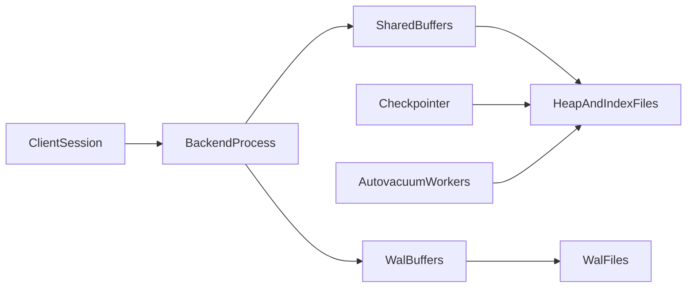
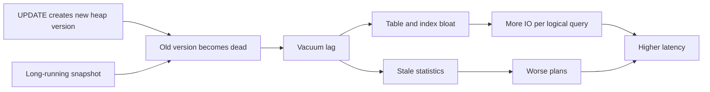
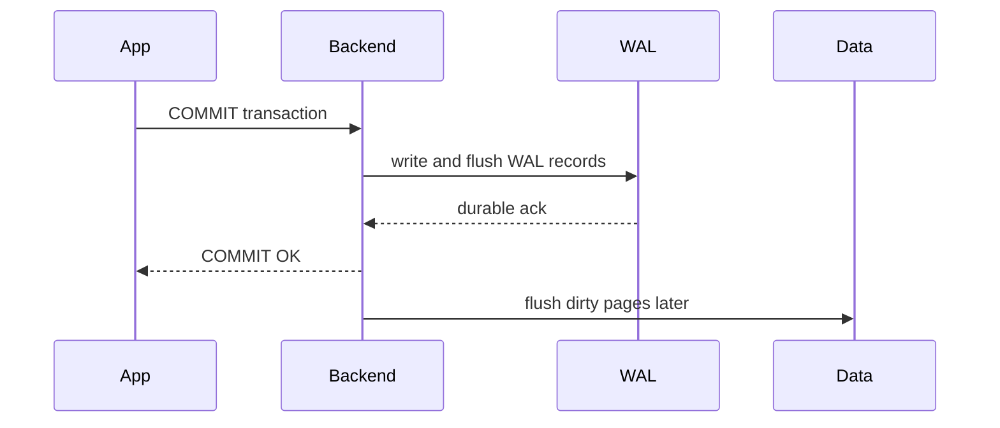

# PostgreSQL Deep Dive: Process Model, MVCC Internals, Indexing Physics, and Scale Patterns

## 1. Why PostgreSQL Still Matters in Modern Architectures

PostgreSQL remains strategically relevant because it combines strict transactional semantics, mature query planning, and extensibility in one engine. For senior architects, the value is not only SQL capability; it is predictable correctness under pressure, rich introspection, and the ability to encode complex invariants close to data.

This chapter teaches PostgreSQL’s internal mechanisms as operable physics. The comparative failure-mode view against MySQL/InnoDB lives in [PostgreSQL vs MySQL Comparison](./03-postgres-vs-mysql-comparison.md); this document owns the PostgreSQL-side mechanism depth.

---

## 2. Process and Memory Architecture

PostgreSQL uses a process-per-connection model. Each client session is handled by a dedicated OS process rather than a shared thread pool inside the database binary, which strengthens isolation and fault containment while increasing per-connection memory and scheduling cost.

The `postmaster` is the parent supervisor: it starts auxiliary processes, accepts new connections, and manages process lifecycle when backends crash or shut down. Each `backend process` owns one client connection and executes that session’s queries against shared memory and on-disk structures. The `checkpointer` coordinates durable page flushing so that recovery has a known consistent point. The `background writer` continuously writes dirty pages in the background to smooth IO spikes that would otherwise appear only at checkpoint time. The `walwriter` drains WAL buffers to durable log files so commit latency and crash recovery stay aligned with durability policy. The `autovacuum launcher` and its workers reclaim dead tuples, freeze old transaction metadata, and refresh planner statistics so MVCC cleanup does not fall indefinitely behind write traffic.

Memory is split between shared and per-backend domains. `shared_buffers` is PostgreSQL’s internal page cache for heap and index pages. `wal_buffers` stages WAL records before they are written to durable log files. Lock and process arrays live in shared memory so backends can coordinate concurrency. Each backend also has local working memory (`work_mem` and related temp allocations) used for sorts, hashes, and other query-local structures that must not inflate the shared cache unbounded.

#### In-Line Glossary: Process-per-Connection

**What it is:** each active session maps to a dedicated OS process.

**Why here:** isolation and fault containment are strong, but process overhead affects high-connection workloads.

**Systemic implication:** connection pooling is mandatory at scale to avoid context-switch and memory pressure.

---

## 3. MVCC Internal Lifecycle

Multi-version concurrency control (MVCC) lets readers see a consistent snapshot without blocking every writer, and lets writers proceed without waiting for every reader. PostgreSQL implements MVCC by keeping multiple physical versions of a row in the table heap until cleanup proves they are no longer needed.

Each row version carries transactional metadata that drives visibility. `xmin` records the transaction ID that created the version, and `xmax` records the transaction ID that deleted or superseded it. A reader’s **snapshot** is the set of rules that decides which versions are visible for that statement or transaction. Because readers can use older versions, they avoid waiting on most writers even while updates create new versions.

### 3.1 Write Path with MVCC

When a transaction updates a row, PostgreSQL writes a new tuple version rather than overwriting the live row in place. The old tuple remains until vacuum cleanup can prove no snapshot still needs it. Index pointers are updated when the indexed key changes or when a non-HOT update forces new index entries.

This design reduces reader/writer blocking because concurrent readers can still see a snapshot-consistent prior version. The cost is **dead tuple accumulation**: versions that are invisible to new transactions but still occupy heap and often index space until vacuum reclaims them.

**Vacuum** is the cleanup process that removes versions no longer needed by any snapshot and marks space reusable. **Autovacuum** is the automatic scheduler that launches vacuum workers based on dead-tuple thresholds and freeze needs. **Vacuum lag** means vacuum is not reclaiming dead versions as fast as writers create them, or that open snapshots prevent reclaim even when workers are running. Lag is a race among write rate, transaction age, and vacuum capacity.

When vacuum lags, **table bloat** and **index bloat** follow. Bloat means the on-disk structure contains many dead or sparsely useful pages relative to live rows. Scans visit more pages for the same logical result. Cache hit rates fall because the working set of pages is larger than the live data set. **Planner estimate drift** compounds the damage: when `ANALYZE` and vacuum lag, catalog statistics describe an older table shape, so the planner may choose nested loops, join orders, or scan types that were cheap yesterday and are disastrous today.

**Use case.** An e-commerce `orders` table receives continuous status updates (`pending → paid → packed → shipped`). Each update creates a new heap version. During a flash sale, update rate jumps from hundreds to thousands of rows per second. One analytics session holds an open transaction for forty minutes. Dead versions cannot be removed past that snapshot horizon. Disk grows, `n_dead_tup` rises, p95 latency climbs, and CPU may still look available because the bottleneck is page IO amplification and poor plans, not arithmetic saturation.

Cross-engine contrast and additional write-path examples are in [PostgreSQL vs MySQL Comparison §4.1](./03-postgres-vs-mysql-comparison.md#41-write-heavy-workloads).

#### In-Line Glossary: Vacuum Lag

**What it is:** a sustained condition where PostgreSQL creates dead tuple versions faster than vacuum can safely reclaim them, or where open snapshots prevent reclaim even when workers are running.

**Why here:** it is the dominant write-path failure mode for PostgreSQL under sustained mutation.

**Systemic implication:** treat autovacuum health, transaction age, and bloat metrics as capacity signals equal in importance to CPU and QPS.

### 3.2 HOT Updates

**Heap-only tuple (HOT) updates** are a PostgreSQL optimization for updates that do not change indexed columns. The new version can stay on the same heap page and remain reachable through the existing index entry via a heap chain, which avoids creating new index entries for that update.

HOT reduces **index write amplification**—the extra IO and CPU caused by maintaining index structures on every write—and slows growth of index bloat on hot update paths. It does **not** remove the need to vacuum dead heap versions. If indexed columns change, or if the new version cannot fit on the same page, the update is non-HOT and pays full index maintenance.

**Use case.** A `users` table is updated thousands of times per second to refresh `last_seen_at`, while indexes exist only on `user_id` and `email`. Those updates can often be HOT, keeping index churn low. If the team also indexes `last_seen_at` “just in case,” every heartbeat update becomes a non-HOT index-maintaining write, accelerating index bloat and WAL volume without a measured query benefit.

### 3.3 Freeze and Wraparound Safety

PostgreSQL transaction IDs (XIDs) are finite. Visibility comparisons depend on XID ordering. Over a long enough life, XIDs must recycle. Before that recycle point, old tuple metadata must be **frozen**: marked so visibility checks remain unambiguous after IDs wrap.

**Wraparound** is the condition where XID space approaches exhaustion relative to unfrozen tuples. If freeze work falls far behind, PostgreSQL can enter **anti-wraparound emergency vacuum**: aggressive cleanup that protects correctness by seizing substantial IO and CPU until freeze debt is cleared. That path is availability-threatening even when the product query set is otherwise healthy.

**Use case.** A large append-mostly events table grows for months with autovacuum tuned too passively and with long-lived logical decoding slots holding an old horizon. Freeze debt accumulates quietly. One night, anti-wraparound vacuum starts on the largest relation, storage latency spikes, and OLTP p99 collapses until freeze progress catches up. The incident is not “sudden corruption”; it is deferred maintenance becoming mandatory.

**Logical decoding slots** retain a consumer bookmark for PostgreSQL’s logical change stream. While a slot exists and lags, vacuum cannot remove tuple versions still required to decode that history. Forgotten or stalled slots are a common vacuum-lag cause that looks mysterious if operators only watch interactive query sessions.

#### In-Line Glossary: Visibility Map

**What it is:** a metadata bitmap indicating which heap pages contain only all-visible or all-frozen tuples.

**Why here:** it lets vacuum skip already-clean pages and enables index-only scans when heap fetches are unnecessary.

**Systemic implication:** healthy visibility-map state improves both read performance and vacuum efficiency; chronic vacuum lag keeps the map stale and raises scan cost.

---

## 4. WAL, Checkpoints, and Crash Recovery

PostgreSQL durability follows **WAL-first** discipline. The write-ahead log (WAL) is an append-only durability journal: changes are logged in WAL before the corresponding data pages are required to be durable. Commit success depends on the configured WAL durability policy (for example, whether the commit record must hit disk). Data page flush can occur later under checkpoint and background-writer control.

**Write amplification** in this path means one logical change produces multiple physical writes: WAL records now, dirty page flushes later, and additional index/heap maintenance for the same business update. Indexes multiply the tax because each maintained index adds WAL and page dirtiness.

A **checkpoint** is a recorded point from which crash recovery can start with a bounded amount of WAL replay. Frequent checkpoints shrink the crash-replay window and therefore recovery time, but they increase write pressure as dirty pages are forced out more often. Infrequent checkpoints reduce immediate write amplification and checkpoint spikes, but they enlarge the volume of WAL that must be replayed after a crash.

**Use case.** An operator lengthens checkpoint intervals to “make writes faster” during a load test. Short-window throughput rises, but after a crash during peak traffic the replica or restarted primary must replay a much larger WAL segment set, extending recovery beyond the outage SLO. Checkpoint policy is therefore a latency-versus-recovery-time trade-off, not a free performance knob.

#### In-Line Glossary: Checkpoint Spike

**What it is:** a burst of dirty-page write IO concentrated around checkpoint time when background flushing did not smooth the debt earlier.

**Why here:** spikes compete with foreground reads and writes for disk bandwidth and raise p99 latency.

**Systemic implication:** tune checkpoint and background-writer behavior against measured IO, not only against average QPS.

---

## 5. Indexing Internals and Selection

### 5.1 B-Tree

B-tree is the general-purpose, balanced default. Use it for equality and range predicates, for ORDER BY support that can avoid explicit sorts, and for unique constraints that need both enforcement and lookup efficiency. It is usually the first correct choice unless the access pattern clearly matches a specialized index type.

### 5.2 GIN

GIN (generalized inverted index) is an inverted index for composite or containment-heavy data such as JSONB arrays and full-text tokens. Membership and containment reads are typically fast because posting lists map values to matching rows. The trade-off is heavier writes and maintenance: each insert or update may touch many posting list entries, so write-heavy workloads with large GIN indexes need explicit capacity planning.

### 5.3 GiST

GiST (generalized search tree) is an extensible tree framework for geometric, range, and proximity operator classes. It is the right tool when predicates are not well expressed as simple scalar equality or contiguous ranges on a single ordered key, and when operator classes already exist for the domain.

### 5.4 BRIN

BRIN (block range index) stores block-range summaries rather than per-row keys. It fits very large, naturally ordered tables (for example, time-series append patterns) where pages contain correlated values. The benefit is tiny index size and low maintenance; the cost is that disordered data or poorly correlated columns make summaries unselective and scans expensive.

### 5.5 Hash

Hash indexes serve niche equality lookups. They are usually less flexible than B-tree because they do not support range scans or ordering, so B-tree remains preferred unless a measured equality-only workload and operational constraints justify hash.

#### In-Line Glossary: Index Write Amplification

**What it is:** additional IO/CPU cost on writes caused by maintaining index structures.

**Why here:** every extra index taxes insert/update performance.

**Systemic implication:** index count and design should be justified by measured query benefits.

---

## 6. JSONB and Hybrid Modeling

JSONB enables semi-structured fields while retaining a relational backbone. The practical pattern is to keep stable, high-selectivity fields as typed columns for joins, constraints, and planner-friendly predicates; put variable or sparse attributes in JSONB; and add GIN only where containment or search-heavy predicates dominate. The anti-pattern is burying core relational join keys deep inside JSONB and then expecting the same ergonomics and performance as first-class columns.

---

## 7. Partitioning, Replication, and Sharding

### 7.1 Native Partitioning

Range partitions fit time windows and retention policies by isolating old and new data. List partitions fit tenant or region keys where discrete values define clear ownership boundaries. Hash partitions spread load when there is no natural ordered key but even distribution across children matters.

Partitioning pays off through **partition pruning** (the planner excludes irrelevant child tables so queries touch fewer children) and maintenance isolation (vacuum, reindex, or detach can target a subset of data). Poor key choice or overly fine partitions reverse those gains by multiplying planning overhead and empty or tiny segments.

### 7.2 Replication

Physical streaming replicas provide read scaling and failover with a nearly identical on-disk state. Logical replication supports selective publication of tables or subsets and is often used for migrations, fan-out, or heterogeneous targets. Choice of mode should follow whether you need byte-level standby fidelity or table-level flexibility.

**Replication lag** is the delay between a primary commit and the replica applying that commit. Read-your-writes paths must not silently route to lagged replicas without an explicit stale-read policy.

### 7.3 Sharding Decision Point

When single-node constraints dominate—write throughput ceilings, maintenance windows that cannot finish, or storage growth that outpaces vertical options—external sharding or distributed Postgres variants become relevant. That step changes operational model and cross-shard transaction semantics, so it should follow measured single-node limits rather than premature scale-out fashion. See [Sharding, Data Partitioning, and Horizontal Database Scale](../01-theory-and-foundations/05-sharding-data-partitioning-and-horizontal-scale.md).

---

## 8. Contention and Performance Diagnostics

Critical observability starts with surfaces that separate “CPU is busy” from “cleanup, locking, or durability is the real constraint.”

`pg_stat_statements` shows query frequency and cumulative cost so hot statements are visible before hardware is blamed. Wait-event sampling shows whether backends spend time on locks, IO, or CPU. Autovacuum lag and dead-tuple growth (`n_dead_tup`, vacuum runtime, transaction age / `xact_start`) show MVCC health: rising dead tuples with aging snapshots is vacuum lag forming, not a mysterious latency ghost. Replica lag and replay delay govern whether read routing remains within SLO.

**What operators should do when vacuum lag appears.** Shorten or eliminate long transactions and idle-in-transaction sessions. Inspect logical decoding slots for retained horizons. Ensure autovacuum is not starved by too few workers or thresholds that never fire on large tables. Reduce unnecessary indexes that multiply update cost. Measure bloat and plan regressions before scaling CPU.

The performance approach is ordered: fix schema and query plan path first; then reduce lock scope and transaction duration; then optimize indexes and maintenance; only after model-level fixes scale compute and storage. Scaling hardware on a bloated or lock-heavy design usually buys temporary relief and a larger bill.

---

## 9. Architect Guidance

Use PostgreSQL when strong local invariants are central to the product, when SQL expressiveness and the extension ecosystem materially reduce application complexity, and when the operational team can tune vacuum, checkpoint, and index behavior as first-class capacity work.

Be cautious when the workload demands extreme geo-distributed write availability with strict consistency and low latency at once, or when the team lacks operational maturity for large-scale Postgres maintenance discipline. In those cases, engine strengths can be outweighed by topology and process gaps.

---

## 10. External References

- [PostgreSQL Documentation](https://www.postgresql.org/docs/current/)
- [MVCC in PostgreSQL](https://www.postgresql.org/docs/current/mvcc.html)
- [Routine Vacuuming](https://www.postgresql.org/docs/current/routine-vacuuming.html)
- [PostgreSQL vs MySQL Comparison](./03-postgres-vs-mysql-comparison.md)
