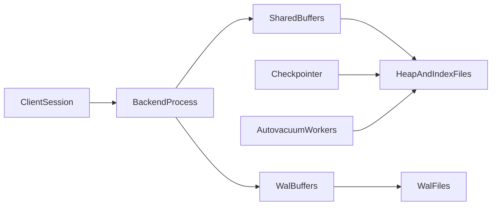
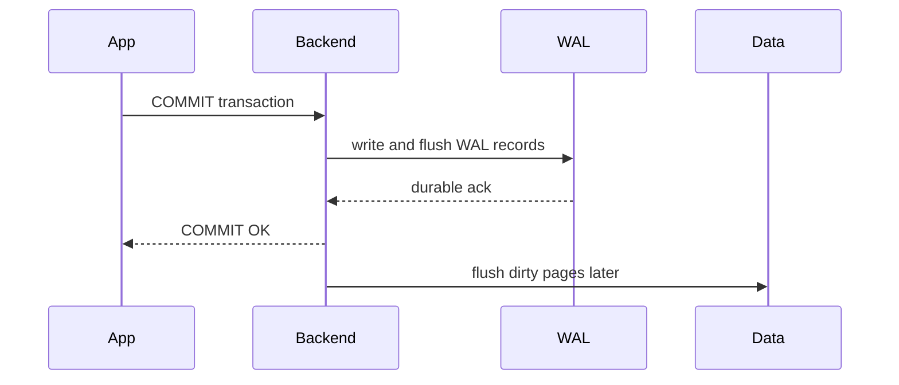

# PostgreSQL Deep Dive: Process Model, MVCC Internals, Indexing Physics, and Scale Patterns

## 1. Why PostgreSQL Still Matters in Modern Architectures

PostgreSQL remains strategically relevant because it combines strict transactional semantics, mature query planning, and extensibility in one engine. For senior architects, the value is not only SQL capability; it is predictable correctness under pressure, rich introspection, and the ability to encode complex invariants close to data.

---

## 2. Process and Memory Architecture

PostgreSQL uses a process-per-connection model.

Core process roles:

- `postmaster`: parent supervisor and process lifecycle manager
- `backend process`: handles one client connection/session
- `checkpointer`: coordinates durable page flushing
- `background writer`: smooths dirty page write pressure
- `walwriter`: writes WAL buffers to durable log
- `autovacuum launcher/workers`: cleanup, freeze, stats refresh

Memory domains:

- `shared_buffers`: PostgreSQL internal page cache
- `wal_buffers`: transient WAL staging
- lock/proc shared memory structures
- per-backend local memory (`work_mem`, temp memory)

#### In-Line Glossary: Process-per-Connection

**What it is:** each active session maps to a dedicated OS process.  
**Why here:** isolation and fault containment are strong, but process overhead affects high-connection workloads.  
**Systemic implication:** connection pooling is mandatory at scale to avoid context-switch and memory pressure.

---

## 3. MVCC Internal Lifecycle

Each row version tracks transactional metadata:

- `xmin`: creating transaction ID
- `xmax`: deleting/updating transaction ID

A reader’s snapshot defines which versions are visible. This allows readers to avoid waiting on most writers.

### 3.1 Write Path with MVCC

1. transaction updates row
2. new tuple version written
3. old tuple remains until vacuum cleanup
4. index pointers updated when needed

Benefits:

- reduced reader/writer blocking

Costs:

- dead tuple accumulation
- table/index bloat if cleanup lags

### 3.2 HOT Updates

Heap-only tuple updates avoid index churn when indexed columns do not change.

Impact:

- lower write amplification
- lower index bloat growth

### 3.3 Freeze and Wraparound Safety

Transaction ID space is finite. Old tuple metadata must be frozen before wraparound horizons.

Operational failure mode:

- if autovacuum falls behind severely, anti-wraparound emergency vacuum can disrupt throughput.

#### In-Line Glossary: Visibility Map

**What it is:** metadata bitmap indicating pages with all-visible/all-frozen tuples.  
**Why here:** it allows index-only scans and reduces vacuum work.  
**Systemic implication:** healthy visibility map state improves read performance and maintenance efficiency.

---

## 4. WAL, Checkpoints, and Crash Recovery

PostgreSQL durability follows WAL-first discipline:

1. changes are logged in WAL
2. commit success depends on WAL durability policy
3. data page flush can occur later

Checkpoint trade-off:

- frequent checkpoints reduce recovery time but increase write pressure
- infrequent checkpoints reduce immediate pressure but enlarge crash-replay window

---

## 5. Indexing Internals and Selection

### 5.1 B-Tree

General-purpose, balanced tree.

Use for:

- equality and range queries
- ORDER BY support
- unique constraints

### 5.2 GIN

Inverted index for composite/containment-heavy data (JSONB arrays, full-text tokens).

Trade-off:

- fast membership/containment reads
- heavier writes and maintenance

### 5.3 GiST

Extensible tree for geometric/range/proximity operator classes.

### 5.4 BRIN

Block-range summaries for very large, naturally ordered tables.

### 5.5 Hash

Niche equality use. Usually less flexible than B-tree.

#### In-Line Glossary: Index Write Amplification

**What it is:** additional IO/CPU cost on writes caused by maintaining index structures.  
**Why here:** every extra index taxes insert/update performance.  
**Systemic implication:** index count and design should be justified by measured query benefits.

---

## 6. JSONB and Hybrid Modeling

JSONB enables semi-structured fields while retaining relational backbone.

Practical pattern:

- stable, high-selectivity fields as typed columns
- variable attributes in JSONB
- GIN for containment/search-heavy predicates

Anti-pattern:

- putting core relational join keys deep in JSONB and expecting relational query ergonomics

---

## 7. Partitioning, Replication, and Sharding

### 7.1 Native Partitioning

- range partitions for time windows
- list partitions for tenant/region
- hash partitions for even spread

Benefits:

- partition pruning
- maintenance isolation

### 7.2 Replication

- physical streaming replicas for read scaling/failover
- logical replication for selective replication/migrations

### 7.3 Sharding Decision Point

When single-node constraints dominate (write throughput, maintenance window, storage), external sharding/distributed Postgres variants become relevant.

---

## 8. Contention and Performance Diagnostics

Critical observability surfaces:

- `pg_stat_statements` for query frequency and cost
- wait events for lock/io bottlenecks
- autovacuum lag and dead tuple growth
- replica lag and replay delay

Performance approach:

1. fix schema and query plan path
2. reduce lock scope and transaction duration
3. optimize indexes and maintenance
4. scale compute/storage after model-level fixes

---

## 9. Architect Guidance

Use PostgreSQL when:

- strong local invariants are central
- SQL expressiveness and ecosystem matter
- operational team can tune vacuum/checkpoint/index behavior

Be cautious when:

- workload needs extreme geo-distributed write availability with strict consistency and low latency simultaneously
- team lacks operational maturity for large-scale Postgres maintenance discipline

---

## 10. External References

- [PostgreSQL Documentation](https://www.postgresql.org/docs/current/)
- [MVCC in PostgreSQL](https://www.postgresql.org/docs/current/mvcc.html)
