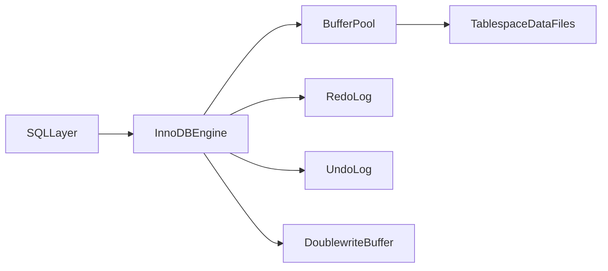
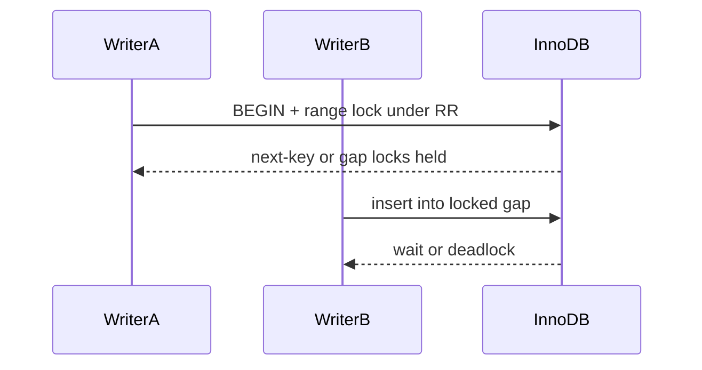
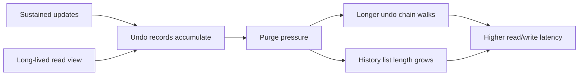
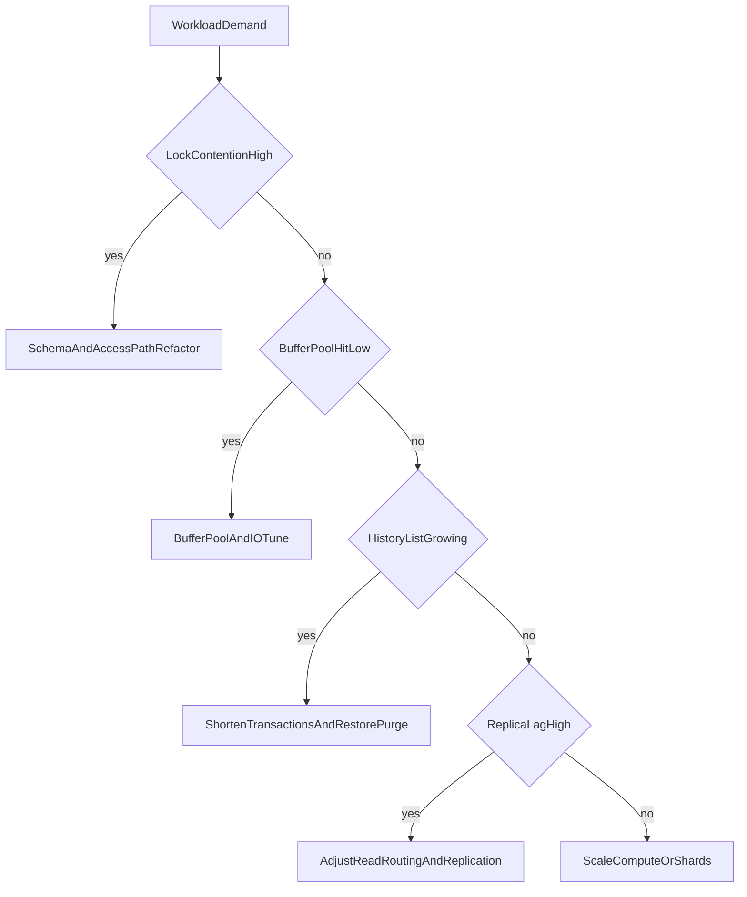

# MySQL InnoDB Architecture: Buffering, Locking, Replication, and Scale Trade-offs

## 1. Why InnoDB Is Architecturally Important

InnoDB is one of the most deployed OLTP engines in production. Senior-level understanding requires going beyond “it is fast” and explicitly modeling how buffer behavior, lock semantics, logging, and replication policy shape correctness and tail latency.

This chapter teaches InnoDB mechanisms as operable physics. The comparative failure-mode view against PostgreSQL lives in [PostgreSQL vs MySQL Comparison](./03-postgres-vs-mysql-comparison.md); this document owns the InnoDB-side mechanism depth.

---

## 2. InnoDB Internal Components

InnoDB is organized around a small set of tightly coupled subsystems. Each subsystem owns a distinct part of latency, durability, or concurrency behavior.

The **Buffer Pool** is the primary in-memory page cache for data and index pages. Working-set fit here dominates read latency and write-back behavior: if hot pages stay resident, reads avoid storage round-trips; if the pool is too small, misses and eviction churn raise p99.

The **Redo Log** is the durability and crash-recovery journal. Committed changes become recoverable once redo is durable according to flush policy. Commit latency is therefore tied to redo durability rules more than to immediate data-file writes.

The **Undo Log** supports MVCC visibility and rollback by retaining prior row images that snapshot readers and aborting transactions need. Unlike PostgreSQL’s heap versions, InnoDB keeps current rows in the clustered index and reconstructs older versions by walking undo.

The **Doublewrite Buffer** mitigates torn-page corruption by staging full pages before they land in tablespace files. A torn page is a partial write of a database page caused by a crash mid-write; recovery assumptions break if a page is half-new and half-old on disk.

The **Change Buffer** can defer secondary-index maintenance for pages not currently in memory, trading delayed work for lower immediate random IO on some write patterns. Deferred work still must be applied later, so it is a smoothing mechanism, not free maintenance.

The **Adaptive Hash Index (AHI)** opportunistically builds hash lookups over hot B-tree paths to shorten repeated equality access when the optimizer and runtime decide it is profitable. It can help stable hot-point workloads and can add overhead or contention when access patterns are unstable.

#### In-Line Glossary: Doublewrite Buffer

**What it is:** an intermediate write area that reduces torn-page risk during crashes by staging full pages before tablespace write.

**Why here:** partial page writes can break recovery assumptions.

**Systemic implication:** durability safety improves at some additional IO cost; treat doublewrite behavior as part of write-path capacity planning.

---

## 3. Read/Write Path Mechanics

### 3.1 Write Path

A modifying statement loads or updates the target page in the buffer pool, appends a redo record describing the change, and treats commit durability as governed by the configured flush policy. Dirty pages—pages modified in memory but not yet written back to tablespace files—are flushed later by background activity rather than necessarily at commit time.

That separation keeps commit latency tied to log durability while data-file write pressure is smoothed. The smoothing only works until backlog accumulates.

**Flush debt** is the backlog of dirty pages waiting to be written to disk. When writers dirty pages faster than background flush can write them, the pool fills with dirty pages and foreground activity eventually stalls waiting for free clean pages or forced flush.

**Checkpoint pressure** is the force that appears when recovery-bounding rules require dirty pages to be flushed so the redo stream can advance and crash recovery remains within a target window. Under pressure, InnoDB must flush more aggressively, competing with reads and writes for IO bandwidth and raising p99 latency even when CPU looks free.

**Use case.** A bursty order-ingest job keeps the buffer pool nearly full of dirty pages. Flush threads fall behind. Shortly after, user-facing product reads that previously hit memory begin to wait on page cleaning and disk writes. Throughput did not fail because SQL became “harder”; it failed because flush debt caught up with the write rate.

### 3.2 Read Path

A **buffer pool hit** returns the page with low latency because no storage round-trip is required. A **buffer pool miss** forces a storage read and page load into the pool, which can evict other pages and perturb the hot set. Tail latency therefore depends heavily on working-set fit relative to buffer pool size and on flush pressure that competes with reads for IO bandwidth.

**Use case.** A session service keeps active sessions in a well-sized buffer pool and serves primary-key lookups at stable low latency. After a marketing campaign expands the active user set beyond pool capacity, miss rate rises, disks compete with redo/flush traffic, and p99 climbs without any query-text change.

---

## 4. Locking Semantics and Anomaly Control

InnoDB locking is index-aware: locks attach to index records and gaps rather than only to abstract heap rows.

A **record lock** protects a specific existing index row. A **gap lock** protects the open interval between index records so another transaction cannot insert into that interval. A **next-key lock** combines a record lock with the adjacent gap, covering both the existing key and the space beside it.

These lock types exist to control **phantoms** under **repeatable read (RR)**, InnoDB’s default isolation level. An isolation level defines which concurrent effects a transaction may observe. A phantom is a new row that did not exist at the first read of a predicate range but would satisfy that same predicate on a later read in the same transaction. Range predicates therefore need interval protection, not only protection of rows that already exist at statement start.

The trade-off is concurrency. Stronger predicate protection increases contention in **hotspot key ranges**—small regions of an index that absorb disproportionate conflict. Skewed write patterns on narrow intervals often surface as lock waits and deadlocks rather than as pure CPU saturation.

**Use case: gap contention.** Two checkout workers concurrently reserve stock for popular SKUs under RR with `SELECT ... FOR UPDATE` on a warehouse/SKU predicate, then insert reservation rows into a secondary index interval. Session A’s gap or next-key protection can block Session B’s insert even when the exact primary-key rows do not conflict in the application’s mental model. Product symptoms are lock wait timeouts, deadlock victim errors, and latency spikes concentrated on popular items.

Additional side-by-side contrast with PostgreSQL vacuum debt is in [PostgreSQL vs MySQL Comparison §4.1](./03-postgres-vs-mysql-comparison.md#41-write-heavy-workloads).

#### In-Line Glossary: Next-Key Lock

**What it is:** a lock that protects both the targeted index record and the surrounding key gap.

**Why here:** range predicates need interval protection, not only row protection.

**Systemic implication:** phantom prevention can reduce write concurrency under skewed access; design indexes and predicates to shrink hot gaps and keep transactions short.

### 4.1 Deadlock Handling

A **deadlock** is a cycle of lock waits where no waiter can proceed. InnoDB detects lock cycles and aborts a victim transaction so the remaining waiters can proceed. Architects should design deterministic lock acquisition ordering across related tables, keep transactions short and bounded so lock hold time stays small, and apply application-level retry with idempotency so aborted victims can safely re-run without double effects.

---

## 5. MVCC via Undo Chains

Snapshot reads reconstruct visible versions by walking undo logs rather than by retaining multiple live heap versions the way PostgreSQL does. The current row lives in the clustered index; older images live in undo. A reader with an older **read view** (the snapshot definition used for visibility) walks the undo chain backward until it finds a version visible to that view.

**Purge** is InnoDB’s cleanup of undo records that no transaction needs anymore. **Purge pressure** means undo history is growing or purge cannot keep up. The usual cause is long-running transactions or long-running consistent reads that keep an old read view alive. While that view exists, purge cannot discard undo still required to reconstruct older versions.

**History list length** is the operational metric for how much undo history remains to purge. When it grows without bound, old read views or purge lag are usually the cause. Longer chains mean more CPU and IO for readers that must reconstruct old versions, more purge work, and eventually degraded performance on both reads and writes until history can catch up.

**Use case: purge pressure.** An OLTP primary processes thousands of order updates per second. A developer starts a transaction in a GUI client, runs a heavy read, then leaves for lunch without commit or rollback. Undo needed for that old read view accumulates for an hour. History list length rises. Purge threads work harder. Latency degrades even though business transactions are short. The analogous PostgreSQL hazard is the same long transaction holding back vacuum’s removable horizon; the debt location differs (undo versus heap bloat).

#### In-Line Glossary: Purge Pressure

**What it is:** sustained growth or slow reclaim of InnoDB undo history because old read views still need prior row images.

**Why here:** it is InnoDB’s cleanup-debt analogue to PostgreSQL vacuum lag.

**Systemic implication:** monitor history length and long transactions as capacity and correctness risks, not as minor housekeeping.

---

## 6. Replication and Binlog Trade-offs

### 6.1 Binlog Formats

The binary log (binlog) records changes for replication and point-in-time recovery. Statement-based logging is compact because it records SQL text, but non-deterministic functions and certain statement shapes create correctness risk on replicas. Row-based logging records deterministic data changes and is safer for many workloads, at the cost of higher binlog volume. Mixed mode switches automatically based on statement safety, aiming for compactness when statements are deterministic and row images when they are not.

### 6.2 Topology Modes

Async primary-replica topologies maximize primary throughput by not waiting for replica acknowledgment, accepting that lag and failover data loss windows are possible. **Semi-sync** improves durability confidence by requiring at least one replica to acknowledge receipt before commit completes under configured rules, at some primary latency cost. Group replication adds membership and certification for a more advanced failover and consistency posture than a simple async tree, with corresponding coordination cost.

#### In-Line Glossary: Replication Lag

**What it is:** delay between commit on primary and apply on replica.

**Why here:** stale-read behavior and failover data freshness depend on lag.

**Systemic implication:** read-routing policy must account for lag SLOs; read-your-writes paths need primary reads or lag-aware routing.

---

## 7. Group Replication and Vitess

### 7.1 Group Replication

Group Replication uses certification-based conflict control so members agree on which transactions can commit in a multi-primary or single-primary group. It also manages membership and failure detection so failed nodes can be expelled and the group can continue under quorum rules. Relative to plain async trees, this is a stronger availability model because failover and conflict handling are built into the protocol rather than bolted on externally. The cost is write conflict management and coordination overhead: conflicting concurrent writes may abort, and group communication adds latency under load.

### 7.2 Vitess

Vitess is a control plane and routing layer over many MySQL shards. Applications talk to a gateway that routes by shard key, while operators manage shard topology, resharding, and tablet lifecycle. The benefit is horizontal scale while preserving familiar MySQL compatibility patterns for many application queries. The costs are control-plane complexity and hard constraints on cross-shard queries and transactions that force application and schema design to respect shard keys. See [Sharding, Data Partitioning, and Horizontal Database Scale](../01-theory-and-foundations/05-sharding-data-partitioning-and-horizontal-scale.md).

---

## 8. Performance Engineering Priorities

Performance work should start by right-sizing the buffer pool for the hot set so reads and dirty-page residency stay in memory. Next, tune flush and redo durability policy to match SLO needs rather than defaulting to maximum durability or maximum throughput blindly. Select replication mode by consistency and failover objectives, not only by advertised QPS. Minimize hotspot lock ranges through schema, key design, and access ordering. Keep transactions short so gap locks release quickly and purge can advance. Finally, benchmark p95 and p99—tail-latency percentiles where 95% or 99% of requests finish at or below that latency—under realistic mixed traffic so optimizations that look good on microbenchmarks are validated under contention.

---

## 9. Architect Guidance

Use InnoDB when the dominant pattern is OLTP, when ecosystem and operational familiarity are strategic advantages for the team, and when relational constraints plus transactional correctness are non-negotiable product requirements.

Avoid simplistic assumptions: “high throughput” claims are meaningless without workload shape and contention profile, and replication mode selection is a correctness decision, not only a scaling choice. Treat engine marketing numbers as hypotheses until they survive your skew, lag, and failover tests.

---

## 10. External References

- [MySQL InnoDB Architecture](https://dev.mysql.com/doc/refman/8.0/en/innodb-architecture.html)
- [InnoDB Multi-Versioning](https://dev.mysql.com/doc/refman/8.0/en/innodb-multi-versioning.html)
- [InnoDB Locking](https://dev.mysql.com/doc/refman/8.0/en/innodb-locking.html)
- [MySQL Replication](https://dev.mysql.com/doc/refman/8.0/en/replication.html)
- [PostgreSQL vs MySQL Comparison](./03-postgres-vs-mysql-comparison.md)
