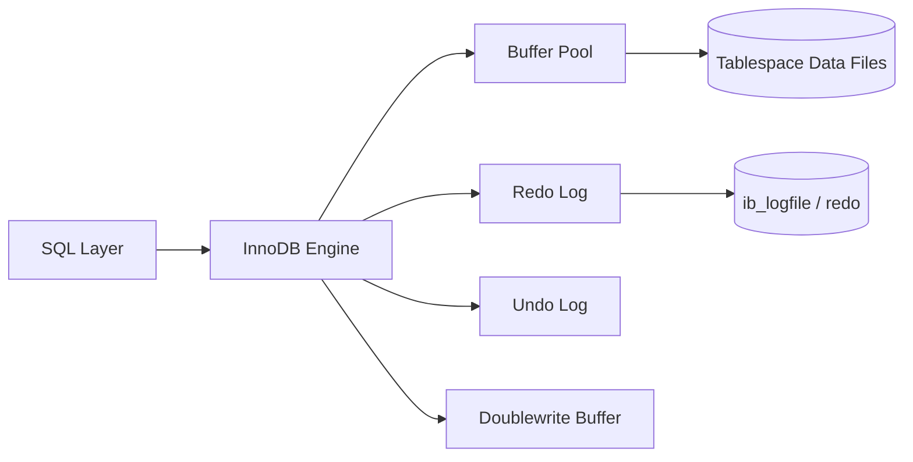
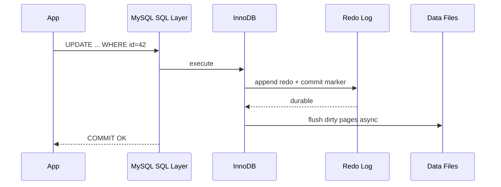

# MySQL InnoDB Architecture: Storage Engine and Scale Behavior

## 1. InnoDB Core Architecture

InnoDB is a transactional storage engine optimized for high concurrency OLTP.

Key internal components:

- **Buffer Pool**: in-memory cache for data/index pages.
- **Redo Log**: crash recovery and durability journal.
- **Undo Log**: rollback support and MVCC snapshot visibility.
- **Doublewrite Buffer**: mitigates torn page corruption risk.
- **Change Buffer**: defers secondary index page updates for non-unique indexes.
- **Adaptive Hash Index (AHI)**: hash acceleration for repeated B-Tree access paths.

---

## 2. Buffer Pool Internals

Buffer pool is split into pages with LRU-like management plus flush lists.

Critical behaviors:

- Dirty page flushing coordinated by checkpoint age.
- Read-ahead heuristics on sequential/range scans.
- Buffer pool instances reduce latch contention on large memory deployments.

Failure/latency considerations:

- Overly small buffer pool drives random IO amplification.
- Aggressive flushing can create foreground query jitter.

---

## 3. Locking Semantics

InnoDB uses row-level locking with index-awareness.

### 3.1 Record Lock

Locks a specific index record.

### 3.2 Gap Lock

Locks the gap between index records to prevent phantom insertions in range predicates.

### 3.3 Next-Key Lock

Combination of record + gap lock; default in `REPEATABLE READ` to avoid phantoms.

#### In-Line Glossary: Phantom Read

**What it is:** Re-executing a predicate query within a transaction returns a different set of rows because concurrent inserts/deletes changed membership.  
**Why here:** Range predicates require interval protection, not just row protection.  
**Systemic impact:** Gap/next-key locking improves correctness but can reduce concurrency under hotspot ranges.

### 3.4 Deadlock Detection

InnoDB detects cycles in lock wait graph and aborts one victim transaction.

Architectural implications:

- Access-order discipline in application code lowers deadlock frequency.
- Short, selective transactions reduce lock wait windows.

---

## 4. MVCC and Read Views

InnoDB snapshot reads use undo log chains to reconstruct row versions visible to a transaction’s read view.

Design consequence:

- Long-running transactions delay purge, increasing undo history and storage pressure.

---

## 5. Replication and Binary Logging

### 5.1 Binlog Formats

- **Statement-Based Replication (SBR):** logs SQL statements; compact but non-determinism risks.
- **Row-Based Replication (RBR):** logs row changes; deterministic replication, larger logs.
- **Mixed:** engine chooses mode based on statement safety.

### 5.2 Topologies

- Primary-replica with asynchronous replication.
- Semi-sync for stronger durability semantics.
- Multi-primary patterns through Group Replication.

#### In-Line Glossary: Group Replication

**What it is:** MySQL plugin for fault-tolerant replicated groups using certification-based conflict checks and consensus-like membership.  
**Why here:** Provides higher availability and managed failover semantics beyond basic async replication.  
**Systemic impact:** Write conflicts and certification overhead shape throughput under multi-writer workloads.

---

## 6. Scaling with Vitess

Vitess overlays MySQL with:

- query routing (`vtgate`)
- shard management (`vttablet`)
- resharding workflows

Benefits:

- horizontal scaling while retaining MySQL compatibility for many workloads.

Trade-offs:

- added control-plane complexity
- query pattern constraints (cross-shard transactions and joins need careful design)

---

## 7. Operational Tuning Priorities

1. Size buffer pool for hot working set.
2. Tune redo log and flush policy with durability SLO.
3. Prefer row-based replication for correctness.
4. Keep transactions short to control undo/purge pressure.
5. Benchmark lock contention under realistic access patterns.

