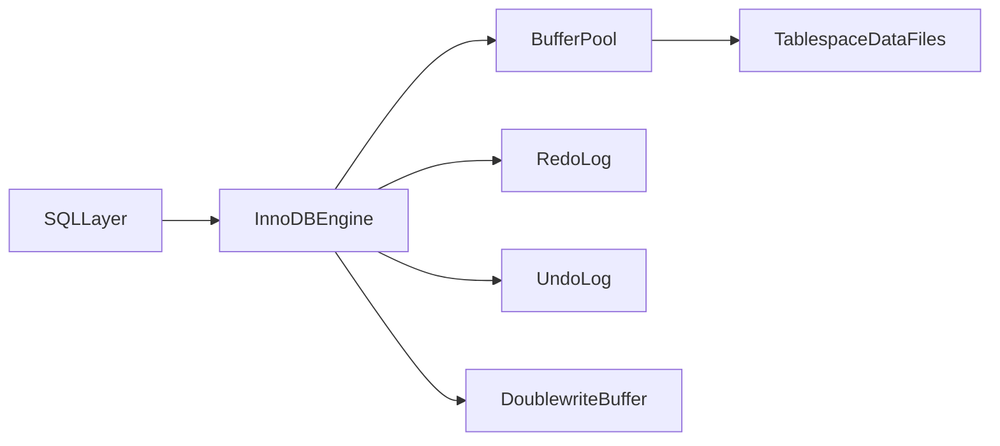
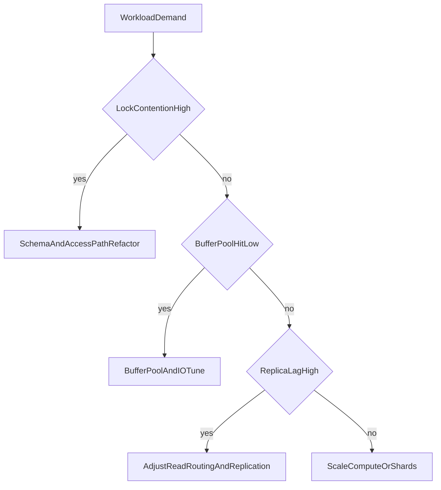

# MySQL InnoDB Architecture: Buffering, Locking, Replication, and Scale Trade-offs

## 1. Why InnoDB Is Architecturally Important

InnoDB is one of the most deployed OLTP engines in production. Senior-level understanding requires going beyond “it is fast” and explicitly modeling how buffer behavior, lock semantics, logging, and replication policy shape correctness and tail latency.

---

## 2. InnoDB Internal Components

Key subsystems:

- Buffer Pool: primary page cache for data/index pages
- Redo Log: durability and crash recovery journal
- Undo Log: MVCC visibility and rollback support
- Doublewrite Buffer: torn-page corruption mitigation
- Change Buffer: deferred secondary index update optimization
- Adaptive Hash Index: opportunistic hash acceleration over B-tree access

#### In-Line Glossary: Doublewrite Buffer

**What it is:** intermediate write area reducing torn-page risk during crashes.  
**Why here:** partial page writes can break recovery assumptions.  
**Systemic implication:** durability safety is improved at some additional IO cost.

---

## 3. Read/Write Path Mechanics

### 3.1 Write Path

1. page loaded/updated in buffer pool
2. redo record appended
3. commit durability governed by flush policy
4. dirty pages flushed later by background activity

### 3.2 Read Path

- buffer pool hit: low latency
- buffer pool miss: storage read and page load

Tail behavior depends heavily on working-set fit and flush pressure.

---

## 4. Locking Semantics and Anomaly Control

InnoDB locking is index-aware.

- **Record lock:** specific index row
- **Gap lock:** range gap between index records
- **Next-key lock:** record + adjacent gap

Purpose:

- controlling phantom effects under repeatable read behavior

Trade-off:

- stronger predicate protection can increase contention in hotspot ranges

#### In-Line Glossary: Next-Key Lock

**What it is:** lock that protects both the targeted index record and surrounding key gap.  
**Why here:** range predicates need interval protection, not only row protection.  
**Systemic implication:** phantom prevention can reduce write concurrency under skewed access.

### 4.1 Deadlock Handling

InnoDB detects lock cycles and aborts a victim transaction.

Architect implications:

- design deterministic lock acquisition ordering
- keep transactions short and bounded
- apply retry with idempotency semantics

---

## 5. MVCC via Undo Chains

Snapshot reads reconstruct visible versions through undo logs.

Operational pressure:

- long-running transactions delay purge
- undo history growth increases overhead and can degrade performance

---

## 6. Replication and Binlog Trade-offs

### 6.1 Binlog Formats

- Statement-based: compact, but non-determinism risk
- Row-based: deterministic data changes, higher volume
- Mixed: automatic switching based on statement safety

### 6.2 Topology Modes

- async primary-replica
- semi-sync for improved durability confidence
- group replication for more advanced failover/consistency posture

#### In-Line Glossary: Replication Lag

**What it is:** delay between commit on primary and apply on replica.  
**Why here:** stale-read behavior and failover data freshness depend on lag.  
**Systemic implication:** read-routing policy must account for lag SLOs.

---

## 7. Group Replication and Vitess

### 7.1 Group Replication

- certification-based conflict control
- membership/failure management
- stronger availability model than plain async trees

Cost:

- write conflict management and coordination overhead

### 7.2 Vitess

Vitess adds sharding and routing control plane to MySQL.

Benefits:

- horizontal scale while preserving MySQL compatibility patterns

Costs:

- control-plane complexity
- cross-shard query/transaction constraints

---

## 8. Performance Engineering Priorities

1. right-size buffer pool for hot set
2. tune flush and redo durability policy
3. select replication mode by consistency objective
4. minimize hotspot lock ranges
5. benchmark p95/p99 under realistic mixed traffic

---

## 9. Architect Guidance

Use InnoDB when:

- OLTP pattern is dominant
- ecosystem and operational familiarity are strategic advantages
- relational constraints and transactional correctness are required

Avoid simplistic assumptions:

- “high throughput” claims are meaningless without workload shape and contention profile
- replication mode selection is a correctness decision, not only a scaling choice

---

## 10. External References

- [MySQL InnoDB Architecture](https://dev.mysql.com/doc/refman/8.0/en/innodb-architecture.html)
- [MySQL Replication](https://dev.mysql.com/doc/refman/8.0/en/replication.html)
