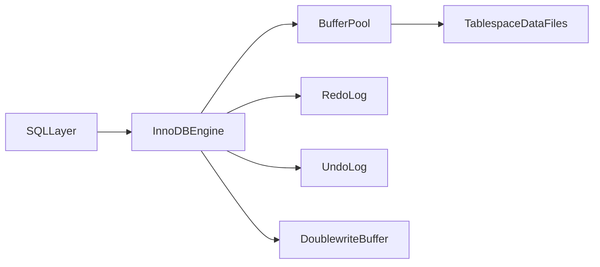
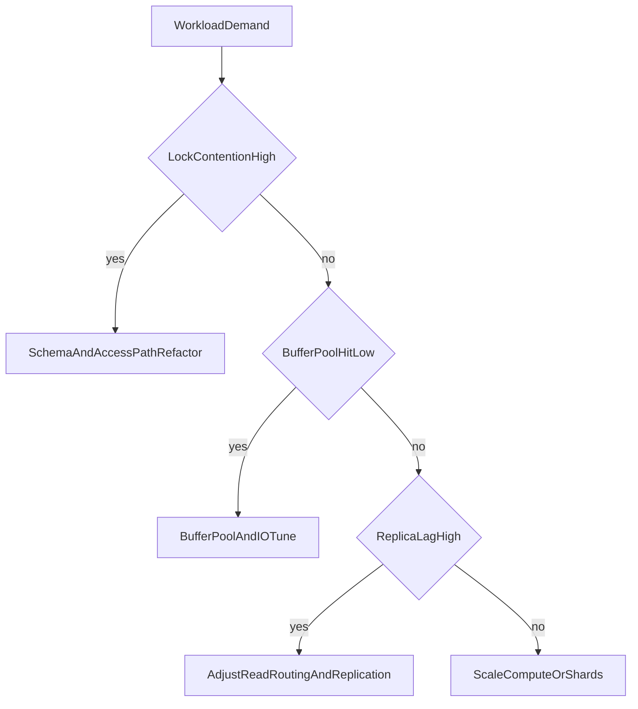

# MySQL InnoDB Architecture: Buffering, Locking, Replication, and Scale Trade-offs

## 1. Why InnoDB Is Architecturally Important

InnoDB is one of the most deployed OLTP engines in production. Senior-level understanding requires going beyond “it is fast” and explicitly modeling how buffer behavior, lock semantics, logging, and replication policy shape correctness and tail latency.

---

## 2. InnoDB Internal Components

InnoDB is organized around a small set of tightly coupled subsystems. The Buffer Pool is the primary page cache for data and index pages, so working-set fit here dominates read latency and write-back behavior. The Redo Log is the durability and crash-recovery journal: committed changes become recoverable once redo is durable according to flush policy. The Undo Log supports MVCC visibility and rollback by retaining prior versions that snapshot readers and aborting transactions need. The Doublewrite Buffer mitigates torn-page corruption by staging full pages before they land in tablespace files. The Change Buffer can defer secondary-index maintenance for pages not currently in memory, trading delayed work for lower immediate random IO on some write patterns. The Adaptive Hash Index opportunistically builds hash lookups over hot B-tree paths to shorten repeated equality access when the optimizer and runtime decide it is profitable.

#### In-Line Glossary: Doublewrite Buffer

**What it is:** intermediate write area reducing torn-page risk during crashes.  
**Why here:** partial page writes can break recovery assumptions.  
**Systemic implication:** durability safety is improved at some additional IO cost.

---

## 3. Read/Write Path Mechanics

### 3.1 Write Path

A modifying statement loads or updates the target page in the buffer pool, appends a redo record describing the change, and treats commit durability as governed by the configured flush policy. Dirty pages are flushed later by background activity rather than necessarily at commit time. That separation keeps commit latency tied to log durability while data-file write pressure is smoothed—until flush debt or checkpoint pressure catches up.

### 3.2 Read Path

A buffer pool hit returns the page with low latency because no storage round-trip is required. A buffer pool miss forces a storage read and page load into the pool, which can evict other pages and perturb the hot set. Tail latency therefore depends heavily on working-set fit relative to buffer pool size and on flush pressure that competes with reads for IO bandwidth.

---

## 4. Locking Semantics and Anomaly Control

InnoDB locking is index-aware: locks attach to index records and gaps rather than only to abstract heap rows. A record lock protects a specific index row. A gap lock protects the open range between index records so inserts into that interval can be blocked. A next-key lock combines a record lock with the adjacent gap, covering both the existing key and the space beside it.

The purpose of these lock types is controlling phantom effects under repeatable-read behavior: range predicates need interval protection, not only protection of rows that already exist at statement start. The trade-off is that stronger predicate protection can increase contention in hotspot ranges, so skewed write patterns on narrow key intervals often surface as lock waits and deadlocks rather than as pure CPU saturation.

#### In-Line Glossary: Next-Key Lock

**What it is:** lock that protects both the targeted index record and surrounding key gap.  
**Why here:** range predicates need interval protection, not only row protection.  
**Systemic implication:** phantom prevention can reduce write concurrency under skewed access.

### 4.1 Deadlock Handling

InnoDB detects lock cycles and aborts a victim transaction so the remaining waiters can proceed. Architects should design deterministic lock acquisition ordering across related tables, keep transactions short and bounded so lock hold time stays small, and apply application-level retry with idempotency so aborted victims can safely re-run without double effects.

---

## 5. MVCC via Undo Chains

Snapshot reads reconstruct visible versions by walking undo logs rather than by retaining multiple live heap versions the way PostgreSQL does. Long-running transactions delay purge because old undo entries may still be needed for visibility. Undo history growth then increases overhead—more chain walking, more purge work, and eventually degraded performance on both reads and writes until history can catch up.

---

## 6. Replication and Binlog Trade-offs

### 6.1 Binlog Formats

Statement-based logging is compact because it records SQL text, but non-deterministic functions and certain statement shapes create correctness risk on replicas. Row-based logging records deterministic data changes and is safer for many workloads, at the cost of higher binlog volume. Mixed mode switches automatically based on statement safety, aiming for compactness when statements are deterministic and row images when they are not.

### 6.2 Topology Modes

Async primary-replica topologies maximize primary throughput by not waiting for replica acknowledgment, accepting that lag and failover data loss windows are possible. Semi-sync improves durability confidence by requiring at least one replica to acknowledge receipt before commit completes under configured rules. Group replication adds membership and certification for a more advanced failover and consistency posture than a simple async tree, with corresponding coordination cost.

#### In-Line Glossary: Replication Lag

**What it is:** delay between commit on primary and apply on replica.  
**Why here:** stale-read behavior and failover data freshness depend on lag.  
**Systemic implication:** read-routing policy must account for lag SLOs.

---

## 7. Group Replication and Vitess

### 7.1 Group Replication

Group Replication uses certification-based conflict control so members agree on which transactions can commit in a multi-primary or single-primary group. It also manages membership and failure detection so failed nodes can be expelled and the group can continue under quorum rules. Relative to plain async trees, this is a stronger availability model because failover and conflict handling are built into the protocol rather than bolted on externally. The cost is write conflict management and coordination overhead: conflicting concurrent writes may abort, and group communication adds latency under load.

### 7.2 Vitess

Vitess adds a sharding and routing control plane on top of MySQL so a fleet of shards can present a more unified SQL access path. The benefit is horizontal scale while preserving familiar MySQL compatibility patterns for many application queries. The costs are control-plane complexity (topo, vtgate, tablet lifecycle) and hard constraints on cross-shard queries and transactions that force application and schema design to respect shard keys.

---

## 8. Performance Engineering Priorities

Performance work should start by right-sizing the buffer pool for the hot set so reads and dirty-page residency stay in memory. Next, tune flush and redo durability policy to match SLO needs rather than defaulting to maximum durability or maximum throughput blindly. Select replication mode by consistency and failover objectives, not only by advertised QPS. Minimize hotspot lock ranges through schema, key design, and access ordering. Finally, benchmark p95 and p99 under realistic mixed traffic so optimizations that look good on microbenchmarks are validated under contention.

---

## 9. Architect Guidance

Use InnoDB when the dominant pattern is OLTP, when ecosystem and operational familiarity are strategic advantages for the team, and when relational constraints plus transactional correctness are non-negotiable product requirements.

Avoid simplistic assumptions: “high throughput” claims are meaningless without workload shape and contention profile, and replication mode selection is a correctness decision, not only a scaling choice. Treat engine marketing numbers as hypotheses until they survive your skew, lag, and failover tests.

---

## 10. External References

- [MySQL InnoDB Architecture](https://dev.mysql.com/doc/refman/8.0/en/innodb-architecture.html)
- [MySQL Replication](https://dev.mysql.com/doc/refman/8.0/en/replication.html)
