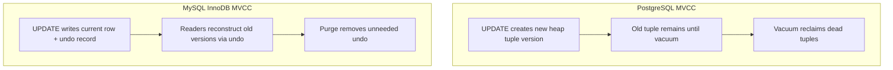
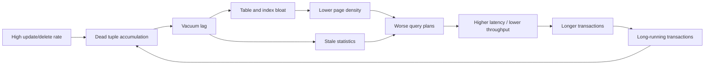
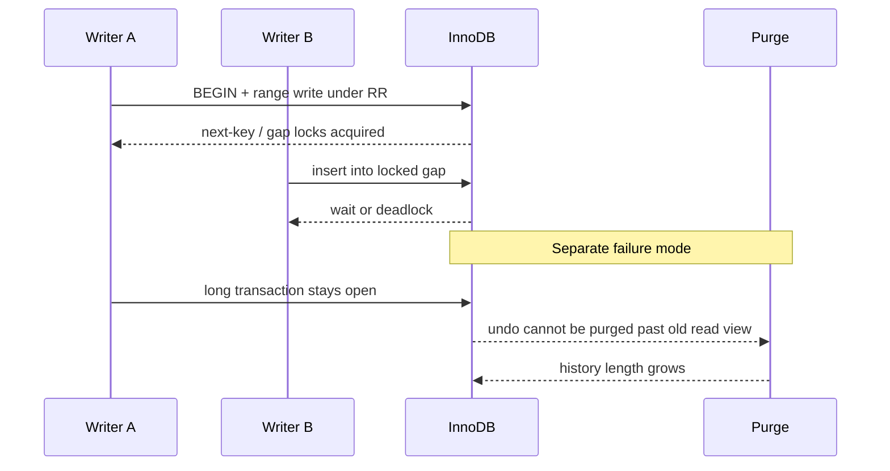

# PostgreSQL vs MySQL (InnoDB): Deep Architectural Comparison

## 1. Purpose and Decision Context

This document compares PostgreSQL and MySQL/InnoDB at architecture level. The goal is not to declare a winner. The goal is to show how each engine’s MVCC model, locking model, maintenance machinery, and operational ecosystem change latency, correctness, and cost under real workloads.

The companion deep dives cover engine internals in isolation:

- [PostgreSQL Deep Dive](./01-postgresql-deep-dive.md)
- [MySQL InnoDB Architecture](./02-mysql-innodb-architecture.md)

This chapter answers the decision question those documents leave open: given a concrete workload shape and team capability, which failure mode do you prefer to own?

---

## 2. Decision Principle

There is no universally superior engine. The correct choice is workload-constrained and team-constrained.

Workload constraints include query shape, write contention patterns, and consistency requirements. Those constraints determine which MVCC and locking model will hurt first under load. A system that updates the same hot primary-key rows thousands of times per second stresses both engines, but the visible pain differs: PostgreSQL tends to accumulate dead versions and vacuum debt, while InnoDB tends to accumulate lock waits and undo history.

Team constraints include operational maturity, tooling familiarity, and incident-response capability. Those constraints determine whether advanced features remain assets or become unowned risk. A team that already runs reliable MySQL failover drills may deliver better outcomes on MySQL even if PostgreSQL’s SQL surface would fit the domain model better on paper. The reverse is also true.

#### In-Line Glossary: Workload Shape

**What it is:** the measurable pattern of reads, writes, predicates, skew, transaction duration, and consistency expectations that actually hit the database.

**Why here:** engine marketing numbers are meaningless without shape. A write-heavy, range-predicate, long-transaction workload exposes different failure modes than a point-lookup OLTP workload with short commits.

**Systemic implication:** choose and benchmark against your shape, not against a generic “database is fast” claim.

---

## 3. Comparative Matrix

The matrix below is a navigation map, not a substitute for mechanism detail. Each row names a dimension that later sections expand with examples.

| Dimension | PostgreSQL | MySQL InnoDB | Architecture Implication |
|---|---|---|---|
| SQL expressiveness | very strong | strong, more pragmatic history | affects complex analytical/relational modeling ergonomics |
| Extensibility | high (extensions, operator classes, FDW) | lower core extensibility | matters when product needs custom data capabilities |
| MVCC style | tuple versions in heap + vacuum cleanup | undo-based snapshot reconstruction | different maintenance pressure and tuning profile |
| JSON capabilities | JSONB ecosystem depth | solid JSON support | hybrid model ergonomics often favor PostgreSQL |
| Lock behavior nuance | robust, highly tunable with model choices | next-key/gap behavior important under RR | contention patterns differ under range-heavy writes |
| Replication tooling | rich physical/logical patterns | mature primary-replica ecosystem | failover/read-scaling architecture differs |
| Horizontal strategy | partition + external/distributed options | partition + Vitess path common | scale-out architecture and ops model diverge |

### 3.1 How to Read the Matrix in Practice

SQL expressiveness matters when the product needs recursive queries, rich window functions, advanced constraint patterns, or custom operators close to the data. PostgreSQL often reduces application-side work in those cases. MySQL remains fully capable for classic OLTP SQL; the difference appears when the domain model pushes the relational language hard.

Extensibility matters when you need PostGIS-class geospatial operators, specialized index operator classes, or foreign data wrappers (FDWs: interfaces that let PostgreSQL query external data sources as if they were local tables). Those are product capabilities in PostgreSQL. On MySQL they often become external services or application logic.

MVCC style is the most important operational distinction for write-heavy systems and is the focus of section 4.1. PostgreSQL keeps old row versions in the table heap until vacuum can reclaim them. InnoDB keeps prior versions in undo logs and reconstructs older snapshots by walking those chains. Cleanup therefore has different names, metrics, and failure signatures: vacuum lag and bloat on one side, purge lag and undo growth on the other.

JSON capabilities matter for hybrid relational/document schemas. PostgreSQL’s JSONB plus GIN ecosystem is deeper for containment and indexing patterns. MySQL JSON support is solid for many product needs; the decision is about indexing and query ergonomics, not about whether JSON exists.

Lock behavior matters when writes use range predicates. InnoDB’s next-key and gap locks under repeatable read can serialize inserts into key intervals that look “empty” to the application. PostgreSQL’s default locking model has different phantom-control trade-offs and different wait signatures. Section 4.1 walks this with a concrete inventory example.

Replication and horizontal strategy matter when the topology must grow beyond one primary. Both engines have mature replica ecosystems. Scale-out paths diverge: PostgreSQL often combines native partitioning with external sharding or distributed Postgres variants; MySQL frequently pairs partitioning with Vitess for routing and shard lifecycle. Neither path is free of cross-shard correctness cost.

---

## 4. Execution Path Trade-offs

### 4.1 Write-Heavy Workloads

Write-heavy means sustained inserts, updates, and deletes at a rate that forces the engine’s versioning and cleanup machinery to work continuously. The product symptom is usually rising p95/p99 latency, falling throughput after a warm-up period, or intermittent stalls that do not correlate with CPU saturation. The root cause is rarely “the database is slow in general.” It is usually that one engine’s cleanup or locking debt has overtaken the write rate.

#### 4.1.1 Shared Premise: Both Engines Use MVCC, but They Store History Differently

Multi-version concurrency control (MVCC) lets readers see a consistent snapshot without blocking every writer, and lets writers proceed without waiting for every reader. To do that, the engine must keep older versions of changed rows until no running transaction still needs them.

PostgreSQL stores those older versions as additional tuples in the table heap (and often as additional index entries). The live logical row is one version among several physical versions. Cleanup is vacuum: a background process that removes versions no snapshot needs anymore.

InnoDB stores the current row in the primary clustered index and keeps prior images in undo logs. A reader that needs an older snapshot walks the undo chain backward until it finds a version visible to its read view. Cleanup is purge: a background process that discards undo records that are no longer required.



The architectural consequence is simple and easy to forget under incident pressure: the same business update (“set order status to shipped”) creates different physical debt in each engine. PostgreSQL debt lives in table and index pages as dead versions. InnoDB debt lives in undo history and in locks held while transactions remain open.

#### 4.1.2 PostgreSQL Dominant Risk: Vacuum Lag, Bloat, and Plan Drift

**Vacuum** is PostgreSQL’s cleanup process. After an update or delete, the previous tuple version is dead for new transactions but must remain until every older snapshot that might need it has finished. Vacuum marks space reusable and updates related metadata. **Autovacuum** is the automatic scheduler that launches vacuum workers based on dead-tuple thresholds and freeze needs.

**Vacuum lag** means vacuum is not reclaiming dead versions as fast as writers create them. Lag is not a single boolean. It is a race between write rate, transaction age, and vacuum capacity. If writers produce dead tuples faster than workers reclaim them, or if a long-running transaction prevents reclaim because its snapshot still “needs” old versions, dead data accumulates.

**Use case.** An e-commerce `orders` table receives continuous status updates: `pending → paid → packed → shipped`. Each update creates a new heap tuple version. During a flash sale, update rate jumps from 200 to 8,000 rows per second. Autovacuum workers are busy on other large tables, and one analytics session holds an open transaction for 40 minutes while exporting. Dead versions cannot be removed past that snapshot horizon. The table grows physically even though the logical row count is almost stable.

**Table bloat** is the result: the on-disk table contains many dead or reusable-but-not-yet-compacted pages relative to live rows. Scans must visit more pages to return the same logical result. Cache hit rates fall because the working set of pages is larger than the live data set. **Index bloat** is the same phenomenon in indexes: leaf pages hold entries pointing at dead or relocated versions, so index lookups touch more pages and produce more heap fetches.

**Page density drift** means pages hold fewer useful live tuples than the planner and operators expect. A page that once held 50 live rows may now hold 10 live rows and many dead versions. Sequential scans and index scans both pay more IO per useful row.

**Statistics drift** compounds the problem. The planner uses catalog statistics (row counts, distinct values, histograms) to choose plans. When vacuum and analyze lag, those statistics describe an older shape of the table. The planner may choose a nested loop that was cheap yesterday and is disastrous today, or may avoid an index that would now be selective enough. **Plan quality** therefore degrades not only because pages are emptier, but because the optimizer’s model of the data is stale.

**Write amplification** here means that one logical update causes more physical write work than a naive overwrite. PostgreSQL must write a new tuple version, maintain indexes when needed, write WAL (write-ahead log) records for durability, and later rewrite or reclaim pages during vacuum. WAL is the append-only durability journal: changes are logged before the corresponding data pages are required to be durable, so crash recovery can replay committed work. Indexes multiply the tax: every secondary index that must change adds more WAL and page dirtiness.

**HOT updates** (heap-only tuple updates) are a PostgreSQL optimization for updates that do not change indexed columns. The new version can stay on the same heap page and remain reachable through the existing index entry via a heap chain, which avoids creating new index entries for that update. HOT reduces some index churn and slows index bloat on hot update paths, but it does not remove the need to vacuum dead heap versions.

**Cleanup debt** is the backlog of reclaim work owed to past writes. Debt is invisible in a short benchmark that never lets vacuum fall behind. In production, debt compounds: more bloat → worse plans → longer transactions → older snapshots → slower vacuum progress → more bloat.



**What operators see.** CPU may look available because the bottleneck is IO amplification and poor plans, not arithmetic saturation. Disk usage climbs. `n_dead_tup` rises. Autovacuum runtime lengthens. p95 latency rises on queries that previously were stable. Adding CPU cores alone often fails because each query is doing more page IO for the same business result.

**Boundary conditions.** Vacuum lag is most dangerous on update-heavy or delete-heavy tables with wide rows, many indexes, and long transactions. Common long-transaction sources include reporting sessions, forgotten `BEGIN` blocks, ORMs that hold a connection inside an open transaction while doing application work, and logical decoding slots that retain an old replication horizon so consumers can stream changes. A logical decoding slot is a retained consumer bookmark for PostgreSQL’s logical change stream; while it exists and lags, vacuum cannot remove tuple versions still required to decode that history, which can create vacuum lag even when interactive queries look healthy. Append-only insert workloads create less dead-tuple pressure per row, though they still create freeze and WAL pressure over time. Freeze work exists because PostgreSQL transaction IDs are finite: very old tuple metadata must eventually be marked frozen so visibility checks remain valid after IDs recycle. If that work falls far behind, emergency anti-wraparound vacuum can seize resources to protect correctness—another reason vacuum health is an availability concern, not only a disk concern.

#### In-Line Glossary: Vacuum Lag

**What it is:** a sustained condition where PostgreSQL creates dead tuple versions faster than vacuum can safely reclaim them, or where open snapshots prevent reclaim even when workers are running.

**Why here:** it is the dominant write-path failure mode for PostgreSQL under sustained mutation.

**Systemic implication:** treat autovacuum health, transaction age, and bloat metrics as capacity signals equal in importance to CPU and QPS.

#### 4.1.3 MySQL/InnoDB Dominant Risks: Gap Contention and Purge Pressure

InnoDB’s write-path pain usually appears as waits and undo growth rather than as heap bloat.

**Predicates** are the filter conditions in a query or update, such as `WHERE warehouse_id = 42 AND sku_id BETWEEN 1000 AND 1100`. The engine must decide which existing rows and which “gaps” between index keys those predicates cover when locking for correctness.

**Repeatable read (RR)** is InnoDB’s default isolation level. An isolation level defines which concurrent effects a transaction is allowed to observe. Under RR, InnoDB uses next-key locking for many range-style accesses so that **phantoms** do not appear inside a transaction. A phantom is a new row that did not exist at the first read of a predicate range but would satisfy that same predicate on a later read in the same transaction. Phantom prevention means a second read of the same range should not suddenly see those new rows. That protection is valuable for correctness. It is also expensive under concurrent writes into the same key interval.

**Record locks** protect existing index records. **Gap locks** protect the open interval between index records so another transaction cannot insert into that interval. **Next-key locks** combine a record lock with the preceding gap. Together they implement predicate protection on the index.

**Range-heavy writes** are inserts, updates, or deletes whose predicates or insertion points cover intervals rather than single equality keys. Examples include allocating the next inventory reservation in a SKU range, inserting into a secondary index with non-unique values that cluster, or updating “all unpaid invoices older than date X.” These statements lock gaps, not only exact rows.

**Use case: gap contention.** Two checkout workers concurrently reserve stock:

```sql
-- Session A
START TRANSACTION;
SELECT * FROM inventory
WHERE warehouse_id = 7 AND sku_id = 555
FOR UPDATE;
-- decides to insert a reservation row with a secondary key in a hot range

-- Session B does the same pattern on nearby keys in the same index gap
```

Under RR, Session A’s range or gap protection can block Session B’s insert into the protected interval even if the exact primary key rows do not conflict in the application’s mental model. The product symptom is lock wait timeouts, deadlocks, or checkout latency spikes concentrated on popular SKUs. This is **hotspot key range** behavior: a small region of the index absorbs disproportionate lock conflict.

**Purge** is InnoDB’s cleanup of undo records that no transaction needs anymore. **Purge pressure** means undo history is growing or purge cannot keep up. The usual cause is **long-running transactions** (or long-running consistent reads) that keep an old read view alive. While that view exists, purge cannot discard undo still required to reconstruct older versions.

**Use case: purge pressure.** An OLTP primary processes thousands of order updates per second. Overnight, a developer starts a transaction in a GUI client, runs `SELECT COUNT(*) FROM large_table`, then leaves for lunch without committing or rolling back. Undo needed for that old read view accumulates for an hour. InnoDB must keep history. Readers that need older versions walk longer undo chains. History length metrics rise. Purge threads work harder. Write and read latency degrade even though the “business” transactions are short.

**Open transactions** are therefore a first-class operational hazard on InnoDB write paths. They convert temporary versioning into durable undo debt. The analogous PostgreSQL hazard is the same long transaction holding back vacuum’s removable horizon; the storage location of the debt differs.



**What operators see.** `SHOW ENGINE INNODB STATUS`, performance_schema wait events, and history-list length become the primary signals. Lock waits and deadlocks dominate incident tickets for hotspot ranges. Undo growth and purge lag dominate incidents involving forgotten transactions, large admin reads inside a transaction, or delayed replicas interacting poorly with history retention. Table files do not “bloat like Postgres heap” in the same way; the debt is in undo and in time spent waiting for locks.

**Boundary conditions.** Gap contention is worst under RR with secondary-index hotspots, monotone keys that insert at the same end of an index, and wide `SELECT ... FOR UPDATE` ranges. Purge pressure is worst when any session holds a consistent snapshot for a long time while the primary keeps mutating. Reducing transaction duration and narrowing predicates are usually higher leverage than buying larger hardware.

#### In-Line Glossary: Gap Lock

**What it is:** a lock on the open index interval between existing records that prevents other transactions from inserting into that interval.

**Why here:** it is central to InnoDB phantom control under repeatable read and is a primary source of write contention on range-heavy workloads.

**Systemic implication:** design write predicates and indexes so hot inserts do not serialize on the same gaps; keep transactions short so gap locks are released quickly.

#### In-Line Glossary: Purge Pressure

**What it is:** sustained growth or slow reclaim of InnoDB undo history because old read views still need prior row images.

**Why here:** it is InnoDB’s cleanup-debt analogue to PostgreSQL vacuum lag.

**Systemic implication:** monitor history length and long transactions as capacity and correctness risks, not as minor housekeeping.

#### 4.1.4 Side-by-Side Contrast for the Same Business Workload

Consider a high-volume order-status updater that mutates the same rows repeatedly and occasionally runs a long reporting query.

On PostgreSQL, repeated updates create many heap versions. If reporting holds a snapshot open, vacuum cannot remove versions below that horizon. The table and its indexes bloat. Query plans on `orders` degrade. Throughput falls while CPU still has headroom. The remediation path focuses on shorter transactions, faster autovacuum, fewer unnecessary indexes, HOT-friendly update shapes, and bloat monitoring.

On MySQL/InnoDB, repeated updates create undo records. If reporting holds a read view open, purge cannot discard undo below that view. History length grows and chain walks get longer. Concurrent range reservations on popular SKUs additionally create gap-lock waits. The remediation path focuses on shorter transactions, narrower locking predicates, isolation and index design for hot ranges, and undo/history monitoring.

The business feature is identical. The engine chooses where the debt accumulates and which metrics tell the truth first.

#### 4.1.5 Trade-offs and Rejected Simplifications

“PostgreSQL is worse at writes” is false as a universal claim. PostgreSQL can sustain high write rates when vacuum keeps up, transactions are short, and indexes are disciplined. Its dominant risk is cleanup lag under mutation plus long snapshots.

“MySQL does not bloat” is false as a universal claim. InnoDB has its own space and fragmentation behaviors, but the first-order write-heavy incident pattern in many OLTP shops is lock/gap contention and undo/purge lag, not PostgreSQL-style heap vacuum bloat.

“Raising isolation always increases safety with no cost” is incomplete. Stronger locking under RR prevents phantoms and can be correct for the product. It also expands the set of conflicting concurrent writes. Isolation is a correctness and concurrency dial, not a free upgrade.

### 4.2 Read-Heavy Workloads

Read-heavy means the dominant cost is evaluating and returning queries rather than creating version debt. Both engines can serve this well. The architectural differences appear in planner capability, index type richness, cache behavior, and how replicas are used.

#### 4.2.1 PostgreSQL Strengths on Complex Reads

PostgreSQL’s planner and executor are strong on joins, subqueries, CTEs (common table expressions: named subqueries in a `WITH` clause), window functions, and specialized indexes. B-tree covers ordinary equality and range lookups. GIN (generalized inverted index) fits containment-heavy values such as JSONB and full-text tokens. GiST (generalized search tree) fits geometries, ranges, and similar non-scalar predicates. BRIN (block range index) stores coarse page-range summaries for very large ordered tables. That index variety matters when the product query is inherently relational or semi-structured: “find active tenants whose JSONB settings contain feature X and whose last 30 days of events match predicate Y.”

**Use case.** A B2B analytics API must filter on typed columns and JSONB attributes, then join to a permissions table and return a sorted page. In PostgreSQL, a GIN index on JSONB plus ordinary B-tree indexes on join keys can keep the query inside the database. In a less expressive setup, the application might pull candidate rows and filter in memory, which shifts CPU and consistency risk out of the engine.

The cost of that power is operational: bad statistics, wrong `work_mem`, or missing indexes still produce terrible plans, and complex plans are harder to reason about during incidents. Expressiveness does not remove the need for `EXPLAIN` discipline.

#### 4.2.2 MySQL/InnoDB Strengths on Predictable OLTP Reads

InnoDB shines when the hot working set fits the buffer pool—InnoDB’s main in-memory page cache for data and index pages—and access patterns are stable point lookups or narrow range scans on well-chosen indexes. Latency becomes largely a function of cache hit rate, lock-free or lightly locked read paths, and redo/undo health rather than of exotic planner features.

**Use case.** A session service reads user session rows by primary key at tens of thousands of QPS. The buffer pool holds the hot sessions. Reads are simple, repetitive, and index-covered or primary-key based. MySQL’s operational familiarity and predictable access path often win here, especially when the team already has mature buffer-pool and replication playbooks.

#### 4.2.3 Shared Trap: Read Replicas Without an Explicit Stale-Read Policy

Both engines commonly scale reads with replicas. **Replication lag** is the delay between a primary commit and the replica applying that commit. If the application routes a read-after-write to a lagged replica, the user may not see their own write.

**Use case.** A user updates a profile and is immediately redirected to a profile page served from a replica that is 2 seconds behind. The page shows the old avatar. The database did not lose the write; the read-routing policy ignored lag.

Therefore read-heavy designs still need SLO-backed routing rules: primary reads for read-your-writes paths, replica reads only for stale-tolerant paths, and lag monitors that shed replica traffic when lag exceeds budget.

```mermaid
flowchart TD
    readReq[Incoming read] --> class{Stale-tolerant?}
    class -- no --> primary[Read from primary]
    class -- yes --> lagCheck{Replica lag within SLO?}
    lagCheck -- yes --> replica[Read from replica]
    lagCheck -- no --> primary
```

#### In-Line Glossary: Read-Your-Writes Consistency

**What it is:** the guarantee that a client sees its own successful writes in subsequent reads.

**Why here:** replica read scaling silently breaks this guarantee when lag is ignored.

**Systemic implication:** classify every read path as lag-sensitive or lag-tolerant before sending traffic to replicas.

---

## 5. Failure Domain and Recovery Considerations

Engine selection should be driven by operational questions, not brand preference.

How often will failover be rehearsed under realistic load? A replica that has never been promoted under peak traffic is an unverified assumption. Both PostgreSQL and MySQL can fail over; only rehearsal proves application connection handling, DNS or proxy cutover, and data freshness expectations.

What replica lag tolerance is acceptable for product correctness? A search index rebuild may tolerate minutes of lag. A balance read after a payment may tolerate none. Lag tolerance is a product invariant expressed as an SLO, not a database default.

What operational budget exists for advanced tuning of vacuum, purge, checkpoints, or group membership? PostgreSQL without vacuum ownership becomes a bloat incident factory. InnoDB without undo/history and lock ownership becomes a deadlock and purge-lag factory. Features without operators are liabilities.

Is extension flexibility a strategic product capability or unnecessary surface area? PostGIS or custom operator classes can be decisive product advantages. They also expand upgrade, security, and support scope. Choose them when the product needs them, not because they are impressive.

#### In-Line Glossary: Operational Complexity Budget

**What it is:** organizational capacity to run sophisticated tuning, incident response, and lifecycle maintenance.

**Why here:** a technically superior option can still be wrong if the operating model cannot sustain it.

**Systemic implication:** platform fit includes people and process, not only benchmarks.

### 5.1 Failure Signatures to Expect

On PostgreSQL, expect incidents framed as “disk grew,” “autovacuum can’t keep up,” “plans regressed after a traffic spike,” or “wraparound prevention vacuum took the system.” Wraparound prevention is the emergency vacuum path that runs when transaction-ID age approaches the point where old unfrozen tuples would make visibility ambiguous after ID recycling; it protects correctness but can consume substantial IO and CPU until freeze debt is cleared. Recovery emphasizes transaction hygiene, vacuum capacity, bloat control, and sometimes rewrite or reindex maintenance windows.

On MySQL/InnoDB, expect incidents framed as “lock wait timeout,” “deadlock victim retries exhausted,” “history list length exploding,” or “replica lag breached SLO after a write burst.” History list length is the operational metric for how much undo history remains to purge; when it grows without bound, old read views or purge lag are usually the cause. Recovery emphasizes shortening transactions, narrowing locks, adjusting isolation or access paths, restoring purge progress, and validating replication apply capacity.

Design runbooks around those signatures before the first production page.

---

## 6. Scenario-Based Recommendations

### Scenario A: Complex Domain Model + Advanced Queries

Likely advantage: PostgreSQL.

**Why.** Richer query, operator, and extensibility ecosystems often reduce architectural workaround complexity. Teams write fewer application-side joins, less duplicated validation, and fewer custom search pipelines for predicates the engine can express natively.

**Example.** A compliance product must store relational entities, enforce exclusion constraints on overlapping time ranges, and query JSONB audit payloads by containment. PostgreSQL can keep more of that invariant surface inside the database. Moving the same logic into the application creates duplicated checks and race windows unless the team rebuilds equivalent transactional controls.

**Caution.** This advantage disappears if the team cannot operate vacuum, statistics, and index maintenance. Complex queries on a bloated, mistuned cluster fail loudly.

### Scenario B: High-Volume OLTP with Existing MySQL Expertise

Likely advantage: MySQL/InnoDB.

**Why.** Team maturity and ecosystem tooling may deliver faster reliable outcomes because operators already know failure modes, backup paths, and replication knobs. Effort goes into schema and contention design instead of learning a new operational culture under production pressure.

**Example.** A payments organization already runs semi-sync MySQL—replication configured so a commit waits for at least one replica to acknowledge receipt under policy, improving failover durability confidence at some primary latency cost—has battle-tested failover proxies, and staff who can diagnose gap locks at 3 a.m. Migrating to PostgreSQL “for cleanliness” would trade known operational risk for unknown vacuum and plan-regression risk during the highest-stakes years of growth.

**Caution.** Expertise does not remove InnoDB hotspot physics. A hot secondary index gap will still serialize writers. The advantage is faster recognition and remediation, not immunity.

### Scenario C: Global Horizontal SQL Ambition

Neither vanilla engine alone solves geo-distributed, high-scale SQL perfectly.

**Why.** A single primary plus replicas is a locality and failover topology, not a multi-region active-active SQL fabric. Cross-region synchronous commits add latency. Asynchronous multi-primary designs add conflict and staleness problems.

**Potential directions.** PostgreSQL plus distributed variants or ecosystem tooling; MySQL plus Vitess for sharded routing; or distributed SQL systems when invariants and geography demand stronger built-in coordination. Vitess is a control plane and routing layer over many MySQL shards: applications talk to a gateway that routes by shard key, while operators manage shard topology, resharding, and tablet lifecycle. Each path changes transaction boundaries and operational ownership. See also [Sharding, Data Partitioning, and Horizontal Database Scale](../01-theory-and-foundations/05-sharding-data-partitioning-and-horizontal-scale.md).

**Example.** A SaaS product needs per-tenant residency in three regions and wants tenant-local ACID (atomic, consistent, isolated, durable transactions within one tenant’s data boundary) with rare cross-tenant reporting. Sharding by `tenant_id` with Vitess or a Postgres sharding layer can work if cross-tenant transactions are redesigned. Choosing “plain MySQL” or “plain PostgreSQL” without a shard story does not meet the geography requirement.

---

## 7. Benchmarking Standard Before Final Decision

Before locking an engine choice, require evidence that survives production physics.

Production-like data skew is mandatory so planner and cache behavior are realistic. Uniform random keys hide hotspot gap locks and hide skewed vacuum targets.

Mixed read/write traffic is mandatory. Isolated microbenchmarks of “inserts only” or “point selects only” miss the interaction between version cleanup, buffer cache, and lock duration.

Explicit p95/p99 objectives must be tied to product SLOs. p95 and p99 are tail-latency percentiles: 95% or 99% of requests finish at or below that latency. Average QPS without tail latency is a vanity metric for user-facing systems.

Failover and lag tests must exercise the topology you will actually run, including proxy behavior and application retry semantics.

Cost and performance must be measured over sustained windows so checkpoint, vacuum, purge, and compaction effects appear. Decisions made on cold caches and five-minute runs rarely survive the first week of compound cleanup debt.


#### In-Line Glossary: Sustained-Window Benchmark

**What it is:** a load test long enough for background maintenance—vacuum, purge, checkpoints, flush—to interact with foreground traffic.

**Why here:** write-heavy engine differences often appear only after cleanup debt accumulates.

**Systemic implication:** reject engine decisions based solely on peak cold-cache QPS.

---

## 8. Final Guidance

Choose the engine that minimizes total architecture risk across correctness, performance predictability, operational sustainability, and evolution flexibility.

Prefer PostgreSQL when complex relational or JSONB-heavy modeling, extensibility, and advanced query capability materially reduce product complexity—and when the team will own vacuum, statistics, and plan health as capacity work.

Prefer MySQL/InnoDB when classic OLTP access patterns dominate and the organization’s operational muscle already concentrates on InnoDB locking, buffer pool, purge, and replication—and when the team will own hotspot design and transaction duration as capacity work.

In both cases, the best decision is explicit, measured, and revisitable via ADRs (Architecture Decision Records: short documents that capture the context, options, choice, and consequences of an architectural decision) so future teams can see which constraints drove the choice when those constraints change.

---

## 9. External References

- [PostgreSQL Deep Dive](./01-postgresql-deep-dive.md)
- [MySQL InnoDB Architecture](./02-mysql-innodb-architecture.md)
- [PostgreSQL Vacuum Documentation](https://www.postgresql.org/docs/current/routine-vacuuming.html)
- [InnoDB Multi-Versioning](https://dev.mysql.com/doc/refman/8.0/en/innodb-multi-versioning.html)
- [InnoDB Locking](https://dev.mysql.com/doc/refman/8.0/en/innodb-locking.html)
