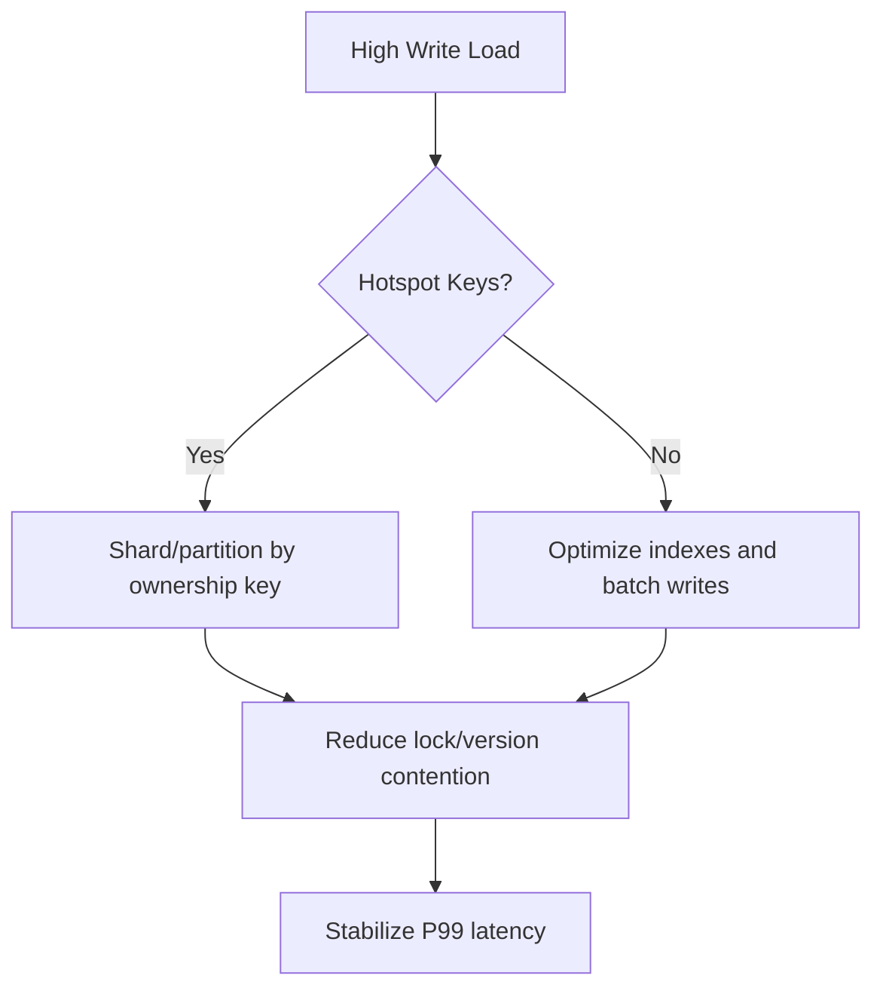

# PostgreSQL vs MySQL (InnoDB): Architectural Decision Comparison

## 1. Decision Context

Both engines are mature and production-proven. Selection should be driven by workload shape, consistency demands, extensibility requirements, and operating model.

---

## 2. Head-to-Head Comparison Matrix

| Criterion | PostgreSQL | MySQL (InnoDB) | Architectural Meaning |
|---|---|---|---|
| SQL Standards Compliance | Generally stronger and feature-rich | Strong but historically more pragmatic deviations | Impacts portability and complex query behavior predictability |
| Extensibility | High (custom types, operators, extensions, FDW) | Lower at engine/planner level | Matters for advanced domains (GIS, time-series, custom indexing semantics) |
| MVCC Model | Tuple versioning in heap, vacuum-managed | Undo-log based MVCC with purge | Different maintenance and bloat/purge operational profiles |
| JSON Workloads | JSONB with rich operators + GIN | JSON support solid, less operator ecosystem depth | Hybrid relational-document workloads often favor PostgreSQL |
| Read Replication | Robust physical/logical replication options | Common primary-replica patterns, strong ecosystem | Both scale reads; consistency semantics depend on lag and routing |
| Write Throughput | Excellent; can be limited by contention and autovacuum tuning | Excellent OLTP throughput with tuned InnoDB | Data model and contention hotspots dominate outcomes |
| Partitioning/Sharding | Native partitioning; sharding often external tooling | Native partitioning + Vitess ecosystem maturity | Large-scale horizontal strategy differs significantly |
| Operational Simplicity | Rich features, tuning depth can be complex | Operationally familiar in many orgs | Team expertise can outweigh theoretical advantages |

---

## 3. Optimizer and Execution Behavior

### PostgreSQL

- Cost-based optimizer with deep plan variants.
- Benefits strongly from accurate statistics and `ANALYZE`.
- Advanced query shapes (CTEs, window functions, complex joins) often perform predictably with careful tuning.

### MySQL

- Optimizer matured significantly; still may require query/index shaping for complex analytical patterns.
- InnoDB clustering around primary key can be advantageous for certain access paths.

Architectural takeaway:

- For complex relational modeling and advanced SQL semantics, PostgreSQL often provides stronger ergonomics.
- For high-volume OLTP with straightforward access paths and organizational familiarity, MySQL can reduce adoption friction.

---

## 4. Concurrency Under High Write Load

Dominant factors for both:

- hotspot key concentration
- transaction length
- secondary index churn
- durability flush policy

Differences:

- PostgreSQL may accumulate bloat if vacuum lags.
- InnoDB may face lock/gap-lock contention depending on access patterns and isolation behavior.

---

## 5. Ecosystem Maturity and Tooling

### PostgreSQL Ecosystem Strengths

- Extensions (`postgis`, `timescaledb`, `pgvector`, `pg_stat_statements`).
- Strong community around observability and performance diagnostics.

### MySQL Ecosystem Strengths

- Broad hosting support and operational familiarity.
- Mature managed offerings and tools around replication and failover.
- Vitess for large-scale sharded MySQL platforms.

---

## 6. Strictness vs Pragmatism Trade-off

If the organization values expressive SQL, standards alignment, and extensibility, PostgreSQL is often strategic.  
If operational familiarity, existing tooling, and straightforward transactional patterns dominate, MySQL may lower risk and delivery time.

#### In-Line Glossary: Operational Risk Budget

**What it is:** The practical capacity of a team to absorb incidents, tuning complexity, and migration effort.  
**Why here:** “Best” database technically may be wrong if operating model cannot sustain it.  
**Systemic impact:** Platform choices must optimize for socio-technical throughput, not only benchmark metrics.

---

## 7. Practical Decision Heuristics

Pick PostgreSQL when:

- You need advanced SQL features and extensibility.
- Hybrid relational + document querying is first-class.
- Strict transactional semantics and rich indexing diversity are critical.

Pick MySQL when:

- Existing operational skillset is predominantly MySQL.
- OLTP workload is high and access patterns are predictable.
- You plan to leverage Vitess for sharded scale-out.

Run a proof using production-like data distributions and SLO-centric benchmarks before final commitment.
