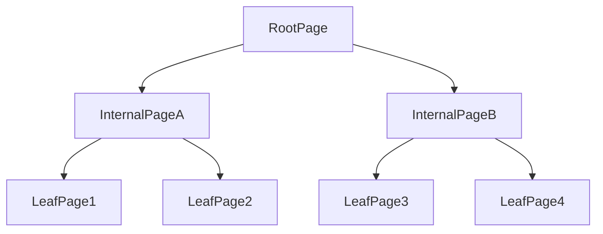
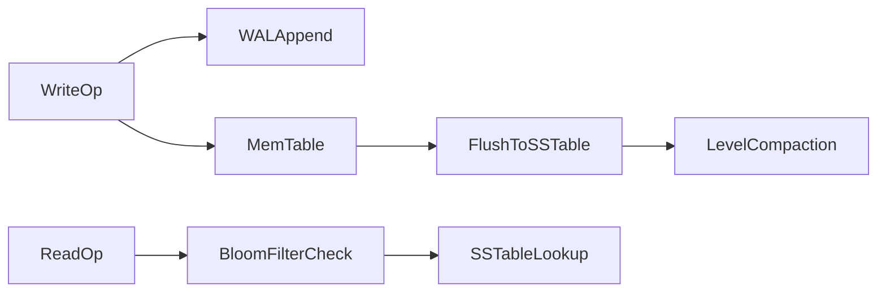
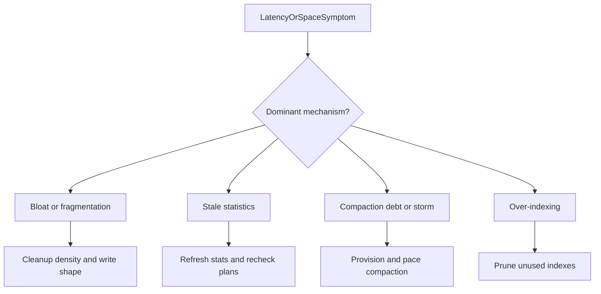
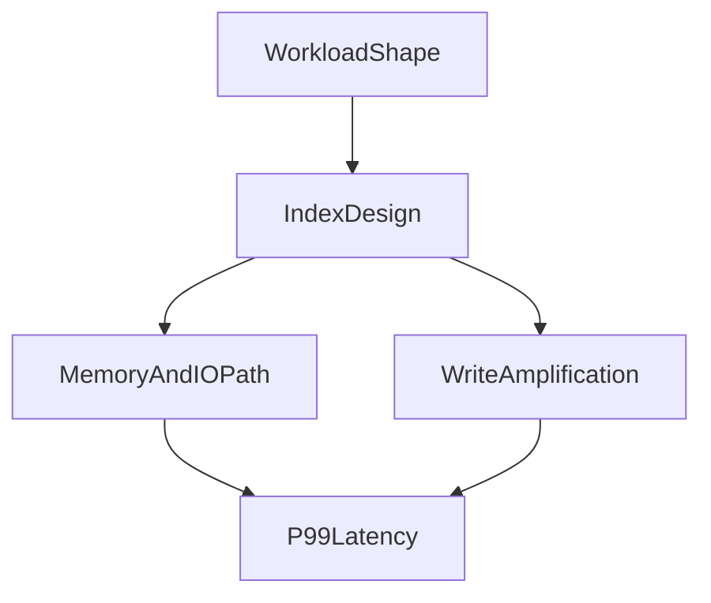

# Index Internals and Memory Layouts: From Theory to Practical Trade-offs

## 1. Why Index Internals Matter

Index choice is not a syntax optimization. It is a storage, memory, and CPU behavior decision that directly changes write amplification, cache residency, and tail latency.

**Write amplification** means one logical write (an insert, update, or delete the application believes is a single change) causes multiple physical writes to logs, pages, or compacted files. **Cache residency** means whether the pages or blocks needed for a lookup stay in memory. **Tail latency** (especially p95/p99) is where index layout mistakes appear first: average QPS can look healthy while a minority of lookups chase cold pages, decompress blocks, or wait on compaction.

This chapter compares the two dominant storage organizations behind indexes and primary stores—B-trees and LSM-trees—then connects those physics to operational failure modes.

---

## 2. B-Tree Internals

B-tree nodes are page-organized and balanced so tree height stays small as cardinality grows. Internal pages route lookups by comparing keys and descending to the correct child; leaf pages store key references (or clustered rows, depending on the engine) that finally resolve to the row payload. Lookup complexity approximates `O(log_b N)`, where `b` is fan-out: wider keys and lower fan-out raise height and increase page traversals per lookup.

When a leaf page fills, the engine performs a **page split**: it allocates a new page, moves roughly half the entries, and updates parent pointers. Splits keep the tree balanced, but they create random IO, temporarily lower page density, and contribute to fragmentation over time under random insert patterns.

**Use case.** A B-tree secondary index on `created_at` receives mostly appends of increasing timestamps. Leaf splits concentrate at the right edge (“right-hand insert hotspot”), causing latch contention and elevated insert latency even though the logical operation is a simple insert. Hashing or reversing a monotonic key, or choosing a different access model, can spread that hotspot when measurement shows the right edge is saturated.

#### In-Line Glossary: Fan-out

**What it is:** the number of child pointers per internal node.

**Why here:** larger fan-out lowers tree height and page traversals.

**Systemic implication:** key width and page layout influence lookup depth and cache performance; wide composite keys reduce fan-out and can raise IO per lookup.

---

## 3. LSM-Tree Pipeline

A **Log-Structured Merge-Tree (LSM-tree)** optimizes for high ingest by turning random updates into sequential writes, then merging immutable files in the background.

### 3.1 Write Path Components

The write path typically proceeds as follows. First, the engine appends to a **WAL** (write-ahead log) so a crash can recover recent writes. Next, it applies the change to an in-memory **memtable**, usually a sorted structure that absorbs ingest at memory speed. When the memtable fills, it becomes immutable and is **flushed** to disk as an **SSTable** (sorted string table): an immutable, ordered file of keyed data. Over time, many SSTables accumulate across levels. **Compaction** merges overlapping SSTables, discards obsolete versions, and rewrites data into cleaner levels so reads do not have to consult an ever-growing set of files.

### 3.2 Read Path Components

A read may consult the memtable, a block cache of recently used SSTable blocks, **Bloom filters**, and multiple SSTables before a key is found or ruled absent. A Bloom filter is a probabilistic structure that can say “this key is definitely not in this SSTable” (avoiding an IO) or “maybe present” (requiring a check). False positives waste some checks; false negatives do not occur for standard Bloom filters.

### 3.3 Amplification Trade-offs

The LSM trade-off profile favors stronger write throughput potential because sequential appends and batched flushes beat random in-place B-tree page updates under heavy ingest. **Read amplification** and **write amplification** are then controlled by compaction strategy.

Aggressive compaction lowers read cost by keeping fewer overlapping files, but burns write IO rewriting the same logical data repeatedly. Deferred compaction protects short-term write throughput until **compaction debt**—the backlog of merges owed to past ingest—causes read latency spikes, space blowups, and eventually a **compaction storm** when deferred work catches up under peak traffic.

**Use case.** An event-ingest cluster accepts millions of writes per minute with compaction deliberately relaxed to protect ingest SLOs. Space usage climbs and each point lookup touches more SSTables. During the next traffic peak, compaction finally runs hard to reclaim space, disk util hits 100%, and both ingest and query p99 collapse together. The failure mode was not “LSM is slow”; it was unmanaged compaction debt becoming mandatory work at the worst time.

#### In-Line Glossary: Compaction Debt

**What it is:** the backlog of merge and rewrite work an LSM owes because flushes have created overlapping SSTables faster than compaction has cleaned them.

**Why here:** deferred compaction looks free until debt is repaid as IO storms and space growth.

**Systemic implication:** treat compaction lag and space amplification as first-class capacity signals, not background housekeeping.

---

## 4. Memory and CPU-Level Effects

Micro-architecture factors matter as much as asymptotic complexity. **Cache-line locality** determines whether successive key comparisons stay hot in L1/L2 CPU caches. **Branch predictability** affects how often the CPU pipeline stalls on comparison outcomes. Pointer-chasing depth across pages and nodes multiplies memory latency. Decompression CPU overhead on compressed pages or SSTable blocks can dominate when storage IO is already fast.

Two indexes with similar big-O can therefore show very different p99 behavior because their memory access patterns differ: a shallow, cache-friendly layout can beat a theoretically “equivalent” structure that chases cold pointers or decompresses on every probe.

#### In-Line Glossary: Read Amplification

**What it is:** the number of physical or logical reads required per logical lookup.

**Why here:** index and storage design determines the amplification profile.

**Systemic implication:** amplification influences latency, IO cost, and capacity planning; lowering it often costs write amplification or memory.

---

## 5. Clustered vs Secondary Index Dynamics

A **clustered index** benefits primary-key range access by placing rows in key order on disk (or in the primary structure), so sequential scans of a key range enjoy physical locality and fewer random seeks. InnoDB’s primary key is the classic clustered example: the row lives in the primary B-tree.

**Secondary indexes** cost additional maintenance on every write that touches indexed columns, and in many engines they require extra lookup hops from secondary key to primary/clustered location before the row is fully available. That extra hop is another form of read amplification on secondary-index plans.

The design law follows directly: every secondary index is a permanent write tax. Keep only indexes with measured query ROI, and prune indexes that no longer appear in hot plans or that protect queries that no longer run at meaningful volume.

**Use case.** A support tool adds five secondary indexes “for flexibility” on an orders table. Insert and status-update throughput drop immediately because each write maintains six structures instead of one. Only two of the indexes appear in production plans. Pruning the unused three recovers write headroom without harming measured reads.

---

## 6. Composite Keys and Selectivity

**Selectivity** describes how strongly a predicate narrows the candidate set. High selectivity means few rows match; low selectivity means many rows match and indexes help less.

Composite index ordering determines which prefixes the planner can use. Place high-selectivity predicates early unless workload measurement proves an alternative ordering better matches combined filter and sort patterns. Align key order with the dominant filter-plus-sort shapes so a single index can satisfy both predicate and ORDER BY without a separate sort.

Poor ordering can leave an index logically present but practically ineffective: queries that do not share a usable leftmost prefix will ignore it, while writes still pay the full maintenance cost.

**Use case.** An index on `(status, created_at)` helps `WHERE status = 'open' ORDER BY created_at`. It does not help `WHERE created_at > $1` alone, because `created_at` is not a usable leftmost prefix. Writes still maintain the composite index for every status change.

---

## 7. Operational Failure Patterns

Common failure modes are measurable, not mysterious. Each one has a mechanism, a symptom, and a remediation path.

**Index bloat and fragmentation** mean leaf pages hold fewer useful live entries than expected, often after heavy updates/deletes (in heap/B-tree engines) or after incomplete cleanup. Lookups touch more pages per logical key. In PostgreSQL this often pairs with vacuum lag; in B-tree engines generally it pairs with random update churn and incomplete page reuse. Remediation includes cleanup/reindex strategies justified by measured density loss, not ritual weekly rebuilds.

**Stale statistics** mean the planner’s catalog model of row counts and value distributions no longer matches reality. Plans regress after data-shape shifts: a nested loop that was cheap on a small table becomes catastrophic after growth. Remediation is timely analyze/statistics refresh tied to load patterns, plus plan monitoring after large data changes.

**Compaction storms** in LSM systems spike write IO and latency when deferred compaction debt is repaid under peak traffic. Space amplification often precedes the storm. Remediation is continuous compaction capacity planning, ingest throttling when debt grows, and avoiding “pause compaction to go faster” as a steady-state policy.

**Over-indexing** collapses write throughput because each insert or update updates many structures for queries that never justify the tax. Remediation is index inventory against `EXPLAIN`/plan telemetry and deletion of indexes with no measured read ROI.

**Tombstone pressure** appears in LSM and some distributed stores when deletes are recorded as markers (tombstones) that must be retained until compaction can drop them safely. Excessive tombstones inflate read amplification until compaction clears them. Remediation includes bounded delete rates, compaction tuning, and avoiding delete-heavy patterns that the storage engine cannot reclaim in time.

Mitigation requires continuous measurement—hit ratios, amplification, and plan changes over time—not a one-time design review at schema creation.

---

## 8. Measurement Framework

Track at minimum the signals that connect design to user-visible latency. Index hit ratio shows whether the working set fits cache. Scanned rows versus returned rows expose selectivity and plan waste. Write amplification indicators such as WAL volume or compaction bytes written quantify the tax of the current index and storage layout. Page split and fragmentation patterns reveal B-tree maintenance debt. Compaction lag and space amplification reveal LSM debt before storms. p95 and p99 query latency by access path ties all of the above to product SLOs so you can prune or redesign indexes with evidence.

---

## 9. Architect Guidance

Index strategy should be treated as lifecycle architecture rather than a static schema checkbox. Model expected access patterns first; design a minimal viable index set; benchmark with realistic skew; observe production telemetry; and prune and evolve indexes continuously as queries and data distributions change. This iterative model is mandatory for long-lived systems because yesterday’s “obvious” index is often tomorrow’s write bottleneck.

Choose B-tree-oriented layouts when point and range reads dominate and update rates are moderate. Choose LSM-oriented layouts when sustained ingest dominates and the team can operate compaction as capacity work. In both cases, secondary indexes and composite key order are product decisions with permanent write cost.

---

## 10. External References

- [PostgreSQL Indexes](https://www.postgresql.org/docs/current/indexes.html)
- [RocksDB Tuning Guide](https://github.com/facebook/rocksdb/wiki/RocksDB-Tuning-Guide)
- [PostgreSQL Deep Dive](./01-postgresql-deep-dive.md)
- [MySQL InnoDB Architecture](./02-mysql-innodb-architecture.md)
