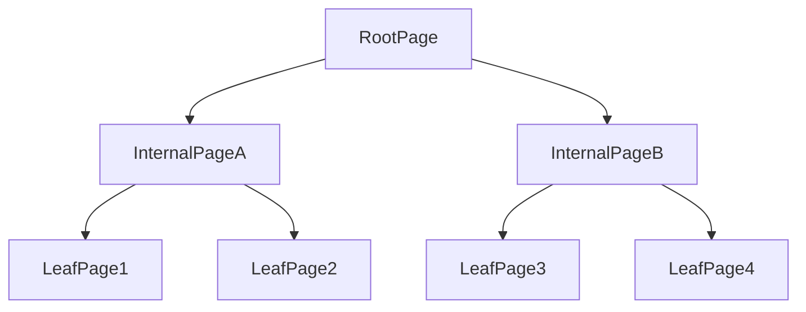
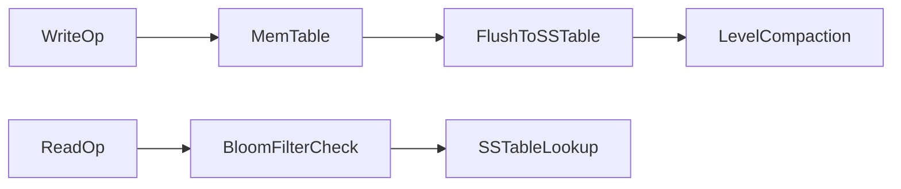
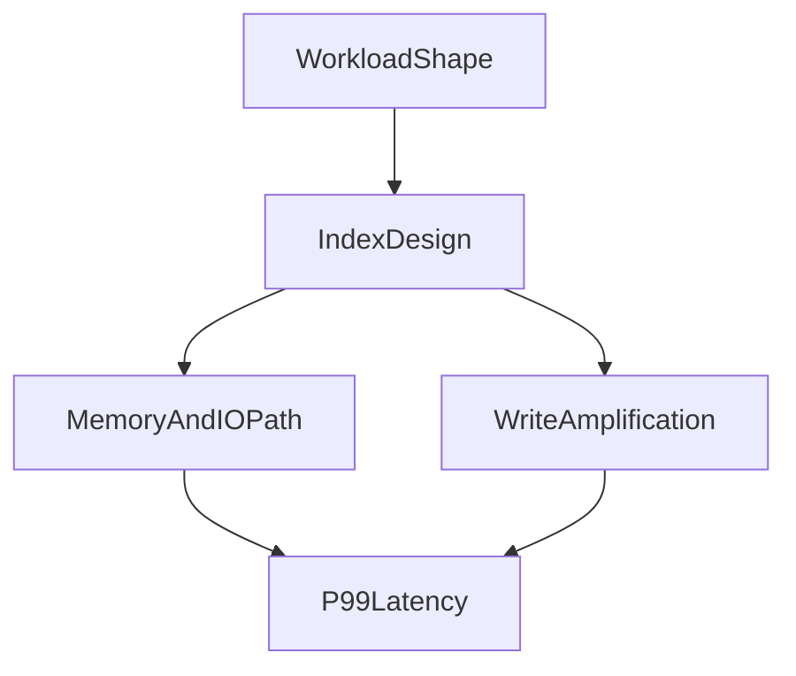

# Index Internals and Memory Layouts: From Theory to Practical Trade-offs

## 1. Why Index Internals Matter

Index choice is not a syntax optimization. It is a storage, memory, and CPU behavior decision that directly changes write amplification, cache residency, and tail latency.

---

## 2. B-Tree Internals

B-tree nodes are page-organized and balanced so tree height stays small as cardinality grows. Internal pages route lookups by comparing keys and descending to the correct child; leaf pages store key references (or clustered rows, depending on the engine) that finally resolve to the row payload. Lookup complexity approximates `O(log_b N)`, where `b` is fan-out: wider keys and lower fan-out raise height and increase page traversals per lookup.

#### In-Line Glossary: Fan-out

**What it is:** number of child pointers per internal node.  
**Why here:** larger fan-out lowers tree height and page traversals.  
**Systemic implication:** key width and page layout influence lookup depth and cache performance.

---

## 3. LSM-Tree Pipeline

The LSM write path appends to a WAL for durability, writes into an in-memory memtable for fast ingest, flushes immutable SSTables when memory fills, and compact levels repeatedly to reclaim space and restore read efficiency. The read path may consult the memtable, block cache, Bloom filters, and multiple SSTables before a key is found or ruled absent.

The trade-off profile favors stronger write throughput potential because sequential appends and batched flushes beat random in-place B-tree page updates under heavy ingest. Read and write amplification are then controlled by compaction strategy: aggressive compaction lowers read cost but burns write IO; deferred compaction protects write throughput until compacted debt causes read latency and space blowups.

---

## 4. Memory and CPU-Level Effects

Micro-architecture factors matter as much as asymptotic complexity. Cache-line locality determines whether successive key comparisons stay hot in L1/L2. Branch predictability affects how often the CPU pipeline stalls on comparison outcomes. Pointer-chasing depth across pages and nodes multiplies memory latency. Decompression CPU overhead on compressed pages or SSTable blocks can dominate when IO is already fast.

Two indexes with similar big-O can therefore show very different p99 behavior because their memory access patterns differ: a shallow, cache-friendly layout can beat a theoretically “equivalent” structure that chases cold pointers or decompresses on every probe.

#### In-Line Glossary: Read Amplification

**What it is:** number of physical/logical reads required per logical lookup.  
**Why here:** index/storage design determines amplification profile.  
**Systemic implication:** amplification influences latency, IO cost, and capacity planning.

---

## 5. Clustered vs Secondary Index Dynamics

A clustered index benefits primary-key range access by placing rows in key order on disk (or in the primary structure), so sequential scans of a key range enjoy physical locality and fewer random seeks. Secondary indexes cost additional maintenance on every write that touches indexed columns, and in many engines they require extra lookup hops from secondary key to primary/clustered location before the row is fully available.

The design law follows directly: every secondary index is a permanent write tax. Keep only indexes with measured query ROI, and prune indexes that no longer appear in hot plans or that protect queries that no longer run at meaningful volume.

---

## 6. Composite Keys and Selectivity

Composite index ordering determines which prefixes the planner can use. Place high-selectivity predicates early unless workload measurement proves an alternative ordering better matches combined filter and sort patterns. Align key order with the dominant filter-plus-sort shapes so a single index can satisfy both predicate and ORDER BY without a separate sort.

Poor ordering can leave an index logically present but practically ineffective: queries that do not share a usable leftmost prefix will ignore it, while writes still pay the full maintenance cost.

---

## 7. Operational Failure Patterns

Common failure modes are measurable, not mysterious. Index bloat and fragmentation inflate leaf density problems and raise IO per logical lookup. Stale statistics cause planner regressions that suddenly prefer sequential scans or wrong join orders after data shape shifts. Compaction storms in LSM systems spike write IO and latency when deferred work catches up under peak traffic. Over-indexing collapses write throughput because each insert or update updates many structures for queries that never justify the tax.

Mitigation requires continuous measurement—hit ratios, amplification, and plan changes over time—not a one-time design review at schema creation.

---

## 8. Measurement Framework

Track at minimum the signals that connect design to user-visible latency. Index hit ratio shows whether the working set fits cache. Scanned rows versus returned rows expose selectivity and plan waste. Write amplification indicators such as WAL volume or compaction bytes written quantify the tax of the current index and storage layout. Page split and fragmentation patterns reveal B-tree maintenance debt. p95 and p99 query latency by access path ties all of the above to product SLOs so you can prune or redesign indexes with evidence.

---

## 9. Architect Guidance

Index strategy should be treated as lifecycle architecture rather than a static schema checkbox. Model expected access patterns first; design a minimal viable index set; benchmark with realistic skew; observe production telemetry; and prune and evolve indexes continuously as queries and data distributions change. This iterative model is mandatory for long-lived systems because yesterday’s “obvious” index is often tomorrow’s write bottleneck.

---

## 10. External References

- [PostgreSQL Indexes](https://www.postgresql.org/docs/current/indexes.html)
- [RocksDB Tuning Guide](https://github.com/facebook/rocksdb/wiki/RocksDB-Tuning-Guide)
