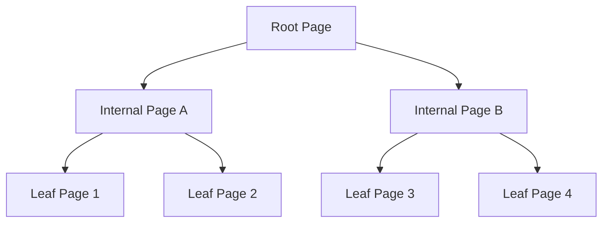
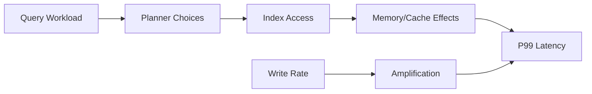

# Index Internals and Memory Layouts Across Database Engines

## 1. Purpose

Senior database architecture decisions fail when index choice is treated as syntax instead of storage physics.  
This guide explains internal page structures, memory behavior, and amplification trade-offs that drive real performance.

---

## 2. B-Tree Page-Level Mechanics

B-Tree nodes (pages) maintain sorted keys with child pointers.

- leaf pages contain key + row pointer (or clustered row data)
- internal pages route search path
- splits/merges preserve tree balance

Cost model:

- point lookup: `O(log_b N)` page traversals
- range scans: near-sequential leaf traversal, cache-friendly

#### In-Line Glossary: Fan-out

**What it is:** Number of child pointers per internal node, determined by page size and key width.  
**Why here:** Higher fan-out lowers tree height and read IO depth.  
**Systemic impact:** Large composite keys increase page occupancy pressure and can degrade cache efficiency.

---

## 3. LSM Memory/Storage Pipeline

LSM write path:

1. append to WAL
2. insert into memtable
3. flush immutable SSTables
4. compact levels

Read path:

- memtable + block cache + Bloom filters + SSTable search

Performance shape:

- write-optimized under sustained ingest
- compaction-induced write amplification and tail jitter

---

## 4. Memory Layout and CPU Effects

Important micro-architecture factors:

- cache line alignment
- branch predictability in comparison chains
- pointer chasing vs contiguous arrays
- compression/decompression CPU overhead

Practical implication:

- two indexes with same big-O complexity can behave very differently at P99 due to cache miss profile and decompression cost.

#### In-Line Glossary: Read Amplification

**What it is:** Number of storage/memory accesses required to satisfy a logical read.  
**Why here:** LSM engines may probe multiple structures; B-Tree may require deeper random page traversal.  
**Systemic impact:** Amplification directly influences latency predictability and IO cost.

---

## 5. Clustered vs Secondary Index Trade-offs

Clustered index:

- stores row data in primary index order
- excellent locality for primary-key range scans

Secondary index:

- additional structure that points to primary key/row locator
- speeds alternative predicates at write/storage cost

Guideline:

- every secondary index is a persistent write tax; keep only indexes with measurable query benefit.

---

## 6. Selectivity, Cardinality, and Composite Ordering

Index usefulness depends on:

- predicate selectivity
- leading column order in composite keys
- sort/group patterns

Heuristic:

- put high-selectivity filters earlier unless workload strongly requires different prefix access.

---

## 7. Operational Diagnostics

Essential measurements:

- index hit ratio and page read distribution
- bloat/fragmentation percentage
- top query index usage and missed-index scans
- write amplification indicators (WAL volume, compaction IO)

---

## 8. External Visual References

- [CMU Database Group: Storage and Indexing Lectures](https://15445.courses.cs.cmu.edu/)
- [RocksDB Tuning Guide](https://github.com/facebook/rocksdb/wiki/RocksDB-Tuning-Guide)
- [PostgreSQL Indexes Documentation](https://www.postgresql.org/docs/current/indexes.html)
