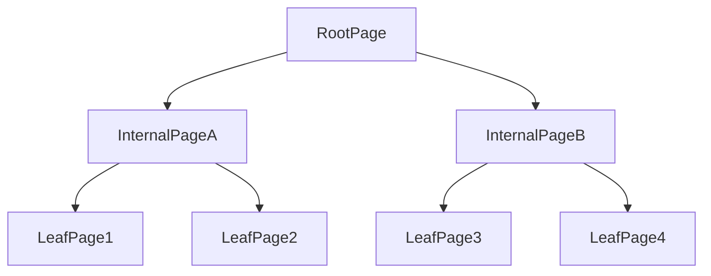
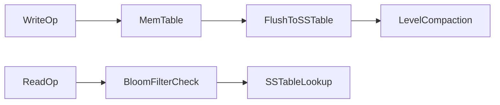
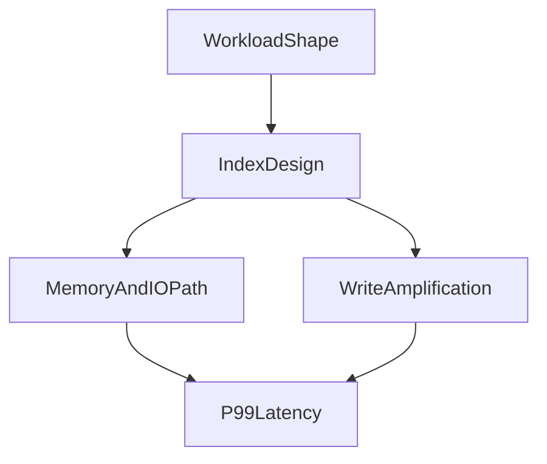

# Index Internals and Memory Layouts: From Theory to Practical Trade-offs

## 1. Why Index Internals Matter

Index choice is not a syntax optimization. It is a storage, memory, and CPU behavior decision that directly changes write amplification, cache residency, and tail latency.

---

## 2. B-Tree Internals

B-tree nodes are page-organized and balanced.

- internal pages route lookups
- leaf pages store key references (or clustered rows depending on engine)

Lookup complexity approximates `O(log_b N)`, where `b` is fan-out.

#### In-Line Glossary: Fan-out

**What it is:** number of child pointers per internal node.  
**Why here:** larger fan-out lowers tree height and page traversals.  
**Systemic implication:** key width and page layout influence lookup depth and cache performance.

---

## 3. LSM-Tree Pipeline

LSM write path:

1. append to WAL
2. write to memtable
3. flush immutable SSTables
4. compact levels repeatedly

Read path:

- memtable, cache, Bloom filters, multiple SSTables

Trade-off profile:

- stronger write throughput potential
- read and write amplification controlled by compaction strategy

---

## 4. Memory and CPU-Level Effects

Micro-architecture factors matter:

- cache line locality
- branch predictability
- pointer chasing depth
- decompression CPU overhead

Two indexes with similar big-O can have very different p99 behavior due to memory access patterns.

#### In-Line Glossary: Read Amplification

**What it is:** number of physical/logical reads required per logical lookup.  
**Why here:** index/storage design determines amplification profile.  
**Systemic implication:** amplification influences latency, IO cost, and capacity planning.

---

## 5. Clustered vs Secondary Index Dynamics

Clustered index benefits:

- physical locality for primary-key range access

Secondary index costs:

- additional maintenance on writes
- extra lookup hops in many engines

Design law:

- every secondary index is a permanent write tax; keep only indexes with measured query ROI.

---

## 6. Composite Keys and Selectivity

Composite index ordering determines usable prefixes.

Guidance:

- place high-selectivity predicates early unless workload proves alternative ordering better
- align key order with dominant filter + sort patterns

Poor ordering can make an index logically present but practically ineffective.

---

## 7. Operational Failure Patterns

Common issues:

- index bloat/fragmentation
- stale statistics causing planner regressions
- compaction storms in LSM systems
- over-indexing causing write collapse

Mitigation requires continuous measurement, not one-time design.

---

## 8. Measurement Framework

Track at minimum:

- index hit ratio
- scanned rows vs returned rows
- write amplification indicators (WAL/compaction volume)
- page split/fragmentation patterns
- p95/p99 query latency by access path

---

## 9. Architect Guidance

Index strategy should be treated as lifecycle architecture:

1. model expected access patterns
2. design minimal viable index set
3. benchmark with realistic skew
4. observe production telemetry
5. prune and evolve indexes continuously

This iterative model is mandatory for long-lived systems.

---

## 10. External References

- [PostgreSQL Indexes](https://www.postgresql.org/docs/current/indexes.html)
- [RocksDB Tuning Guide](https://github.com/facebook/rocksdb/wiki/RocksDB-Tuning-Guide)
