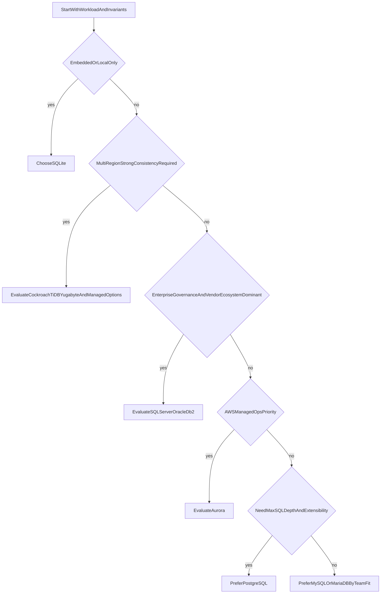

# Main SQL Databases Comparison Guide: Licensing, Trade-offs, and Architecture Fit

## 1. Purpose

This document compares major SQL databases from an architecture and operations perspective, including licensing model (paid vs free), strengths, weaknesses, high-availability posture, migration constraints, and practical selection criteria. The objective is to give you a decision framework you can use in interviews and real production design discussions.

---

## 2. Databases Covered

This guide covers the most relevant engines for modern software architecture:

- PostgreSQL
- MySQL
- MariaDB
- Microsoft SQL Server
- Oracle Database
- SQLite
- CockroachDB (distributed SQL)
- TiDB (distributed SQL)
- YugabyteDB (distributed SQL)
- IBM Db2
- Amazon Aurora (PostgreSQL-compatible / MySQL-compatible managed SQL)

These engines represent the dominant SQL trade-off families: open-source general-purpose relational, enterprise commercial relational, embedded SQL, distributed SQL, and managed cloud relational.

---

## 3. Comparison Matrix (Executive View)

| Database | License / Cost Model | Core Strengths | Core Weaknesses | Best Fit |
|---|---|---|---|---|
| PostgreSQL | Open source (free); paid support optional | SQL depth, extensibility, strong consistency model, rich ecosystem | Operational tuning requires maturity at scale | Complex domains, strong invariants, extensible platform needs |
| MySQL | Open source community + commercial enterprise | Mature OLTP ecosystem, broad adoption, operational familiarity | Advanced query/extensibility profile is narrower than PostgreSQL | High-volume OLTP with teams already strong in MySQL ops |
| MariaDB | Open source fork lineage from MySQL | Familiar SQL model, open governance preference for some teams | Compatibility divergence from MySQL in advanced paths | Teams that want MySQL-like model with MariaDB ecosystem |
| SQL Server | Commercial (paid), Express/Developer editions exist | Strong enterprise tooling, BI integration, mature security/compliance stack | Licensing cost, vendor lock-in concerns | Microsoft-centered enterprises, compliance-heavy operations |
| Oracle Database | Commercial (paid) | High-end enterprise capabilities, mature clustering and advanced options | High licensing and operational cost, complexity | Large enterprise mission-critical systems with budget and DBA depth |
| SQLite | Public domain / embedded free | Zero-admin, file-based simplicity, excellent local/edge use | Not a networked multi-writer server engine | Mobile/desktop/embedded/local cache/offline-first components |
| CockroachDB | Open-source core + commercial offerings | Distributed SQL with strong consistency and horizontal resilience | Coordination latency and operational complexity | Multi-region SQL with strict correctness and high availability goals |
| TiDB | Open-source core + enterprise offerings | MySQL-compatible distributed SQL, HTAP-friendly ecosystem | Operational complexity and cost at scale | Teams needing MySQL compatibility with distributed scale-out |
| YugabyteDB | Open-source core + commercial offerings | PostgreSQL-compatible distributed SQL, strong consistency focus | Coordination cost and operational maturity requirements | Geo-distributed transactional systems needing PG-style SQL |
| IBM Db2 | Commercial (paid), community edition options | Enterprise reliability, mature analytics/integration in IBM estates | Licensing and ecosystem specialization | Large enterprises already invested in IBM platform stack |
| Amazon Aurora | Managed cloud service (paid consumption) | Managed operations, automated backups/failover, strong cloud integration | Cloud lock-in, cost growth under scale, managed constraints | Teams prioritizing speed of delivery and managed operations in AWS |

---

## 4. Licensing and Cost Model Deep Dive

### 4.1 Free and Open-Source Engines

PostgreSQL, MySQL community edition, MariaDB, SQLite, and open-source tiers of distributed SQL engines can be used without direct license fees. “Free” does not mean low total cost. Operational burden, on-call maturity, tuning complexity, staffing, and migration costs can dominate total cost of ownership.

### 4.2 Commercial Engines

SQL Server, Oracle, and Db2 offer enterprise feature depth, support contracts, and ecosystem integration, but licensing can be substantial. The correct question is whether paid capabilities materially reduce risk, compliance exposure, or delivery lead time in your environment.

### 4.3 Managed SQL Services

Aurora is paid by consumption and managed-service capabilities. It can reduce platform overhead and improve delivery speed, but introduces cloud coupling and long-term cost elasticity concerns.

### 4.4 Licensing and Edition Pitfalls

Edition and feature gating can materially alter architecture viability. Capabilities such as advanced HA options, partitioning bundles, deep diagnostics, and security modules may be unavailable in lower tiers. A design proven in one edition may become non-viable or unexpectedly expensive once production requirements force an edition change.

Vendor billing metrics also create hidden cost cliffs. Per-core licensing, replica charges, I/O pricing, backup retention pricing, and cross-region transfer charges can outweigh base software price. Support entitlements are another factor: some organizations require enterprise support SLAs for governance reasons even when using open-source engines.

#### In-Line Glossary: Total Cost of Ownership (TCO)

**What it is:** full lifecycle cost including licensing, infrastructure, engineering effort, operations, incidents, training, and migration risk.  
**Why here:** database decisions fail when teams optimize only for license price.  
**Systemic implication:** the cheapest license can become the most expensive platform if operational fit is poor.

---

## 5. Engine-by-Engine Architectural Guidance

### 5.1 PostgreSQL

Choose PostgreSQL when your domain needs expressive SQL, strong relational modeling, and extension capability (for example, JSONB-heavy hybrid models, geospatial, advanced indexing, or analytics-adjacent workloads). PostgreSQL is often a strong default when correctness and model flexibility matter more than shortest onboarding path.

Avoid blind PostgreSQL adoption when your team lacks operational ability to manage vacuum, replication, tuning, and failover under production pressure.

### 5.2 MySQL

Choose MySQL when OLTP throughput and operational familiarity are dominant priorities, especially in teams with established MySQL practices and mature runbooks.

Avoid choosing MySQL solely from habit when your workload strongly benefits from PostgreSQL extensibility or deeper SQL features.

### 5.3 MariaDB

Choose MariaDB when you want an open-source relational option with MySQL-like ergonomics and ecosystem preferences aligned with MariaDB tooling.

Avoid assuming permanent drop-in equivalence with MySQL enterprise ecosystems; compatibility and feature trajectories can diverge and should be validated strategically.

### 5.4 SQL Server

Choose SQL Server when enterprise integration with Microsoft ecosystem, compliance workflows, and built-in management tooling are central business requirements.

Avoid choosing SQL Server if licensing constraints and multi-cloud portability are primary strategic goals.

### 5.5 Oracle Database

Choose Oracle when you genuinely need its enterprise-grade stack and have budget, DBA depth, and governance maturity to operate it effectively.

Avoid Oracle when your scale/risk profile does not require those capabilities; overbuying platform complexity slows delivery and inflates cost.

### 5.6 SQLite

Choose SQLite for embedded/local scenarios where simplicity, portability, and zero-admin operation are ideal.

Avoid using SQLite as a networked multi-user backend database for high-concurrency server workloads.

### 5.7 CockroachDB

Choose CockroachDB when you need distributed SQL with strong consistency across regions and cannot accept single-primary topology limits.

Avoid underestimating coordination costs, latency implications, and operational complexity.

### 5.8 TiDB

Choose TiDB when you need distributed SQL scale-out with a strong MySQL compatibility posture and want a platform that can support both transactional and analytical patterns.

Avoid adopting TiDB without an explicit distributed-operations maturity plan; MySQL syntax familiarity does not remove control-plane and topology complexity.

### 5.9 YugabyteDB

Choose YugabyteDB when you need PostgreSQL-compatible distributed SQL with strong consistency across regions and resilient transactional behavior.

Avoid assuming complete PostgreSQL operational equivalence; distributed execution semantics introduce latency and governance differences.

### 5.10 IBM Db2

Choose Db2 when operating in enterprise environments where IBM ecosystem integration and existing governance standards are strategic assets.

Avoid Db2-first decisions if your organization does not benefit from IBM stack alignment, as licensing and specialization may increase complexity without proportional value.

### 5.11 Aurora

Choose Aurora when managed operations, rapid delivery, and AWS-native integration are strategic.

Avoid cost-blind adoption; high I/O workloads and scale can create meaningful spend, and cloud coupling can raise future migration friction.

---

## 6. HA/DR and RPO/RTO Matrix

High availability and disaster recovery strategy must be matched to business continuity objectives. RPO (maximum acceptable data loss window) and RTO (maximum acceptable recovery time) are first-class decision constraints.

| Database | Typical HA Pattern | Typical DR Pattern | RPO Tendency | RTO Tendency | Key Trade-off |
|---|---|---|---|---|---|
| PostgreSQL | Primary + synchronous/asynchronous replicas | PITR + cross-region replica/failover | Near-zero with synchronous modes, higher with async | Minutes with mature automation | Consistency strength vs write latency and failover complexity |
| MySQL | Primary-replica, semi-sync, group-replication variants | Binlog/PITR + regional replicas | Low to medium depending on replication mode | Minutes with tested failover | Throughput familiarity vs lag/consistency management |
| MariaDB | MySQL-like replication and clustering options | Backup + replica-based DR | Low to medium by topology | Minutes to tens of minutes | Familiar model vs topology-specific ops complexity |
| SQL Server | Always On availability groups/failover clustering | Backup chains + geo-replica patterns | Low with synchronous AG modes | Low minutes with mature runbooks | Enterprise HA tooling vs licensing and ops depth |
| Oracle | RAC/Data Guard class options | Data Guard + backup/PITR workflows | Very low in high-cost setups | Low minutes in mature estates | Premium HA/DR posture vs high cost/complexity |
| SQLite | Local file durability patterns | App-level sync/backup strategy | App dependent | App dependent | Extreme simplicity vs no native server HA |
| CockroachDB | Multi-node quorum across zones/regions | Built-in distributed survivability + backup restore | Very low for committed data | Fast regional continuity; longer for disaster restore | Strong correctness and resilience vs coordination latency |
| TiDB | Distributed quorum/replica placement | Cluster backup + cross-region strategy | Low for quorum commits | Fast for node failures, longer for regional recovery | Scale-out and compatibility vs distributed ops overhead |
| YugabyteDB | Distributed quorum replicas | Snapshot/backup + regional topology planning | Low for quorum commits | Fast for node failures, longer for disaster restore | PG-like distributed consistency vs coordination cost |
| IBM Db2 | Enterprise cluster/replica patterns | Enterprise backup + DR replication | Low to medium by edition/topology | Minutes to hours by setup | Enterprise durability vs licensing/specialized ops |
| Aurora | Multi-AZ managed replication/failover | Cross-region read replica/global DB options | Low in-region, higher cross-region by design | Fast in-zone/region; cross-region longer | Managed ease vs lock-in and variable cost |

#### In-Line Glossary: RPO and RTO

**What it is:** RPO defines the maximum acceptable data loss window; RTO defines the maximum acceptable recovery duration after outage.  
**Why here:** HA/DR design is incomplete if it cannot satisfy continuity objectives.  
**Systemic implication:** architecture must map critical workflows to explicit RPO/RTO targets and validate them through drills.

---

## 7. Security and Compliance Matrix

Security and compliance should be evaluated explicitly per engine, not inferred from popularity.

| Database | Security Strengths | Compliance/Audit Strengths | Common Gaps or Risks to Validate |
|---|---|---|---|
| PostgreSQL | Strong role model, TLS, rich extension ecosystem | Mature auditing options via ecosystem tooling | Misconfiguration risk in role/schema boundaries |
| MySQL | Mature auth and encryption options, broad hardening guidance | Widely accepted in enterprise controls | Operational inconsistency across teams |
| MariaDB | Similar baseline controls to MySQL family | Commonly adopted in governed OSS environments | Drift vs expected MySQL behaviors/policies |
| SQL Server | AD integration, TDE, row-level security ecosystem | Strong enterprise audit/reporting posture | Edition/licensing dependence for some controls |
| Oracle | Advanced enterprise security controls | Deep compliance support in regulated sectors | Complexity can increase misconfiguration surface |
| SQLite | Small attack surface in embedded use | Suitable where app-level controls are rigorous | App must own encryption/access governance |
| CockroachDB | Strong encrypted distributed posture by design | Good fit for traceability-sensitive flows | Distributed ops maturity required for secure operations |
| TiDB | Distributed security controls with enterprise options | Suitable for governed distributed deployments | Multi-component architecture expands policy surface |
| YugabyteDB | Distributed security model with PG-compatible controls | Strong fit for consistency-sensitive audited paths | Topology and key-management operations complexity |
| IBM Db2 | Enterprise-grade security governance integration | Strong posture in IBM-centric regulated estates | Specialized ops bottlenecks can reduce agility |
| Aurora | Deep integration with AWS IAM/KMS/security services | Strong managed compliance narrative in AWS | Cloud-account boundary assumptions and misconfiguration risk |

---

## 8. Migration Compatibility and Portability

Migration between SQL engines is rarely lift-and-shift. Dialect differences (DDL syntax, functions, procedures, locking semantics, optimizer behavior, data types, collation and time semantics) can produce correctness and performance regressions unless tested explicitly.

Compatibility planning should include:

1. Schema and data type compatibility audit.
2. Query/function/procedure compatibility inventory.
3. Performance regression benchmark on production-like data.
4. Data movement strategy (dump/restore, CDC, dual-write, staged cutover).
5. Rollback/fallback posture for failed cutovers.

Managed-service adoption can increase platform coupling and exit costs. Senior decisions should balance delivery speed gains against long-term reversibility and migration friction.

---

## 9. Distributed SQL and Enterprise Coverage Expansion

Distributed SQL options such as CockroachDB, TiDB, and YugabyteDB exist because single-primary topologies can become limiting under geo-latency, failover, and write-scalability demands. They improve survivability and consistency posture for global transactional systems, but coordination overhead and operational complexity are inherent costs.

Enterprise engines such as SQL Server, Oracle, and Db2 remain strategically relevant where governance integration, ecosystem tooling, support contracts, and regulatory posture are dominant decision factors. In those contexts, organizational constraints are as important as raw engine benchmarks.

---

## 10. Selection by Scenario

### Scenario A: Startup Product, One Region, Fast Iteration

PostgreSQL is usually a strong default because it balances capability, cost, and ecosystem depth. MySQL is equally valid when the team is stronger in MySQL operations and can execute faster with lower operational risk.

### Scenario B: Enterprise Internal Systems with Microsoft Stack

SQL Server often provides a strong integration and governance fit, especially where Microsoft tooling, identity integration, and compliance reporting are first-class requirements.

### Scenario C: Global Multi-Region, Strict Invariants

Evaluate distributed SQL candidates such as CockroachDB, TiDB, and YugabyteDB, and compare them against managed strongly coordinated options. Single-primary topologies should be stress-tested under cross-region latency and failover scenarios before final commitment.

### Scenario D: Mobile/Desktop Local Persistence

SQLite is the right tool for embedded local persistence because it is lightweight, portable, and operationally minimal.

### Scenario E: AWS-First Team with Limited DBA Capacity

Aurora is often pragmatic when reduced platform overhead justifies managed-service cost and cloud coupling.

### Scenario F: Large IBM-Centric Enterprise Estate

Db2 can be strategically effective where IBM platform integration, operational standards, and compliance controls are already institutionalized.

---

## 11. Decision Flow (Practical)

---

## 12. Interview-Ready Trade-off Summary

When comparing SQL databases in interviews, move beyond feature lists and state your decision dimensions explicitly:

1. Invariant criticality and consistency requirements.
2. Read/write profile and p95/p99 latency budget.
3. HA/DR targets (RPO/RTO) and failover behavior.
4. Operational maturity and on-call capability.
5. Licensing, cloud coupling, and total cost of ownership.
6. Migration reversibility and long-term platform strategy.
7. Security/compliance control fit for the organization.

This framing demonstrates architectural maturity because it ties database choice to measurable system constraints rather than brand preference.

---

## 13. External References

- [PostgreSQL Documentation](https://www.postgresql.org/docs/)
- [MySQL Documentation](https://dev.mysql.com/doc/)
- [MariaDB Documentation](https://mariadb.com/kb/en/documentation/)
- [SQL Server Documentation](https://learn.microsoft.com/sql/)
- [Oracle Database Documentation](https://docs.oracle.com/en/database/)
- [SQLite Documentation](https://www.sqlite.org/docs.html)
- [CockroachDB Docs](https://www.cockroachlabs.com/docs/)
- [TiDB Documentation](https://docs.pingcap.com/tidb/stable)
- [YugabyteDB Documentation](https://docs.yugabyte.com/)
- [IBM Db2 Documentation](https://www.ibm.com/docs/en/db2)
- [Amazon Aurora Docs](https://docs.aws.amazon.com/AmazonRDS/latest/AuroraUserGuide/CHAP_AuroraOverview.html)
