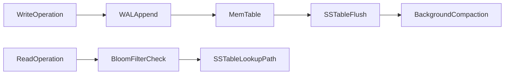

# NoSQL Taxonomy: Model Semantics, Storage Internals, and Decision Boundaries

## 1. Why Taxonomy Matters

“NoSQL” is not a database type. It is an umbrella over several models with different physics and consistency semantics. Senior architecture decisions improve when model selection is tied to workload shape and failure tolerance, not trend adoption.

---

## 2. Model Families and Their Native Strengths

### 2.1 Key-Value

Primary contract:

- key lookup and key mutation with minimal query semantics

Strength profile:

- very low latency
- simple horizontal partitioning

Weakness profile:

- poor ad-hoc query flexibility
- relationship semantics moved into application code

### 2.2 Document

Primary contract:

- semi-structured documents with nested fields and flexible schema

Strength profile:

- rapid schema evolution
- read locality for embedded object graphs

Weakness profile:

- denormalization drift
- large-document update cost

### 2.3 Wide-Column

Primary contract:

- partitioned sparse rows with clustering order

Strength profile:

- massive write throughput
- linear-ish scaling for append/time-series patterns

Weakness profile:

- query flexibility constrained by partition/clustering keys
- secondary access patterns require explicit design effort

### 2.4 Graph

Primary contract:

- nodes and edges as first-class model

Strength profile:

- traversal-centric queries perform naturally

Weakness profile:

- difficult horizontal scaling for arbitrary deep traversals

---

## 3. Storage Engine Physics: B-Tree vs LSM

### 3.1 B-Tree Bias

- balanced page hierarchy
- strong point/range read behavior
- in-place update costs under heavy random write workloads

### 3.2 LSM Bias

- log + memtable write path
- immutable SSTables + compaction lifecycle
- stronger ingest potential, but compaction and read amplification costs

#### In-Line Glossary: Compaction Debt

**What it is:** backlog of pending compaction work relative to incoming write rate.  
**Why here:** compaction debt predicts future latency instability and storage amplification.  
**Systemic implication:** sustained debt causes tail-latency spikes and capacity inefficiency.

---

## 4. Consistency Semantics Across Models

NoSQL designs often expose tunable or eventual consistency by default.

Key architecture implication:

- consistency is operation-specific and must be encoded by endpoint criticality

Examples:

- social reaction write: eventual consistency acceptable
- inventory reservation: stronger consistency required

---

## 5. When to Reject Relational-First Decisions

Choose NoSQL-first when most conditions hold:

1. write volume and partition scale exceed practical single-node relational operation envelope
2. access pattern is strongly key or partition oriented
3. bounded inconsistency is acceptable for target workflows
4. domain model does not rely on frequent cross-entity relational joins under strict transactional invariants

Reject NoSQL-first when:

- strict cross-entity invariants dominate
- ad-hoc relational querying is central to product behavior
- team lacks maturity for eventual consistency reconciliation and repair operations

---

## 6. Failure Modes by Model

- key-value: hotspot keys, eviction policy surprise, replica lag
- document: unbounded document growth, shard key drift
- wide-column: tombstone pressure, compaction storms
- graph: traversal explosion, cross-partition edge penalties

Architects should document these risks explicitly in ADRs before committing to model adoption.

---

## 7. Decision Heuristic

1. classify workload by dominant query shape
2. classify invariants by criticality
3. map model to storage and consistency behavior
4. simulate failure and convergence behavior
5. choose model that minimizes total correctness + latency + ops risk

This process is repeatable and more reliable than preference-based selection.
