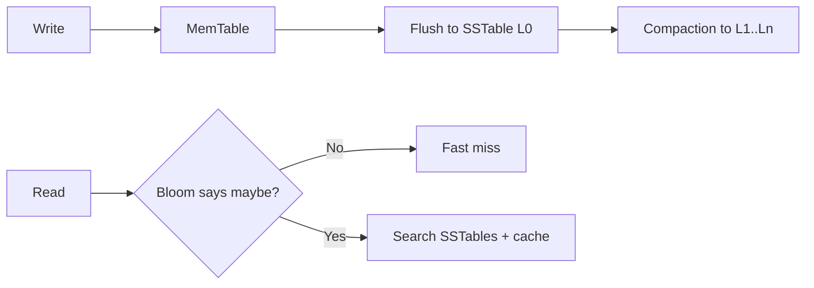

# NoSQL Taxonomy: Models, Storage Engines, and Selection Logic

## 1. NoSQL Is a Family, Not a Single Category

NoSQL systems optimize different invariants than classic relational engines.  
Correct selection starts from access patterns, consistency semantics, and operational constraints.

---

## 2. Taxonomy by Data Model

## 2.1 Key-Value Stores

Data model:

- Opaque value addressed by unique key.

Strengths:

- Extremely low-latency gets/puts.
- Horizontal partitioning is straightforward.

Limits:

- Minimal query expressiveness beyond key access.
- Secondary indexing often limited or expensive.

## 2.2 Document Stores

Data model:

- Self-describing JSON/BSON-like documents.

Strengths:

- Flexible schema evolution.
- Co-located nested data reduces join pressure.

Limits:

- Denormalization drift and document growth issues.
- Complex cross-document invariants are harder than ACID RDBMS.

## 2.3 Wide-Column Stores

Data model:

- Partition key + clustering columns, sparse wide rows.

Strengths:

- Massive write throughput, linear horizontal scaling.
- Strong fit for time-series, event, and log-style workloads.

Limits:

- Query model tied to primary access patterns.
- Secondary querying flexibility is constrained.

## 2.4 Graph Databases

Data model:

- Nodes, edges, properties with traversal-first query semantics.

Strengths:

- Efficient deep relationship traversal.
- Naturally represents highly connected domains.

Limits:

- Horizontal scaling of arbitrary traversals is difficult.
- Not ideal as general OLTP replacement for all entities.

---

## 3. LSM-Tree vs B-Tree Internals

## 3.1 B-Tree

- In-place updates in balanced page hierarchy.
- Read-friendly for point/range queries.
- Write path may incur random IO and page split overhead.

## 3.2 LSM-Tree

- Writes appended to WAL + memtable; flushed to immutable SSTables.
- Background compaction merges levels.

Trade-offs:

- Better sequential write throughput.
- Read amplification unless mitigated with Bloom filters and cache.
- Compaction introduces write amplification and IO scheduling complexity.

#### In-Line Glossary: Write Amplification

**What it is:** Ratio between bytes physically written and bytes logically requested by workload.  
**Why here:** LSM compaction can rewrite data multiple times across levels.  
**Systemic impact:** SSD endurance, IO budget, and p99 latency are strongly affected by compaction policy.

#### In-Line Glossary: Bloom Filter

**What it is:** Probabilistic set-membership structure with false positives but no false negatives.  
**Why here:** Reduces unnecessary SSTable reads on key misses in LSM engines.  
**Systemic impact:** Memory budget for filters directly influences read latency efficiency.

---

## 4. When to Reject Relational Paradigms

Choose NoSQL-first when most are true:

1. Throughput targets require wide horizontal partitioning with minimal cross-partition transactions.
2. Data access is key-centric or denormalized by design.
3. Eventual consistency is domain-acceptable with explicit reconciliation.
4. Schema evolves rapidly and strict relational constraints slow delivery materially.

Do not choose NoSQL merely to avoid schema design discipline.

---

## 5. Failure Domain and Operational Trade-offs

NoSQL architectures shift complexity:

- from schema rigidity to data-model governance
- from synchronous correctness to eventual convergence
- from join planning to partition-key strategy

Critical controls:

- anti-entropy cadence
- tombstone and compaction management
- partition hot-spot detection
- consistency mode selection per endpoint

---

## 6. Practical Mapping Heuristics

- **Session cache, rate limits, feature flags:** key-value.
- **Operational profiles, content catalogs, flexible product attributes:** document.
- **High-ingest telemetry/events/time-series:** wide-column/LSM-heavy.
- **Fraud rings, social graphs, recommendation relationships:** graph.

For deeper decision frameworks and internals, continue with:

- [Columnar Databases and OLAP Architecture](./03-columnar-databases-and-olap-architecture.md)
- [Key-Value Architecture and Design Decisions](./04-key-value-architecture-and-design-decisions.md)
- [Graph Databases and Traversal Workloads](./05-graph-databases-and-traversal-workloads.md)

Final selection should be validated against failure drills and p99 latency under contention, not only peak throughput benchmarks.
