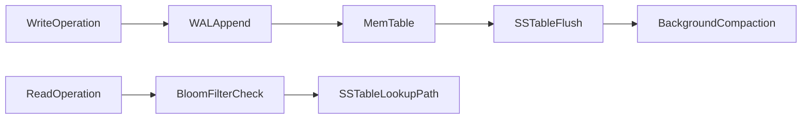

# NoSQL Taxonomy: Model Semantics, Storage Internals, and Decision Boundaries

## 1. Why Taxonomy Matters

“NoSQL” is not a database type. It is an umbrella over several models with different physics and consistency semantics. Senior architecture decisions improve when model selection is tied to workload shape and failure tolerance, not trend adoption.

---

## 2. Model Families and Their Native Strengths

### 2.1 Key-Value

The primary contract of a key-value store is key lookup and key mutation with minimal query semantics. Clients address data by opaque keys; anything beyond get/put/delete is typically implemented in application code or as a thin secondary index layer.

Strength comes from very low latency on hashed key paths and simple horizontal partitioning by key range or hash ring. Because the API surface is narrow, the engine can optimize the hot path aggressively and scale by adding partitions without a heavy query planner.

Weakness appears when ad-hoc query flexibility is required: filtering, joins, and relationship navigation are not native, so relationship semantics move into application code. That shift increases client complexity and makes correctness harder to reason about under concurrent updates.

### 2.2 Document

The primary contract is semi-structured documents with nested fields and a flexible schema. Documents can evolve field-by-field without a rigid DDL cycle, which suits product domains where shape changes frequently.

Strength lies in rapid schema evolution and read locality for embedded object graphs. When related data is co-located in one document, a single fetch reconstructs the view the application needs without multi-table joins.

Weakness centers on denormalization drift—the same logical fact may be copied into many documents and diverge under partial updates—and on large-document update cost, where rewriting a bulky document for a small field change amplifies write amplification and replication traffic.

### 2.3 Wide-Column

The primary contract is partitioned sparse rows with clustering order. Partition keys define distribution; clustering keys define on-disk sort order within a partition, which makes time-series and append-style access patterns natural.

Strength is massive write throughput and linear-ish scaling for append and time-series patterns. Sparse columns avoid paying storage for unused attributes, and sequential clustering keeps common range scans efficient within a partition.

Weakness is that query flexibility is constrained by partition and clustering keys: access patterns that do not match the key design become expensive or impossible without secondary indexes. Secondary access patterns therefore require explicit design effort up front, not after the fact.

### 2.4 Graph

The primary contract treats nodes and edges as first-class model citizens. Relationships are stored and indexed for traversal rather than reconstructed through join pipelines at query time.

Strength is that traversal-centric queries perform naturally: multi-hop path questions expand along edges without repeatedly joining large tables. Weakness is difficult horizontal scaling for arbitrary deep traversals, because deep or high-branching walks often cross partition boundaries and explode the active frontier.

---

## 3. Storage Engine Physics: B-Tree vs LSM

### 3.1 B-Tree Bias

B-tree engines organize data as a balanced page hierarchy that keeps point and range reads efficient under moderate update rates. In-place updates on leaf pages favor read-heavy or update-in-place workloads, but random write churn increases page splits, write amplification, and lock or latch contention on hot pages.

### 3.2 LSM Bias

LSM engines favor a log-plus-memtable write path: mutations append to a WAL, land in an in-memory memtable, then flush as immutable SSTables that are later merged by compaction. That design yields stronger ingest potential under heavy write load, but compaction and read amplification become first-class costs that must be capacity-planned and monitored.

#### In-Line Glossary: Compaction Debt

**What it is:** backlog of pending compaction work relative to incoming write rate.  
**Why here:** compaction debt predicts future latency instability and storage amplification.  
**Systemic implication:** sustained debt causes tail-latency spikes and capacity inefficiency.

---

## 4. Consistency Semantics Across Models

NoSQL designs often expose tunable or eventual consistency by default. The architectural implication is that consistency is operation-specific and must be encoded by endpoint criticality rather than treated as a single cluster-wide constant.

For example, a social reaction write can often tolerate eventual consistency because a briefly stale like count rarely harms the business, whereas an inventory reservation typically requires stronger consistency so two clients cannot claim the same unit.

---

## 5. When to Reject Relational-First Decisions

Choose NoSQL-first when most of the following conditions hold: write volume and partition scale exceed the practical single-node relational operation envelope; the access pattern is strongly key or partition oriented; bounded inconsistency is acceptable for target workflows; and the domain model does not rely on frequent cross-entity relational joins under strict transactional invariants.

Reject NoSQL-first when strict cross-entity invariants dominate the correctness model, when ad-hoc relational querying is central to product behavior, or when the team lacks maturity for eventual consistency reconciliation and repair operations. In those cases, relational engines remain the safer default until the workload evidence clearly justifies a model change.

---

## 6. Failure Modes by Model

Each model fails in characteristic ways that architects should document in ADRs before adoption. Key-value systems suffer hotspot keys, eviction-policy surprises, and replica lag that silently serve stale values. Document stores suffer unbounded document growth and shard-key drift that unbalanced partitions. Wide-column stores suffer tombstone pressure and compaction storms that spike latency under delete-heavy workloads. Graph systems suffer traversal explosion and cross-partition edge penalties that make deep walks unpredictable. Naming these risks early makes capacity, monitoring, and fallback design concrete rather than optimistic.

---

## 7. Decision Heuristic

A repeatable selection process is more reliable than preference-based selection. First classify the workload by dominant query shape, then classify invariants by criticality. Map candidate models to storage and consistency behavior, simulate failure and convergence, and choose the model that minimizes total correctness, latency, and operational risk rather than maximizing novelty or vendor familiarity.
