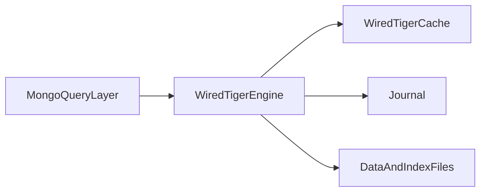
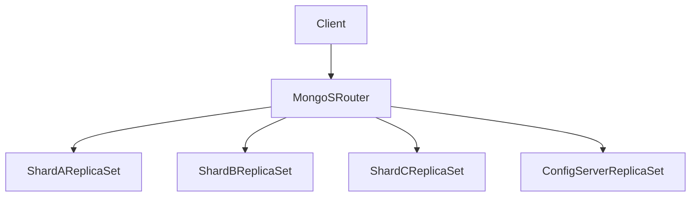

# MongoDB Architecture: WiredTiger Internals, Replication Semantics, and Sharding Consequences

## 1. Why MongoDB Needs Architectural, Not Superficial, Evaluation

MongoDB is often chosen for schema flexibility, but senior-level selection requires evaluating replication semantics, shard-key design, cache behavior, and operational consistency policy.

---

## 2. WiredTiger Core Mechanics

WiredTiger provides:

- B-tree-oriented data/index structures
- compression support for storage and IO efficiency
- journaled durability path
- cache management separate from OS page cache concerns

### 2.1 Cache and Working Set Dynamics

Performance depends on working-set fit relative to cache budget.

Failure symptom:

- cache miss escalation increases storage IO and p99 latency.

#### In-Line Glossary: Working Set

**What it is:** subset of data and indexes actively used over a time window.  
**Why here:** if working set does not fit memory envelope, latency behavior degrades sharply.  
**Systemic implication:** memory sizing and index discipline are architecture concerns, not mere tuning details.

---

## 3. Replica Set Semantics

Replica set roles:

- primary for writes
- secondaries for replication and optional reads
- election mechanism for leadership failover

### 3.1 Election and Consistency Impact

- majority write concern improves durability confidence
- secondary reads can reduce latency but introduce staleness risk
- failover introduces brief write unavailability windows

#### In-Line Glossary: Write Concern

**What it is:** acknowledgment policy defining how many nodes must confirm a write before success is returned.  
**Why here:** it is the main knob controlling durability-vs-latency behavior.  
**Systemic implication:** endpoint-level write concern decisions should map to business criticality.

---

## 4. Sharding Architecture and Distribution Risks

Sharded deployments include:

- `mongos` routers
- config server replica set
- shard replica sets

### 4.1 Chunk and Balancer Behavior

- data partitioned into chunks by shard key
- balancer migrates chunks to maintain distribution

Risks:

- poor shard key creates hotspots and jumbo chunk behavior
- migrations consume resources and can impact p99 under heavy load

---

## 5. Schema Design: Deep Trade-offs

### 5.1 Embed vs Reference

Embed when:

- cardinality bounded
- lifecycle strongly coupled

Reference when:

- cardinality unbounded
- independent lifecycle and update frequency

### 5.2 Anti-patterns

- unbounded arrays in single document
- high-churn massive nested objects
- shard key with low cardinality or monotonic insertion hotspot

---

## 6. Transactions in MongoDB

MongoDB supports multi-document transactions, but cost profile matters.

Guidance:

- prefer single-document atomic boundaries where feasible
- use multi-document transactions for true invariant requirements, not convenience

---

## 7. Operational Decision Guidance

Use MongoDB when:

- document model and schema evolution are dominant product needs
- read/write patterns align with shard key and document boundaries
- team is ready to manage replication and sharding operationally

Avoid MongoDB-first when:

- strict relational invariants dominate across many entities
- query requirements are heavily join-centric and strongly transactional

---

## 8. External References

- [MongoDB Architecture](https://www.mongodb.com/docs/manual/core/)
- [WiredTiger Documentation](https://source.wiredtiger.com/)
