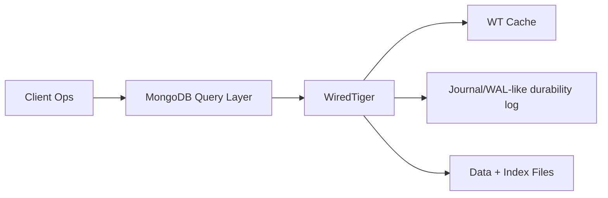
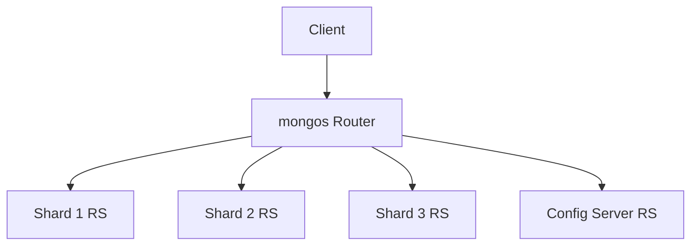

# MongoDB Architecture: WiredTiger, Replication, and Sharding

## 1. WiredTiger Engine Internals

WiredTiger underpins modern MongoDB storage behavior.

Core mechanics:

- B-Tree-like structures for collections and indexes.
- Document-level concurrency controls (with engine and lock manager coordination).
- Compression (Snappy/Zstd configurable) to reduce storage and IO.
- Checkpointing and journaling for durability/recovery.

Memory model:

- WiredTiger cache (default percentage of RAM) plus OS page cache interactions.
- Working set fit strongly determines tail latency.

#### In-Line Glossary: Document-Level Locking

**What it is:** Concurrency model where conflicting operations lock at finer granularity than collection-level, reducing contention for unrelated documents.  
**Why here:** High-throughput OLTP-like workloads benefit from narrow conflict scope.  
**Systemic impact:** Better concurrency than coarse locks, but hotspots still occur on popular documents and unique index paths.

---

## 2. Replica Sets and Elections

Replica set topology:

- Primary accepts writes.
- Secondaries replicate via oplog.
- Arbiters optional for voting (no data copy).

Election protocol behavior:

- Node heartbeat monitors health.
- Eligible secondary can become primary on timeout/quorum conditions.
- Majority write concern improves durability/consistency semantics.

Failure trade-off:

- Failover introduces brief write unavailability.
- Read preference to secondaries can reduce latency but risks stale reads.

#### In-Line Glossary: Oplog

**What it is:** Ordered operation log used by secondaries to replicate primary changes.  
**Why here:** Replication lag and rollback risk are directly tied to oplog apply behavior and retention window.  
**Systemic impact:** Oplog sizing affects recovery survivability when secondaries are temporarily disconnected.

---

## 3. Sharded Cluster Distribution

Main components:

- `mongos` query routers
- config servers (metadata authority)
- shards (replica sets storing chunk subsets)

### 3.1 Chunking and Balancing

- Data partitioned by shard key into chunks.
- Balancer migrates chunks to equalize load/storage.
- Poor shard keys produce hotspots and jumbo chunks.

### 3.2 Chunk Migration Path

1. Balancer identifies imbalance.
2. Destination shard clones chunk data.
3. Catch-up phase applies diffs.
4. Metadata commit updates ownership.
5. Source cleans orphaned ranges.

Operational caution:

- Migration competes for IO/CPU with production workload.
- Must monitor migration windows and queue depth.

---

## 4. Schema Design: Anti-Patterns and Good Patterns

## 4.1 Anti-Patterns

- Unbounded arrays in a single document (explosive growth).
- Embedding high-cardinality frequently updated subdocuments causing write amplification.
- Cross-shard fan-out queries from poor shard key choice.

## 4.2 Preferred Patterns

- Embed tightly bounded one-to-few relationships.
- Reference when cardinality is unbounded or lifecycle differs.
- Choose shard key with high cardinality, even distribution, and query locality.

#### In-Line Glossary: Cardinality (Shard Key)

**What it is:** Number of distinct values available for distribution.  
**Why here:** Low-cardinality keys collapse traffic into few shards, creating hotspots.  
**Systemic impact:** Key choice can dominate cluster scalability more than hardware upgrades.

---

## 5. Consistency and Transaction Semantics

MongoDB supports multi-document ACID transactions, but architects should use them selectively:

- Transactions increase coordination and memory overhead.
- Best performance comes from schema designs where most writes are single-document atomic operations.

Consistency controls:

- read concern levels (`local`, `majority`, `snapshot`)
- write concern levels (`w:1`, `majority`, custom)

These settings should be endpoint-specific, not globally fixed.

---

## 6. Operational Playbook

1. Keep shard key decision as an architecture milestone, not an implementation detail.
2. Track replica lag, cache pressure, lock percentages, and chunk migration activity.
3. Use majority write concern where data loss risk is unacceptable.
4. Tune working set and index footprint to fit memory budget.
5. Validate failover and re-election behavior under realistic traffic before production launch.
