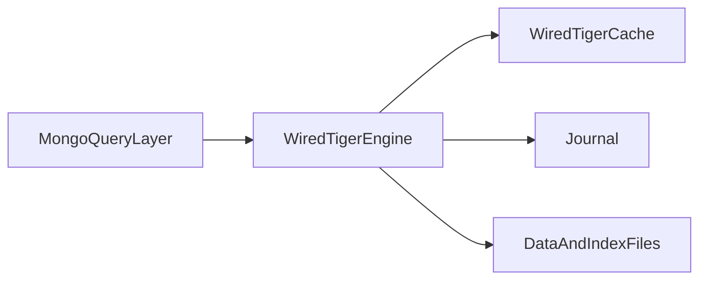
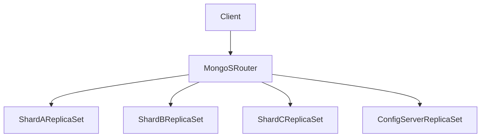

# MongoDB Architecture: WiredTiger Internals, Replication Semantics, and Sharding Consequences

## 1. Why MongoDB Needs Architectural, Not Superficial, Evaluation

MongoDB is often chosen for schema flexibility, but senior-level selection requires evaluating replication semantics, shard-key design, cache behavior, and operational consistency policy.

---

## 2. WiredTiger Core Mechanics

WiredTiger provides B-tree-oriented data and index structures, compression for storage and IO efficiency, a journaled durability path, and cache management that is separate from OS page-cache concerns. Those internals determine how write amplification, cache pressure, and recovery interact under real load—not just how flexible the document API feels in development.

### 2.1 Cache and Working Set Dynamics

Performance depends on working-set fit relative to cache budget. When the active set of documents and indexes exceeds WiredTiger cache, cache-miss escalation increases storage IO and p99 latency, often abruptly rather than linearly. Memory sizing and index discipline are therefore architecture concerns, not mere post-deployment tuning.

#### In-Line Glossary: Working Set

**What it is:** subset of data and indexes actively used over a time window.  
**Why here:** if working set does not fit memory envelope, latency behavior degrades sharply.  
**Systemic implication:** memory sizing and index discipline are architecture concerns, not mere tuning details.

---

## 3. Replica Set Semantics

A replica set designates a primary for writes, secondaries for replication and optional reads, and an election mechanism for leadership failover. Understanding these roles is essential because durability, read freshness, and write availability are coupled to how clients target members and which write concern they request.

### 3.1 Election and Consistency Impact

Majority write concern improves durability confidence because a write is acknowledged only after enough members persist it, at the cost of higher write latency. Secondary reads can reduce primary load and perceived latency, but they introduce staleness risk whenever replication lags. Failover after primary loss restores leadership through election, yet introduces brief write-unavailability windows that applications must tolerate with retries and idempotent write paths.

#### In-Line Glossary: Write Concern

**What it is:** acknowledgment policy defining how many nodes must confirm a write before success is returned.  
**Why here:** it is the main knob controlling durability-vs-latency behavior.  
**Systemic implication:** endpoint-level write concern decisions should map to business criticality.

---

## 4. Sharding Architecture and Distribution Risks

Sharded deployments include `mongos` routers that direct queries, a config-server replica set that stores cluster metadata, and shard replica sets that hold the data. Scaling out therefore adds routing and metadata planes, not only more storage nodes.

### 4.1 Chunk and Balancer Behavior

Data is partitioned into chunks by shard key, and the balancer migrates chunks to maintain distribution across shards. A poor shard key creates hotspots and jumbo-chunk behavior that the balancer cannot split or move efficiently. Migrations themselves consume CPU, network, and disk bandwidth, and under heavy load they can degrade p99 latency even when average utilization looks acceptable.

---

## 5. Schema Design: Deep Trade-offs

### 5.1 Embed vs Reference

Embed related data when cardinality is bounded and lifecycles are strongly coupled, so one document read yields a coherent aggregate without secondary lookups. Reference related entities when cardinality is unbounded or lifecycles and update frequencies diverge, so independent documents can grow and mutate without rewriting a parent document on every child change.

### 5.2 Anti-patterns

Unbounded arrays in a single document grow without a practical upper bound and eventually blow document size limits or update cost. High-churn massive nested objects rewrite large payloads for small logical changes and amplify replication traffic. A shard key with low cardinality or monotonic insertion patterns concentrates writes on few chunks and creates insertion hotspots that horizontal scaling cannot fix without a key redesign.

---

## 6. Transactions in MongoDB

MongoDB supports multi-document transactions, but the cost profile matters. Prefer single-document atomic boundaries where feasible, because they avoid cross-document coordination overhead and keep contention narrow. Use multi-document transactions for true invariant requirements that cannot be modeled inside one document, not as a convenience wrapper around loosely related updates.

---

## 7. Operational Decision Guidance

Use MongoDB when the document model and schema evolution are dominant product needs, when read and write patterns align with shard key and document boundaries, and when the team is ready to manage replication and sharding operationally. Avoid MongoDB-first when strict relational invariants dominate across many entities, or when query requirements are heavily join-centric and strongly transactional in ways that fight document locality.

---

## 8. External References

- [MongoDB Architecture](https://www.mongodb.com/docs/manual/core/)
- [WiredTiger Documentation](https://source.wiredtiger.com/)
