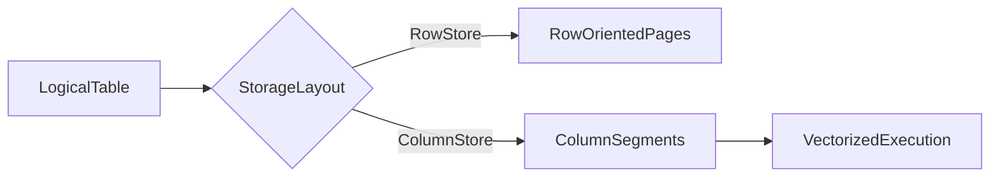
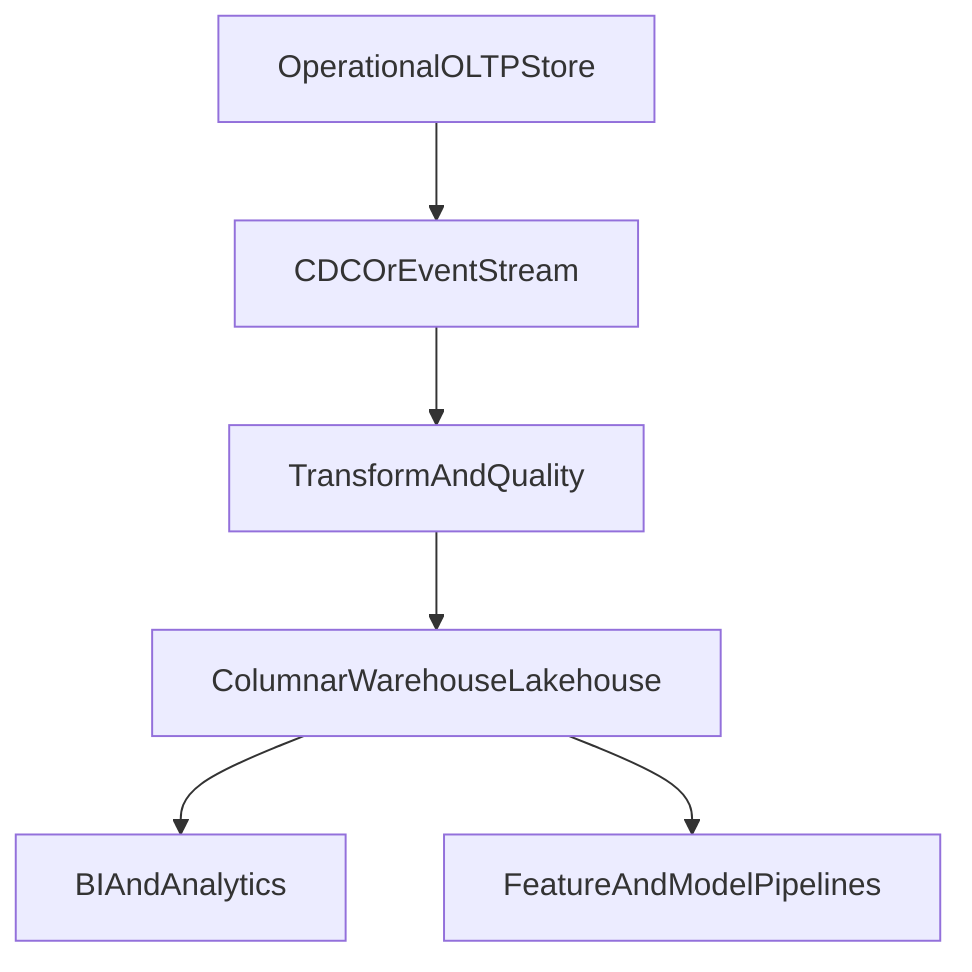

# Columnar Databases and OLAP Architecture: Internal Mechanics and Selection Consequences

## 1. Why Columnar Systems Exist

Columnar systems optimize analytical scans where queries read many rows but few columns, applying aggregation and filtering over large datasets.

This is a fundamentally different optimization target from OLTP row stores.

---

## 2. Physical Layout Differences

Row layout:

- stores full tuples together
- efficient for point updates and row reconstruction

Column layout:

- stores values by column segments
- efficient for compression and vectorized scans

#### In-Line Glossary: Late Materialization

**What it is:** delaying full row reconstruction until after filter and projection stages.  
**Why here:** avoids unnecessary memory and CPU overhead during scans.  
**Systemic implication:** major performance gains for analytical workloads with selective projection.

---

## 3. Engine Mechanics That Matter

Typical columnar optimizations:

- dictionary and run-length encoding
- zone-map/min-max pruning
- vectorized operator pipelines
- column-level caching and decompression strategies

Trade-off:

- row-by-row updates are usually more expensive than in OLTP-focused stores.

---

## 4. Ingestion and Freshness Models

Common ingestion patterns:

- batch ETL
- micro-batch streaming
- near-real-time CDC pipelines

Architecture implication:

- freshness SLA must be explicit (for example, 5 minutes, 1 hour)
- analytics correctness depends on ingestion reliability, not only query engine speed

---

## 5. When Columnar Is the Wrong Choice

Avoid columnar as primary operational store when:

- high-frequency transactional updates dominate
- strict low-latency point writes are required
- cross-row transactional invariants are critical on the serving path

Columnar should be treated as analytical backbone, not default OLTP replacement.

---

## 6. Hybrid Reference Pattern

This separation protects transactional paths while enabling deep analytics.

---

## 7. Architect Decision Checklist

1. Are query patterns scan/aggregate heavy?
2. Is update profile append-oriented?
3. What freshness SLA is acceptable?
4. Is there governance for semantic consistency between OLTP and OLAP layers?
5. Is cost model validated for sustained query concurrency?

---

## 8. External References

- [ClickHouse Architecture](https://clickhouse.com/docs/en/development/architecture)
- [Snowflake Architecture Overview](https://docs.snowflake.com/en/user-guide/intro-key-concepts)
