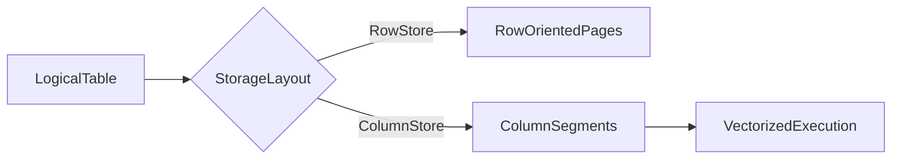
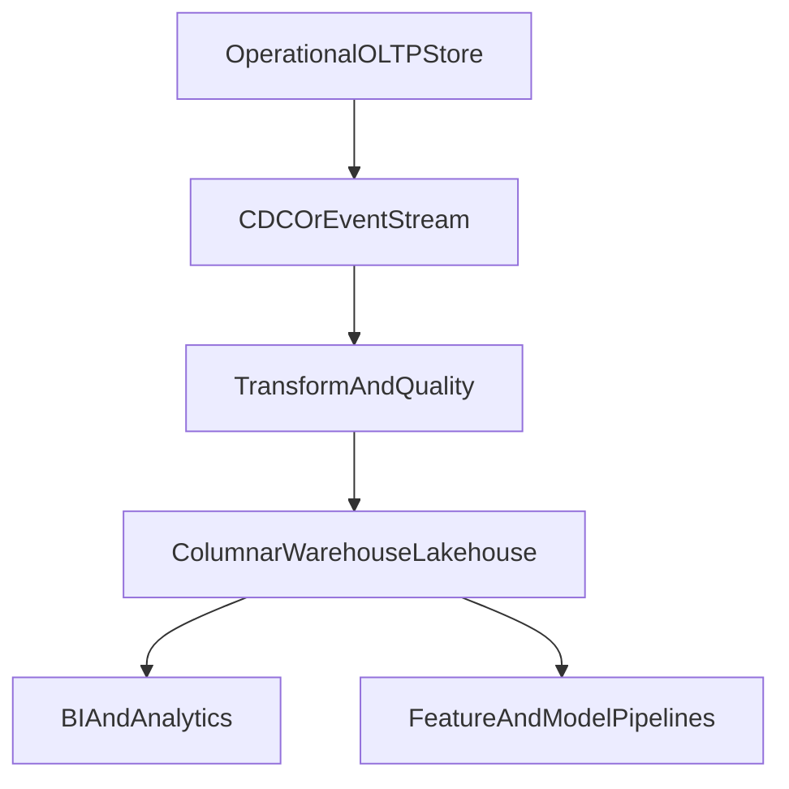

# Columnar Databases and OLAP Architecture: Internal Mechanics and Selection Consequences

## 1. Why Columnar Systems Exist

Columnar systems optimize analytical scans where queries read many rows but few columns, applying aggregation and filtering over large datasets.

This is a fundamentally different optimization target from OLTP row stores.

---

## 2. Physical Layout Differences

Row layout stores full tuples together, which is efficient for point updates and row reconstruction because all columns of a row sit on the same page or nearby pages. Column layout stores values by column segments, which is efficient for compression and vectorized scans because homogeneous values compress well and unused columns are never read from disk.

#### In-Line Glossary: Late Materialization

**What it is:** delaying full row reconstruction until after filter and projection stages.  
**Why here:** avoids unnecessary memory and CPU overhead during scans.  
**Systemic implication:** major performance gains for analytical workloads with selective projection.

---

## 3. Engine Mechanics That Matter

Typical columnar engines combine dictionary and run-length encoding to shrink repetitive values, zone-map or min-max pruning to skip irrelevant segments, vectorized operator pipelines that process batches of values in CPU-friendly loops, and column-level caching with decompression strategies tuned for scan throughput. The trade-off is that row-by-row updates are usually more expensive than in OLTP-focused stores, because mutating one row may touch many column segments and invalidate compression blocks that were optimized for append-oriented ingest.

---

## 4. Ingestion and Freshness Models

Common ingestion patterns include batch ETL for periodic warehouse loads, micro-batch streaming for frequent but not continuous refresh, and near-real-time CDC pipelines that mirror operational change events into analytical storage. Architecture implication follows directly: freshness SLAs must be explicit—for example five minutes or one hour—and analytics correctness depends on ingestion reliability and ordering, not only on how fast the query engine can scan once data has landed.

---

## 5. When Columnar Is the Wrong Choice

Avoid columnar as the primary operational store when high-frequency transactional updates dominate, when strict low-latency point writes are required, or when cross-row transactional invariants are critical on the serving path. Columnar systems should be treated as an analytical backbone, not as a default OLTP replacement, because their physical layout and execution model optimize scans at the expense of fine-grained mutation and interactive write latency.

---

## 6. Hybrid Reference Pattern

This separation protects transactional paths while enabling deep analytics.

---

## 7. Architect Decision Checklist

1. Are query patterns scan and aggregate heavy enough that column projection and vectorized execution will dominate cost?
2. Is the update profile append-oriented rather than random in-place mutation of individual rows?
3. What freshness SLA is acceptable between operational writes and analytical visibility?
4. Is there governance for semantic consistency between OLTP and OLAP layers so metrics do not silently diverge?
5. Is the cost model validated for sustained query concurrency, not only for a single offline report?

---

## 8. External References

- [ClickHouse Architecture](https://clickhouse.com/docs/en/development/architecture)
- [Snowflake Architecture Overview](https://docs.snowflake.com/en/user-guide/intro-key-concepts)
