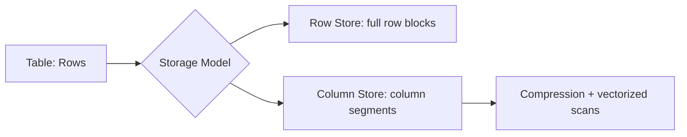
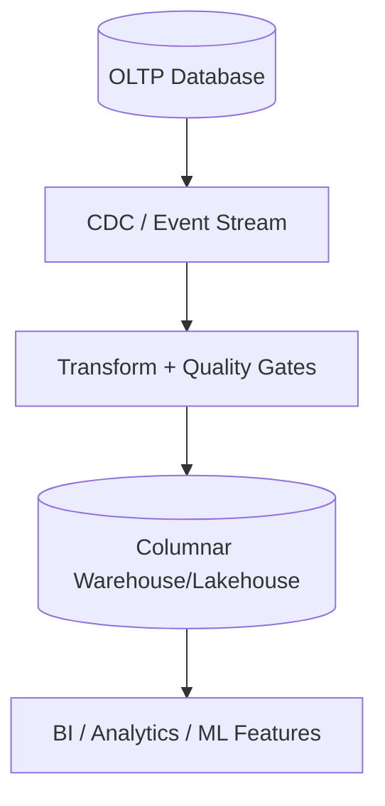

# Columnar Databases and OLAP Architecture Decisions

## 1. Why Columnar Engines Matter

Columnar databases are optimized for analytical workloads where queries scan many rows but relatively few columns, applying aggregations, filters, and time-window analysis.

---

## 2. Storage Layout Fundamentals

Row-store layout favors OLTP point updates and entity reconstruction.  
Column-store layout groups values by column, enabling:

- high compression (similar adjacent values)
- vectorized execution
- minimized IO for selective column reads

#### In-Line Glossary: Vectorized Execution

**What it is:** Query operators process batches of values (vectors) rather than one tuple at a time.  
**Why here:** Modern CPUs benefit from cache locality and SIMD-friendly operations.  
**Systemic impact:** Significant analytic speedup, especially for scans/aggregations over large datasets.

---

## 3. Internal Mechanics Relevant to Architects

Common internals across columnar systems:

- segment/stripe files by column
- zone maps/min-max metadata for data skipping
- dictionary/run-length encoding
- late materialization (reconstruct rows only when needed)

Trade-off:

- writes and row-level updates are typically more expensive than in OLTP row stores.

---

## 4. Workload Fit and Misfit

Best fit:

- BI dashboards
- ad-hoc analytics
- cohort analysis
- large fact-table aggregation

Poor fit:

- high-frequency small transactional updates
- strict low-latency point writes
- complex per-request OLTP invariants

---

## 5. Decision Impact in Polyglot Architectures

Recommended pattern:

1. transactional system of record in relational OLTP engine
2. event/CDC pipeline into columnar OLAP store
3. analytical serving isolated from transactional path

---

## 6. Cost and Governance Considerations

- Storage often cheaper per analytic query due to compression and pruning.
- Compute separation can improve elasticity but requires robust cost controls.
- Data freshness depends on ingestion latency and pipeline reliability.

#### In-Line Glossary: Data Freshness SLA

**What it is:** Maximum acceptable lag between source-of-truth updates and analytical availability.  
**Why here:** Decision quality may degrade if analytical data is stale.  
**Systemic impact:** Pipeline architecture must be designed as an SLO-governed system, not a best-effort batch job.

---

## 7. Decision Checklist

- Does the workload scan large datasets and few columns?
- Is sub-second transactional write latency required (if yes, keep out of columnar write path)?
- Can ingestion lag be tolerated?
- Is there governance for schema evolution and semantic consistency?

If answers favor analytics-first behavior, columnar engines should be a first-class component in the architecture.
