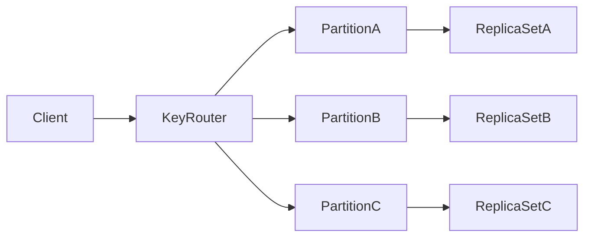
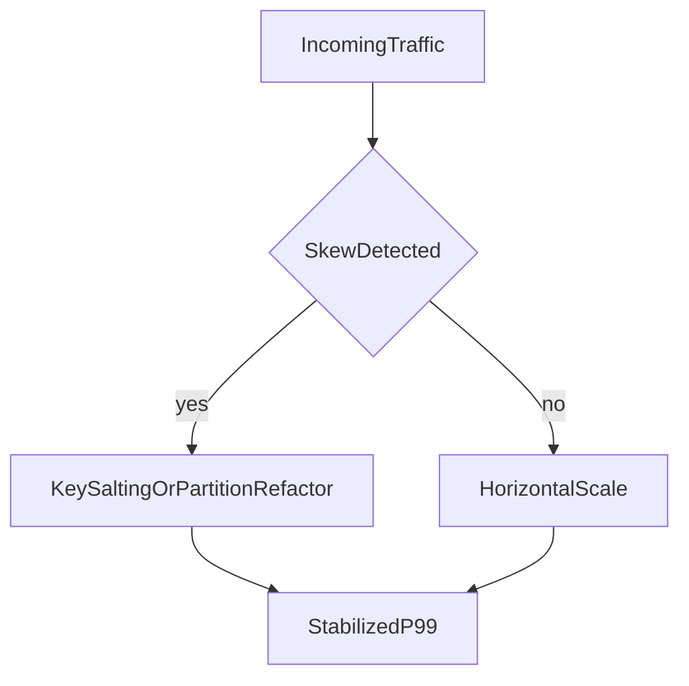

# Key-Value Architecture: Latency Physics, Partitioning, and Correctness Trade-offs

## 1. Why Key-Value Systems Are Strategic

Key-value databases are often the lowest-latency persistence layer in distributed architectures. Their simplicity is a strength, but that same simplicity pushes relational complexity and consistency policy into surrounding services.

---

## 2. Internal Design Patterns

Common architecture elements:

- key hashing for partition routing
- replication groups per partition
- optional in-memory serving layer
- append-only logs and snapshot/compaction lifecycle

#### In-Line Glossary: Hot Key

**What it is:** disproportionately accessed key causing localized resource saturation.  
**Why here:** partition scalability assumptions break under skewed access distributions.  
**Systemic implication:** throughput collapse can occur despite low average cluster utilization.

---

## 3. Consistency Modes and Their Effects

Many key-value systems support configurable consistency:

- eventual/async for low latency
- quorum/strong read options for correctness-sensitive operations

Architecture implication:

- consistency choice should be operation-level
- retries must be idempotent
- stale read tolerance must be explicit in product behavior

---

## 4. Performance and Capacity Behavior

Primary drivers:

- key distribution entropy
- value size distribution
- memory pressure and eviction policy
- replication lag and failover mode

Tail risk drivers:

- hotspot partitions
- large-object skew
- background persistence or compaction spikes

---

## 5. Strong Use Cases

- sessions and auth state
- feature flags
- rate limiting and counters
- fast cache-backed serving paths

Weak use cases:

- join-centric querying
- strict multi-entity relational invariants
- complex ad-hoc analytics

---

## 6. Failure and Recovery Trade-offs

Key questions:

1. What data loss window is acceptable?
2. Are writes acknowledged before replication?
3. How is failover promoted and how quickly?
4. Can downstream systems reconcile duplicate/reordered events?

---

## 7. Architect Guidance

Use key-value as a deliberate layer for latency-dominant paths, not as a universal system of record.

If domain invariants or query complexity increase, pair key-value with relational/document systems instead of forcing one model to solve incompatible requirements.
