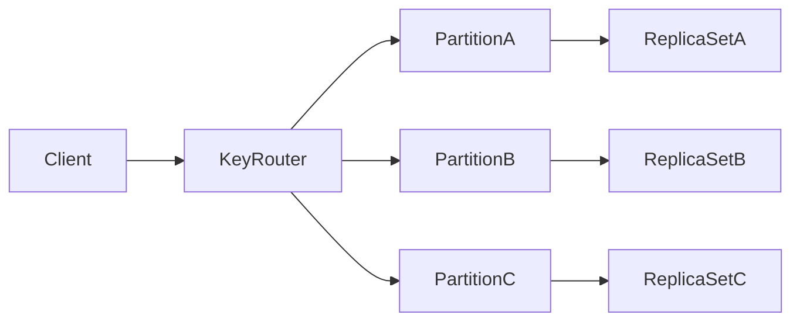
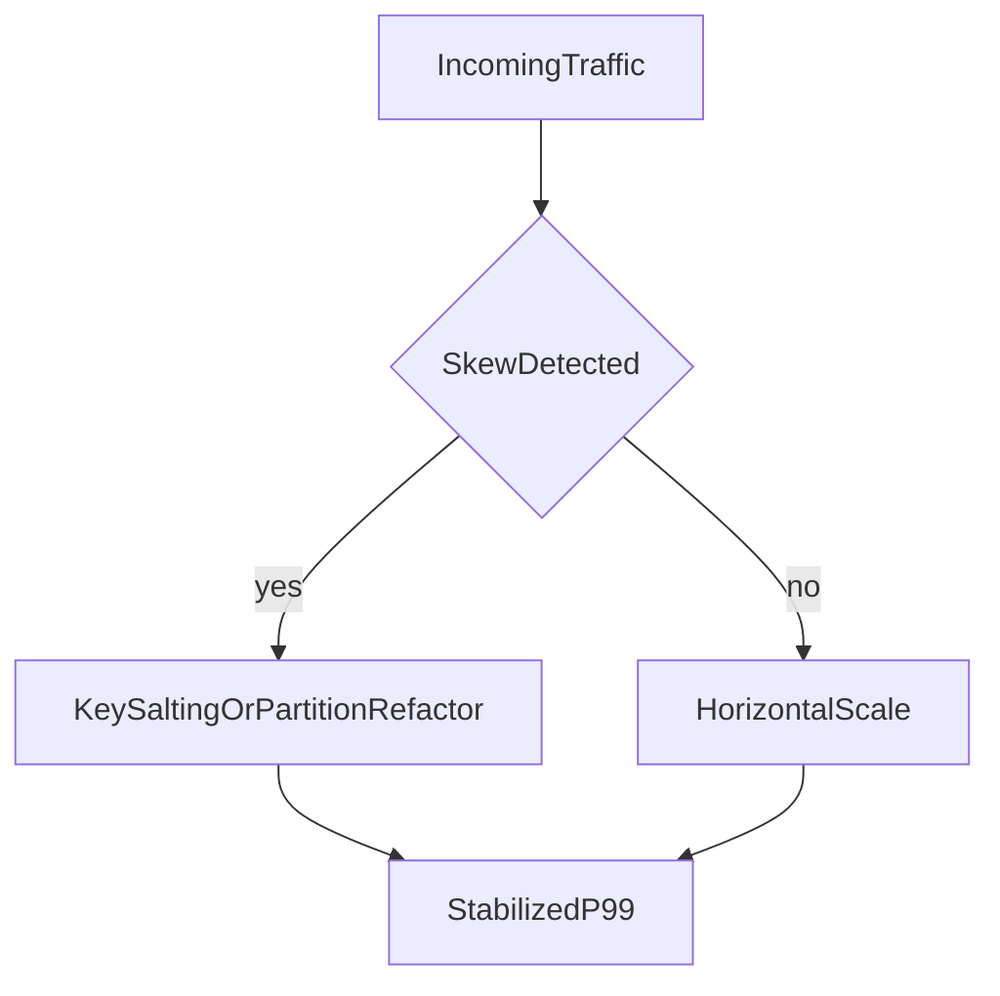

# Key-Value Architecture: Latency Physics, Partitioning, and Correctness Trade-offs

## 1. Why Key-Value Systems Are Strategic

Key-value databases are often the lowest-latency persistence layer in distributed architectures. Their simplicity is a strength, but that same simplicity pushes relational complexity and consistency policy into surrounding services.

---

## 2. Internal Design Patterns

Common architecture elements include key hashing for partition routing, replication groups per partition, an optional in-memory serving layer for hot keys, and append-only logs with snapshot or compaction lifecycles for durable persistence. Together these pieces explain why key-value systems scale horizontally for point access while remaining fragile under skewed keys and oversized values.

#### In-Line Glossary: Hot Key

**What it is:** disproportionately accessed key causing localized resource saturation.  
**Why here:** partition scalability assumptions break under skewed access distributions.  
**Systemic implication:** throughput collapse can occur despite low average cluster utilization.

---

## 3. Consistency Modes and Their Effects

Many key-value systems support configurable consistency, ranging from eventual or async replication for lowest latency to quorum or strong-read options for correctness-sensitive operations. Consistency choice should therefore be operation-level rather than cluster-global; retries must be idempotent so failover and duplicate delivery do not corrupt state; and stale-read tolerance must be explicit in product behavior so clients do not assume freshness the store does not guarantee.

---

## 4. Performance and Capacity Behavior

Primary drivers of throughput and latency include key-distribution entropy, value-size distribution, memory pressure under the chosen eviction policy, and replication lag under the configured failover mode. Tail risk concentrates on hotspot partitions that pin load to a few nodes, large-object skew that inflates network and memory cost per request, and background persistence or compaction spikes that steal IO from the serving path even when request rates look steady.

---

## 5. Strong Use Cases

Key-value stores fit sessions and auth state that are keyed by session id and need fast get/put semantics. They fit feature flags and configuration blobs that are read far more often than written. They fit rate limiting and counters where atomic increments on a key are the natural API. They also fit fast cache-backed serving paths that absorb read spikes in front of a slower system of record.

They are weak when join-centric querying is required, when strict multi-entity relational invariants must be enforced in one place, or when complex ad-hoc analytics need scan and aggregation over many keys without a preplanned access path.

---

## 6. Failure and Recovery Trade-offs

Key recovery questions should be answered before production: what data-loss window is acceptable if a node fails before replication completes; whether writes are acknowledged before replicas confirm; how failover is promoted and how quickly clients observe the new primary; and whether downstream systems can reconcile duplicate or reordered events after retries. Those answers determine whether key-value is a durable store or a speed layer with explicit rebuild paths.

---

## 7. Architect Guidance

Use key-value as a deliberate layer for latency-dominant paths, not as a universal system of record.

If domain invariants or query complexity increase, pair key-value with relational or document systems instead of forcing one model to solve incompatible requirements.
