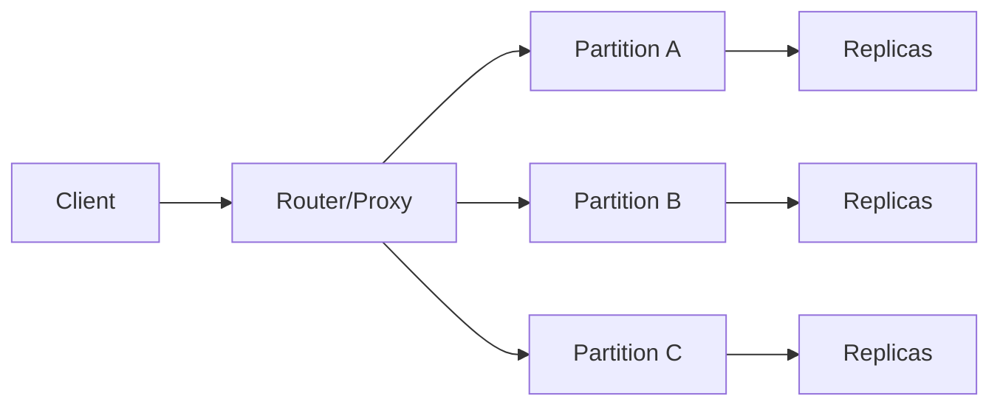
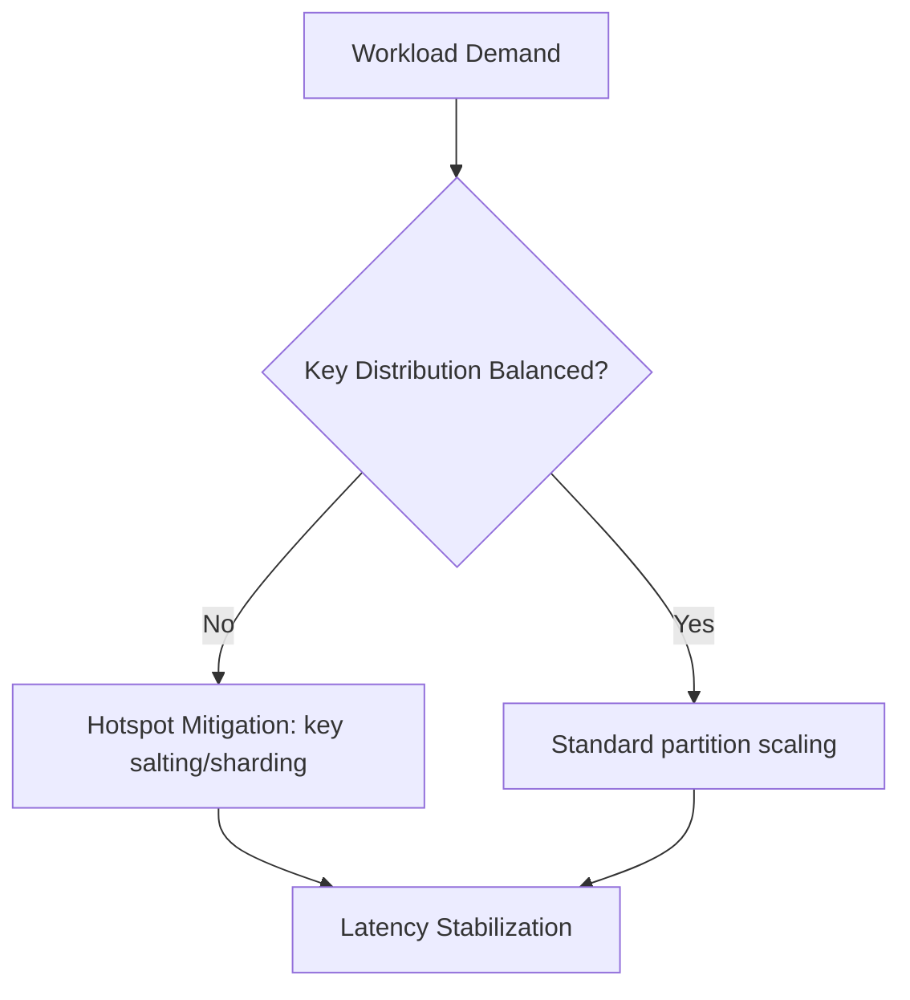

# Key-Value Databases: Architecture and Decision Impact

## 1. Core Model

Key-value stores expose a simple contract:

- `GET(key) -> value`
- `PUT(key, value)`
- optional TTL, atomic increment, and conditional writes

Simplicity enables extremely low latency and high throughput.

---

## 2. Internal Architecture Patterns

Common implementation patterns:

- hash partitioning by key
- replication per partition
- in-memory or memory-first access paths
- append-only logs and periodic compaction/snapshot

#### In-Line Glossary: Partition Key Hotspot

**What it is:** Uneven request concentration on specific keys or key ranges.  
**Why here:** Even horizontally scalable KV systems can fail under skewed key distributions.  
**Systemic impact:** Throughput collapses at hotspot partitions while cluster-wide utilization appears underused.

---

## 3. Strengths and Limits

Strengths:

- predictable latency for key lookups
- straightforward horizontal scaling
- excellent for ephemeral/session state

Limits:

- weak ad-hoc query flexibility
- secondary indexes may be limited/expensive
- modeling complex relationships becomes application burden

---

## 4. Typical Enterprise Use Cases

- session storage
- distributed locks (with caution)
- rate limiting counters
- feature flag delivery
- cache-aside acceleration

Do not treat key-value as universal primary database for domains needing rich relational constraints.

---

## 5. Consistency and Correctness Decisions

Key-value systems often provide tunable consistency:

- eventual reads for low latency
- quorum/stronger reads for correctness-critical operations

Architectural impact:

- endpoint-level consistency policies should be explicit.
- idempotency and conflict-safe write semantics are required under retry/failover.

---

## 6. Operational Risk Profile

Critical risks:

- memory pressure and eviction policy side effects
- replication lag during failover
- noisy-neighbor effects in multi-tenant clusters

Controls:

- keyspace governance
- per-tenant quotas
- capacity modeling by item size distribution and TTL churn

---

## 7. Decision Checklist

- Is the dominant access pattern point lookup by key?
- Are relationships and ad-hoc queries minimal?
- Can data loss/eviction semantics be constrained by policy?
- Is tail latency more important than query expressiveness?

If yes, key-value is likely a strategic fit for that bounded context.
