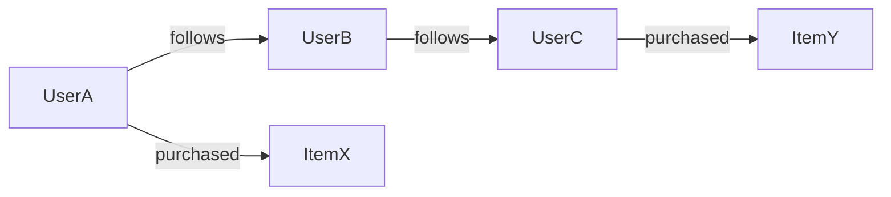
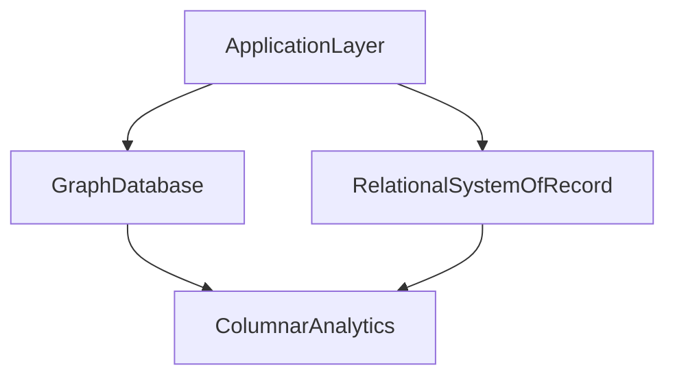

# Graph Databases and Traversal Workloads: Relationship-Centric Decision Framework

## 1. Why Graph Systems Exist

Graph databases optimize domains where **relationships are first-class data**, not merely join artifacts.

They are most valuable when high-value questions are path-dependent: fraud rings, recommendation proximity, dependency impact, trust and influence networks.

---

## 2. Data Model and Execution Semantics

Core entities:

- nodes (entities)
- edges (typed relationships)
- properties (attributes)

Query engines execute traversals that expand neighborhoods and apply constraints at each hop.

#### In-Line Glossary: Traversal Frontier

**What it is:** active set of nodes reached at the current hop during traversal expansion.  
**Why here:** frontier growth determines computational and latency cost.  
**Systemic implication:** branching-factor control is essential for predictable performance.

---

## 3. Complexity and Locality

Traversal complexity is sensitive to:

- branching factor
- depth (`k` hops)
- predicate selectivity on nodes/edges
- partition locality of traversed subgraph

Even with efficient graph primitives, uncontrolled traversal depth can explode request cost.

---

## 4. Partitioning Challenges

Graph partitioning aims to minimize cross-partition edges while preserving balance.

Reality:

- dynamic graphs evolve continuously
- perfect partitioning is usually impossible

#### In-Line Glossary: Edge Cut

**What it is:** edge crossing partition boundaries.  
**Why here:** each cut can imply network hops and remote fetch cost during traversal.  
**Systemic implication:** latency and throughput degrade as cross-partition traversals increase.

---

## 5. When Graph Is the Right Primary Model

Choose graph-first when:

- core product value is multi-hop relational reasoning
- relational join chains are becoming bottlenecks
- edge semantics change faster than static schema assumptions

Do not choose graph-first solely for novelty if workload is mostly key lookup or tabular aggregation.

---

## 6. Hybrid Patterns

Common production architecture:

- graph DB for relationship reasoning
- relational/document system of record for transactional entities
- columnar/search systems for analytics and retrieval

---

## 7. Failure and Governance Considerations

- traversal guardrails (depth limits, timeout budgets)
- index strategy on high-selectivity edge properties
- partition locality monitoring
- consistency and write ordering on edge updates

Graph systems are powerful but demand explicit query governance to remain predictable.

---

## 8. Architect Checklist

1. Are top business questions truly path-centric?
2. What are acceptable traversal depth and latency budgets?
3. How will partition locality be measured and improved?
4. Which entities remain better in relational/document stores?
5. What failure behavior is acceptable for graph-dependent features?
