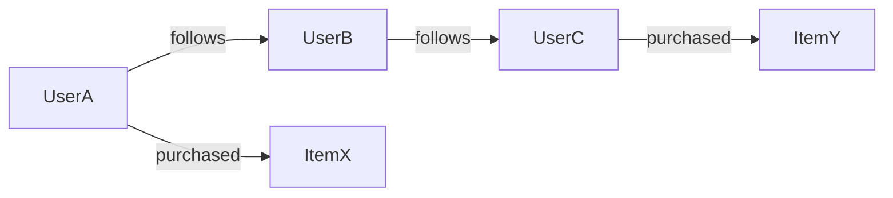
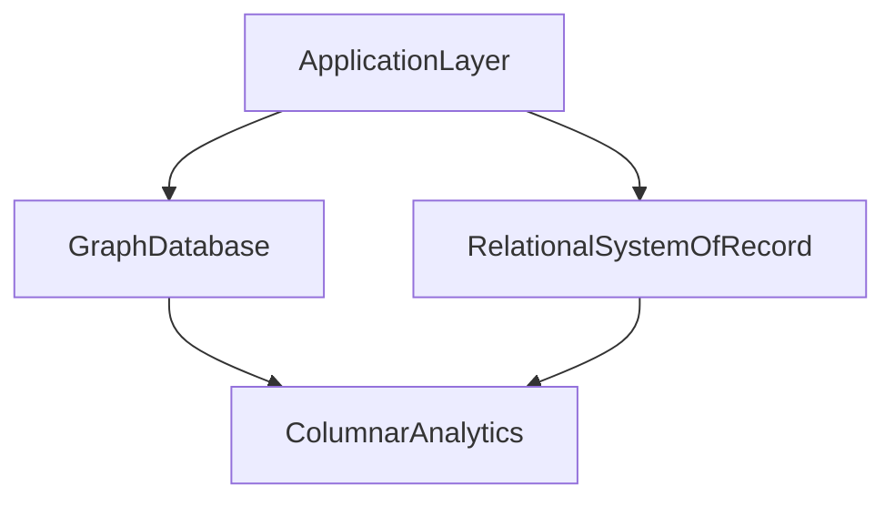

# Graph Databases and Traversal Workloads: Relationship-Centric Decision Framework

## 1. Why Graph Systems Exist

Graph databases optimize domains where **relationships are first-class data**, not merely join artifacts.

They are most valuable when high-value questions are path-dependent: fraud rings, recommendation proximity, dependency impact, trust and influence networks.

---

## 2. Data Model and Execution Semantics

Core entities are nodes for domain entities, edges for typed relationships between them, and properties as attributes on either. Query engines execute traversals that expand neighborhoods and apply constraints at each hop, so cost is driven by frontier growth rather than by a fixed join plan over tables.

#### In-Line Glossary: Traversal Frontier

**What it is:** active set of nodes reached at the current hop during traversal expansion.  
**Why here:** frontier growth determines computational and latency cost.  
**Systemic implication:** branching-factor control is essential for predictable performance.

---

## 3. Complexity and Locality

Traversal complexity is sensitive to branching factor, depth in hops, predicate selectivity on nodes and edges, and partition locality of the traversed subgraph. Even with efficient graph primitives, uncontrolled traversal depth can explode request cost because each hop multiplies the frontier when neighborhoods are dense and filters are weak.

---

## 4. Partitioning Challenges

Graph partitioning aims to minimize cross-partition edges while preserving balance across machines. Reality is harder: dynamic graphs evolve continuously as nodes and edges appear, and perfect partitioning is usually impossible for real-world connectivity patterns. Architects must therefore measure edge cuts and accept that some remote fetches are inevitable.

#### In-Line Glossary: Edge Cut

**What it is:** edge crossing partition boundaries.  
**Why here:** each cut can imply network hops and remote fetch cost during traversal.  
**Systemic implication:** latency and throughput degrade as cross-partition traversals increase.

---

## 5. When Graph Is the Right Primary Model

Choose graph-first when core product value is multi-hop relational reasoning, when relational join chains are becoming bottlenecks for the same path questions, and when edge semantics change faster than static schema assumptions can absorb. Do not choose graph-first solely for novelty if the workload is mostly key lookup or tabular aggregation, because those shapes are cheaper in key-value, document, or columnar stores without traversal overhead.

---

## 6. Hybrid Patterns

A common production architecture uses a graph database for relationship reasoning, a relational or document system of record for transactional entities, and columnar or search systems for analytics and retrieval. This polyglot split keeps path queries where they perform well without forcing every entity write through a graph transaction model.

---

## 7. Failure and Governance Considerations

Predictable graph serving requires traversal guardrails such as depth limits and timeout budgets so runaway walks cannot monopolize the cluster. Index strategy on high-selectivity edge properties reduces fan-out before expansion. Partition locality must be monitored because edge-cut growth silently raises p99. Consistency and write ordering on edge updates matter whenever concurrent relationship changes could produce contradictory paths. Graph systems are powerful but demand this explicit query governance to remain predictable under production traffic.

---

## 8. Architect Checklist

1. Are top business questions truly path-centric rather than simple lookups or aggregations?
2. What are acceptable traversal depth and latency budgets for each graph-dependent endpoint?
3. How will partition locality be measured and improved as the graph evolves?
4. Which entities remain better in relational or document stores as systems of record?
5. What failure behavior is acceptable for graph-dependent features when traversals time out or return partial neighborhoods?
