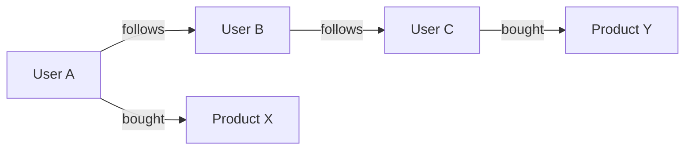
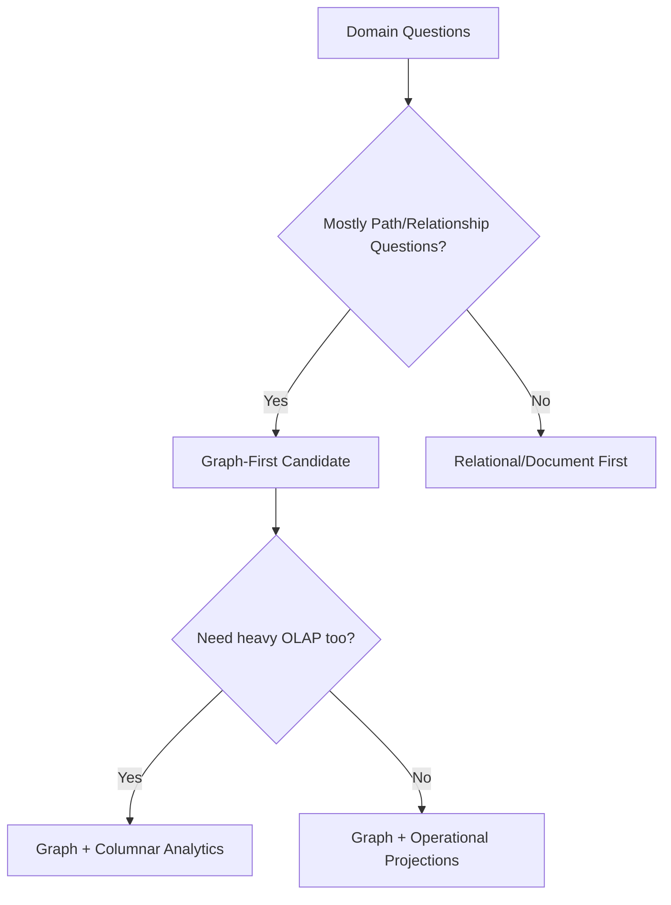

# Graph Databases and Traversal-Centric Architecture

## 1. Why Graph Databases Exist

Graph databases optimize relationship traversal where the edges are first-class data, not join artifacts.

They are valuable when business questions are fundamentally path-based:

- fraud rings
- recommendation proximity
- dependency impact analysis
- social and organizational networks

---

## 2. Graph Data Model and Execution

Core elements:

- nodes (entities)
- edges (relationships, often directed and typed)
- properties (attributes on nodes/edges)

Traversal engines execute path expansion, filtering, and ranking.

#### In-Line Glossary: k-hop Traversal

**What it is:** Query that expands graph neighbors up to `k` edge steps from a start set.  
**Why here:** Many graph workloads depend on neighborhood depth semantics.  
**Systemic impact:** Complexity can grow rapidly with branching factor, requiring traversal bounds and predicate pruning.

---

## 3. Architectural Strengths

- Efficient deep relationship queries that are expensive in relational join chains.
- Natural fit for continuously evolving relationship-centric domains.
- Better semantic clarity for edge-heavy business logic.

---

## 4. Architectural Limits

- Horizontal scaling of arbitrary traversals is difficult due to cross-partition edge cuts.
- Transaction semantics vary by engine and topology.
- Not ideal for heavy tabular aggregation without complementary analytical systems.

---

## 5. Partitioning and Locality Challenges

Graph partitioning objective:

- maximize intra-partition traversal locality
- minimize cross-partition edge traversals

Trade-off:

- perfect partitioning is often impossible in dynamic real graphs.

#### In-Line Glossary: Edge Cut

**What it is:** Relationship crossing partition boundaries.  
**Why here:** Cross-partition traversals add network hops and tail latency.  
**Systemic impact:** Graph performance depends heavily on partition-local query ratio.

---

## 6. Decision Impact in Data System Selection

Choose graph as primary for a bounded context when:

- queries are path-centric rather than entity-centric
- relationship evolution speed is high
- query value depends on multi-hop semantics

Keep relational/document support when:

- strong tabular invariants and reporting workloads remain dominant.

---

## 7. Practical Hybrid Pattern

- Graph DB for online relationship reasoning
- Relational SoR for transactional entities
- Search/columnar for analytical and text retrieval needs

This avoids forcing one model to solve incompatible workload classes.

---

## 8. Decision Checklist

- Are the highest-value queries relationship/path dependent?
- Are joins in current systems becoming operational bottlenecks?
- Is there a partition/locality strategy to control cross-shard traversals?
- Is there a clear ownership boundary for graph-specific semantics?

If yes, graph databases should be explicitly evaluated as a core component, not an afterthought.
