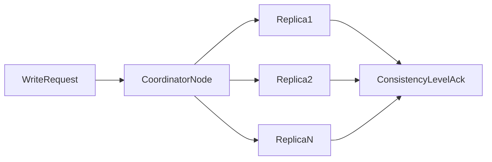
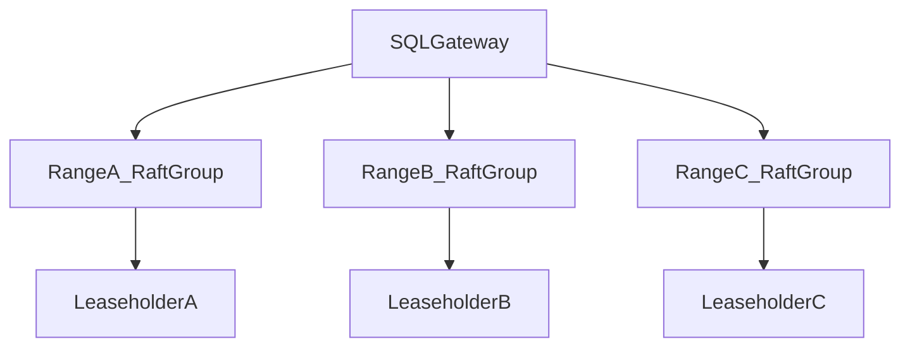

# Cassandra, CockroachDB, Redis, and PACELC Mapping: Deep Decision Analysis

## 1. Purpose

This document compares database families that are frequently confused in interviews and real architecture discussions. The goal is to map each engine to **partition behavior**, **healthy-network latency behavior**, and **operational consequences**.

---

## 2. PACELC Mapping Table (Deep Reading)

| Database | Partition Regime | Else Regime | Typical Practical Reading |
|---|---|---|---|
| Cassandra | A over C (tunable) | L over C (tunable) | Often PA/EL, but CL can shift toward C |
| CockroachDB | C over A | C over L | PC/EC, consistency-first distributed SQL |
| Redis (sentinel + async replicas) | often A-leaning continuity | L-leaning serving | speed layer posture, durability depends on config |
| Spanner | C over A | C over L | external-consistency-first global SQL |
| DynamoDB | tunable | tunable | operation-level consistency profile |

Interpretation note:

- table labels indicate baseline tendencies, not immutable outcomes
- endpoint-level consistency and topology can shift practical behavior significantly

---

## 3. Cassandra Deep Mechanics

### 3.1 Partitioning and Replication

Cassandra distributes data by token ranges and replication factor (`RF`).

Majority threshold for RF:

`majority = floor(RF/2) + 1`

Consistency levels (`ONE`, `QUORUM`, `ALL`, `LOCAL_QUORUM`) control acknowledgment and read intersection behavior.

#### In-Line Glossary: Tunable Consistency

**What it is:** per-operation control of read/write acknowledgment thresholds.  
**Why here:** it allows one workload to blend low-latency and high-consistency paths.  
**Systemic implication:** consistency policy becomes application architecture, not only database configuration.

### 3.2 Trade-off Reality

- low CL improves latency/availability, increases stale risk
- high CL improves freshness confidence, increases latency and failure sensitivity

---

## 4. CockroachDB Deep Mechanics

CockroachDB combines relational SQL interface with consensus-backed distributed storage.

Core features:

- range-based sharding
- Raft replication per range
- serializable isolation default posture

Trade-off:

- stronger global correctness model
- higher coordination latency compared with single-region single-node assumptions

Best fit:

- multi-region SQL with strict invariants and mature operations

---

## 5. Redis Sentinel Deep Mechanics

Redis sentinel provides monitoring, failover orchestration, and topology notification for master-replica deployments.

It does not transform Redis into a universal strict transactional system of record by default.

#### In-Line Glossary: Sentinel Quorum

**What it is:** voting threshold among sentinels used to confirm failures and promote failover decisions.  
**Why here:** prevents single-observer false positives from triggering unsafe failover.  
**Systemic implication:** sentinel topology design directly affects failover safety and responsiveness.

Use Redis primarily for:

- session and ephemeral state
- caching and low-latency serving adjunct paths
- rate limiting and counters

---

## 6. Decision Playbook for These Engines

1. If strict cross-region invariants dominate: evaluate CockroachDB/Spanner-style consistency-first systems.
2. If availability and low latency dominate with tunable consistency appetite: evaluate Cassandra/Dynamo-style systems.
3. If ultra-low-latency ephemeral state dominates: use Redis as speed layer, not default durable SoR.
4. For mixed domains, design polyglot persistence with explicit boundaries and consistency contracts.

---

## 7. External References

- [Cassandra Consistency](https://cassandra.apache.org/doc/latest/cassandra/dml/dmlConfigConsistency.html)
- [CockroachDB Architecture](https://www.cockroachlabs.com/docs/stable/architecture/overview)
- [Redis Sentinel](https://redis.io/docs/latest/operate/oss_and_stack/management/sentinel/)
