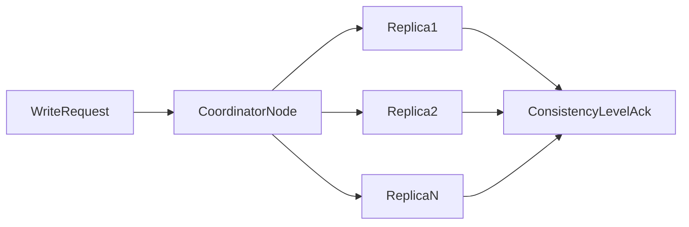
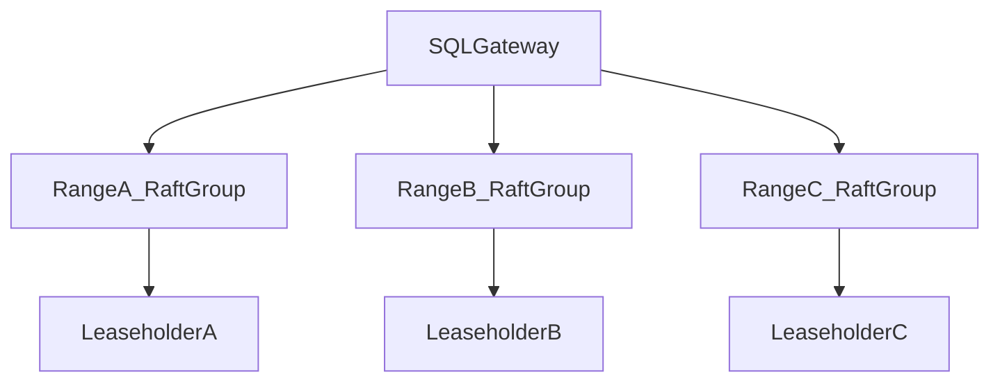

# Cassandra, CockroachDB, Redis, and PACELC Mapping: Deep Decision Analysis

## 1. Purpose

This document compares database families that are frequently confused in interviews and real architecture discussions. The goal is to map each engine to **partition behavior**, **healthy-network latency behavior**, and **operational consequences**.

---

## 2. PACELC Mapping Table (Deep Reading)

| Database | Partition Regime | Else Regime | Typical Practical Reading |
|---|---|---|---|
| Cassandra | A over C (tunable) | L over C (tunable) | Often PA/EL, but CL can shift toward C |
| CockroachDB | C over A | C over L | PC/EC, consistency-first distributed SQL |
| Redis (sentinel + async replicas) | often A-leaning continuity | L-leaning serving | speed layer posture, durability depends on config |
| Spanner | C over A | C over L | external-consistency-first global SQL |
| DynamoDB | tunable | tunable | operation-level consistency profile |

Interpretation note: table labels indicate baseline tendencies, not immutable outcomes. Endpoint-level consistency settings and topology choices can shift practical behavior significantly, so treat PACELC as a reading aid for default posture rather than a fixed guarantee for every operation.

---

## 3. Cassandra Deep Mechanics

### 3.1 Partitioning and Replication

Cassandra distributes data by token ranges and replication factor (`RF`).

Majority threshold for RF:

`majority = floor(RF/2) + 1`

Consistency levels (`ONE`, `QUORUM`, `ALL`, `LOCAL_QUORUM`) control acknowledgment and read intersection behavior. Lower levels return sooner with fewer replicas; higher levels wait for more acknowledgments and improve the chance that reads see recent writes.

#### In-Line Glossary: Tunable Consistency

**What it is:** per-operation control of read/write acknowledgment thresholds.  
**Why here:** it allows one workload to blend low-latency and high-consistency paths.  
**Systemic implication:** consistency policy becomes application architecture, not only database configuration.

### 3.2 Trade-off Reality

A low consistency level improves latency and availability because fewer replicas must respond, but it increases stale-read and lost-write risk under failure. A high consistency level improves freshness confidence by requiring broader acknowledgment, but it increases latency and failure sensitivity because any unavailable replica can block the operation from meeting its quorum.

---

## 4. CockroachDB Deep Mechanics

CockroachDB combines a relational SQL interface with consensus-backed distributed storage. Core features include range-based sharding that splits the keyspace as data grows, Raft replication per range for consensus durability, and a serializable isolation default posture that favors correctness over optimistic concurrency shortcuts.

The trade-off is a stronger global correctness model at the cost of higher coordination latency compared with single-region, single-node assumptions. Best fit is multi-region SQL workloads that need strict invariants and have mature operations for range rebalancing, leaseholder placement, and latency budgeting across regions.

---

## 5. Redis Sentinel Deep Mechanics

Redis Sentinel provides monitoring, failover orchestration, and topology notification for master-replica deployments.

It does not transform Redis into a universal strict transactional system of record by default.

#### In-Line Glossary: Sentinel Quorum

**What it is:** voting threshold among sentinels used to confirm failures and promote failover decisions.  
**Why here:** prevents single-observer false positives from triggering unsafe failover.  
**Systemic implication:** sentinel topology design directly affects failover safety and responsiveness.

Use Redis primarily for session and ephemeral state that can be rebuilt, for caching and low-latency serving adjunct paths in front of a durable store, and for rate limiting and counters where microsecond-class operations matter more than multi-entity ACID semantics.

---

## 6. Decision Playbook for These Engines

1. If strict cross-region invariants dominate, evaluate CockroachDB or Spanner-style consistency-first systems whose default posture favors C over A and C over L.
2. If availability and low latency dominate with appetite for tunable consistency, evaluate Cassandra or Dynamo-style systems where per-operation CL can trade freshness for speed.
3. If ultra-low-latency ephemeral state dominates, use Redis as a speed layer rather than as the default durable system of record.
4. For mixed domains, design polyglot persistence with explicit boundaries and consistency contracts so each engine owns the workloads it can guarantee.

---

## 7. External References

- [Cassandra Consistency](https://cassandra.apache.org/doc/latest/cassandra/dml/dmlConfigConsistency.html)
- [CockroachDB Architecture](https://www.cockroachlabs.com/docs/stable/architecture/overview)
- [Redis Sentinel](https://redis.io/docs/latest/operate/oss_and_stack/management/sentinel/)
