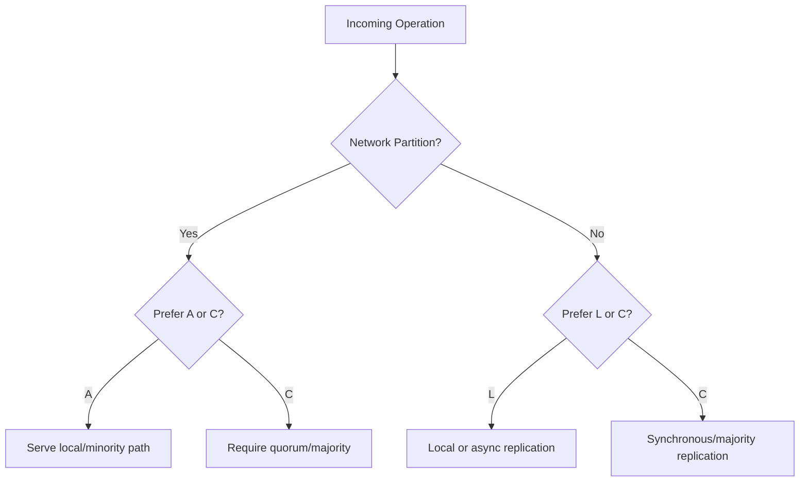
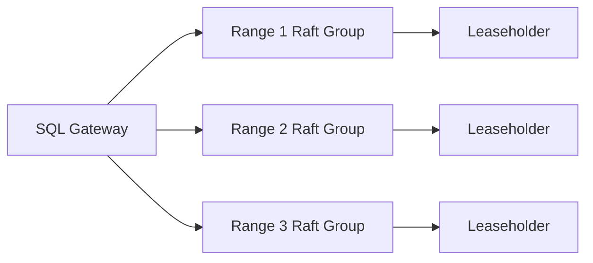

# Cassandra, CockroachDB, Redis, and PACELC Mapping

## 1. Purpose

This document closes remaining gaps for interview-grade database selection: Cassandra quorum tuning, CockroachDB distributed SQL posture, Redis Sentinel behavior, and explicit before/after network-partition trade-offs.

---

## 2. PACELC Decision Table (Healthy Network vs Partition)

| Database | During Partition (P) | Else / Healthy Network (E) | Default Interpretation | Notes |
|---|---|---|---|---|
| Cassandra | Availability-first (tunable) | Latency-first (tunable) | Often **PA/EL** | Consistency level can move it toward C |
| DynamoDB | Tunable | Tunable (`ConsistentRead`) | Commonly near **PA/EL** | Strong reads available per request |
| MongoDB (majority + primary reads) | Consistency-first | Consistency-first | Often **PC/EC** | Secondary reads can shift toward L |
| PostgreSQL (single primary) | Consistency on accepted writes | Consistency on primary | Topology-driven **CA-like / CP-like** | Not natively multi-primary distributed |
| CockroachDB | Consistency-first | Consistency-first | **PC/EC** | Raft ranges, serializable isolation |
| Spanner | Consistency-first | Consistency-first | **PC/EC** | TrueTime + Paxos/consensus lineage |
| Redis (Sentinel/async replicas) | Availability trade-offs depend on config | Latency-first for local reads | Often **PA/EL**-leaning | Not a full ACID SoR by default |

---

## 3. Cassandra: Quorum as Runtime Architecture Control

Cassandra stores data across nodes with partitioning (token rings) and replication factor (`RF`).

Key formula:

`majority = floor(RF / 2) + 1`

Examples with `RF=10`:

- majority = 6
- `CL=ONE`: ack from 1 replica (availability/latency)
- `CL=QUORUM`: ack from 6 replicas (stronger freshness)
- `CL=ALL`: ack from all replicas (highest latency/availability risk)

#### In-Line Glossary: Consistency Level (CL)

**What it is:** Per-operation acknowledgment threshold for reads/writes in Cassandra.  
**Why here:** Enables endpoint-specific PACELC posture without changing cluster topology.  
**Systemic impact:** Critical banking-like keys can use `QUORUM`; social likes/comments can use `ONE`.

Decision impact:

- Social feed / likes: prefer availability + low latency.
- Inventory critical path: prefer quorum reads/writes.
- Never assume Cassandra is only AP; it is tunable.

External visual/reference:

- [Apache Cassandra Documentation](https://cassandra.apache.org/doc/latest/)

---

## 4. CockroachDB: Distributed Relational SQL

CockroachDB targets globally distributed relational workloads with:

- range-based sharding
- Raft consensus per range
- serializable isolation defaults
- SQL interface with distributed execution

PACELC posture:

- During partition: reject minority writes (consistency over availability).
- Else: accepts higher coordination latency for strong consistency.

Best-fit use cases:

- financial systems needing SQL + multi-region resilience
- inventory systems with strict invariants
- multi-region backends requiring distributed ACID semantics

Trade-offs:

- higher write latency than single-node PostgreSQL
- operational model must account for range rebalancing and leaseholder locality

External reference:

- [CockroachDB Architecture Overview](https://www.cockroachlabs.com/docs/stable/architecture/overview)

---

## 5. Redis and Sentinel

Redis is primarily an in-memory key-value engine for ultra-low-latency access.

Sentinel responsibilities:

- monitoring master health
- notifying clients of topology changes
- performing automatic failover elections

#### In-Line Glossary: Redis Sentinel

**What it is:** A distributed monitoring/failover subsystem for Redis master-replica topologies.  
**Why here:** Improves availability of Redis serving paths under master failure.  
**Systemic impact:** Failover can introduce brief write interruption and potential data loss windows depending on replication durability settings.

Decision impact:

- Excellent for sessions, rate limits, cache, feature flags.
- Not a default system-of-record for strict financial ledgers.
- Choose Redis when latency dominates and data can be reconstructed or is ephemeral.

External reference:

- [Redis Sentinel Documentation](https://redis.io/docs/latest/operate/oss_and_stack/management/sentinel/)

---

## 6. How This Changes Selection Decisions

1. Start from required attribute under partition and under healthy network.
2. Map that attribute set to PACELC class.
3. Prefer engines designed for that class (Cassandra for PA/EL, Cockroach/Spanner for PC/EC).
4. Use tunability only when team maturity and operational controls can manage per-endpoint consistency.
5. Keep Redis as a speed layer unless domain semantics explicitly justify stronger durability modes.

---

## 7. Practical Scenario Mapping

| Scenario | Preferred Attribute Mix | Strong Candidates |
|---|---|---|
| Social likes/comments | Availability + low latency | Cassandra, DynamoDB (`eventual`) |
| Bank balance transfer | Consistency | CockroachDB, Spanner, strongly configured relational |
| Global product catalog | Availability + scale | Cassandra / document + search projections |
| Session and rate-limit path | Latency | Redis |
| Multi-region inventory with SQL | Consistency + SQL model | CockroachDB |
