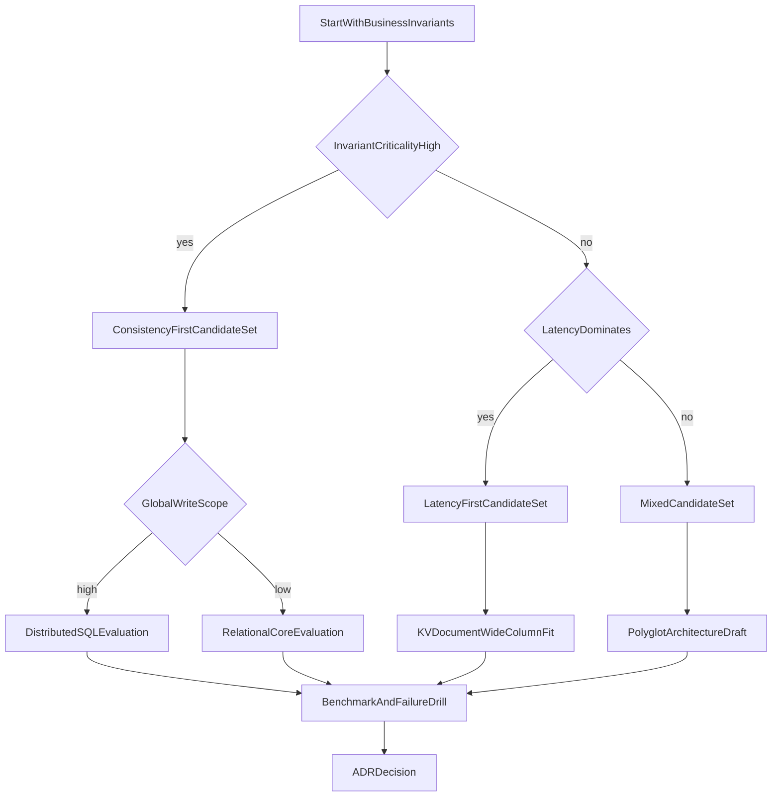
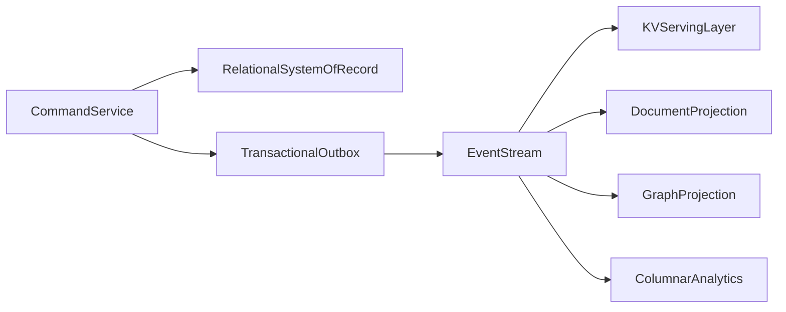

# Database Selection Playbook: Quantitative, Failure-Aware, Architecture-Grade

## 1. Purpose

This playbook defines a repeatable decision process for selecting databases based on workload, invariants, latency budgets, consistency contracts, and operational capacity.

Selection must be auditable, testable, and revisitable. Preference-based decisions are not acceptable for senior architecture.

---

## 2. Required Inputs Before Decision

Do not choose a database before collecting these inputs. Each input constrains which engines remain viable and which trade-offs are acceptable.

1. Measure the read/write ratio per critical endpoint so you know whether the workload is read-dominated, write-dominated, or mixed, and can reject engines whose storage model or replication path cannot sustain that mix.
2. Capture the concurrency envelope and burst profile, including steady-state QPS and peak multipliers, because engines that look fine at average load often fail under contention spikes and connection storms.
3. Define p95 and p99 latency targets by operation class (point read, range query, commit, admin path) so tail behavior—not average latency—becomes a hard filter in evaluation.
4. State the consistency requirement for each business invariant, separating must-be-linearizable commitments from domains that can tolerate bounded staleness.
5. Project data growth and retention policy over the planning horizon so storage engine choice, indexing strategy, and archival design remain feasible as volume compounds.
6. Set failure tolerance objectives (RTO, RPO, and stale-read tolerance) before shortlisting, because recovery and consistency under partition are not retrofit features.
7. Assess team operational maturity and on-call capacity honestly; an engine that exceeds the team's ability to run, debug, and fail over safely is an architectural liability regardless of feature fit.

Missing these inputs means decision quality is structurally compromised.

---

## 3. Multi-Gate Decision Workflow

### Gate Definitions

- **Gate 1:** if invariant breach is catastrophic, consistency-first candidates are mandatory.
- **Gate 2:** if user-experience depends on ultra-low latency and bounded inconsistency is acceptable, latency-first candidates are prioritized.
- **Gate 3:** if write ownership spans regions and strict ordering is needed, distributed consensus-backed systems must be evaluated.

---

## 4. Scoring Model with Hard Constraints

Use weighted scoring only after passing hard constraints.

### 4.1 Hard Constraints

A candidate is rejected immediately if it fails any of the following gates, because weighted scores cannot compensate for correctness or compliance failure.

- The engine cannot meet invariant correctness requirements under the declared consistency model, including multi-row or multi-entity constraints that the business treats as non-negotiable.
- The engine cannot meet the p99 latency budget under realistic mixed load, including contention, cache misses, and failover-adjacent traffic shapes.
- The engine cannot satisfy compliance and auditability requirements for the data classes involved, such as encryption, retention, access logging, or jurisdictional residency.

### 4.2 Weighted Score

| Criterion | Weight | Evaluation Focus |
|---|---:|---|
| Correctness fit | 25% | invariant enforcement viability |
| p99 latency fit | 20% | tail behavior under mixed traffic |
| Write scalability | 15% | contention and partition scaling |
| Query flexibility | 10% | future access-pattern adaptability |
| Operational complexity | 15% | team ability to run it safely |
| Cost efficiency | 10% | infra + engineering operations cost |
| Reversibility | 5% | migration and lock-in risk |

Formula:

`total_score = sum(score_i * weight_i)`

Use score only among candidates that passed hard constraints. Correctness and tail latency dominate the weights because they most directly determine whether the system remains trustworthy under production load; operational complexity and reversibility exist to prevent selecting an engine the organization cannot sustain or exit.

---

## 5. Workload-to-Model Mapping

### 5.1 OLTP Dominant

OLTP-dominant systems enforce strict local invariants with short transactional writes and predictable point or range reads. The product value depends on ACID-style commit semantics for a bounded set of entities, not on analytical scan throughput or multi-hop graph traversal.

Prefer relational cores such as PostgreSQL or MySQL when write ownership is regional and consistency can be satisfied within a primary-replica or consensus-local topology. Prefer distributed SQL when geography or multi-region write scope demands strongly consistent commits across sites. The implication is that OLTP selection is driven by invariant and geography first, not by fashion around document or KV alternatives.

### 5.2 OLAP Dominant

OLAP-dominant workloads are scan-heavy analytical queries over large historical windows, with aggregation and dimensional filtering as the primary access pattern. Transactional write latency is secondary to throughput and cost per scanned byte.

Columnar warehouse or lakehouse platforms fit because they optimize sequential scan, compression, and vectorized aggregation rather than row-level mutability. The implication is that forcing OLAP onto an OLTP engine usually produces both cost blowups and latency violations once historical windows grow.

### 5.3 Low-Latency Key Serving

Key-serving workloads are dominated by key lookups where strict ad-hoc query flexibility is not required. Latency budgets are typically aggressive, and the access path is intentionally narrow.

Key-value systems, often paired with cache layers, fit because they minimize coordination and execution overhead for fixed lookup patterns. The implication is that you trade query expressiveness for predictable tail latency; if product requirements later demand rich filtering or joins, you will need projections or a polyglot path rather than stretching the KV store.

### 5.4 Path-Centric Relationship Queries

Path-centric workloads derive product value from multi-hop relationship traversal—recommendations, fraud graphs, dependency walks—where join depth or recursive SQL becomes the bottleneck.

A graph database, backed by a system of record and optional analytics projections, fits when traversal is the primary read model. The implication is that graph engines should rarely be the sole source of truth for irreversible business commitments; they excel as relationship-serving projections with clear consistency contracts back to the SoR.

---

## 6. Consistency Policy by Endpoint Class

Do not apply one consistency setting globally. Endpoint classes encode how costly inconsistency is to the business, which in turn dictates latency budgets and acceptable stale-read windows.

Class A covers critical operations such as balances, reservations, and irreversible commitments: these endpoints require strong consistency (or carefully proven equivalent) because stale or divergent state produces financial or legal damage. Class B covers material operations such as inventory visibility and pricing updates: bounded staleness may be acceptable if users and downstream systems can tolerate briefly outdated views and compensating actions exist. Class C covers cosmetic signals such as feed counts, likes, and non-critical counters: eventual consistency is usually enough because temporary inaccuracy does not break core invariants.

Map each class to an explicit consistency model and latency budget, then verify that the selected engine and replication topology can enforce that mapping under failure, not only in healthy steady state.

---

## 7. Failure-First Validation Protocol

Each shortlisted candidate must pass failure drills that prove correctness and recovery under adversarial conditions, not only healthy throughput benchmarks.

1. Run partition simulation between nodes or regions to observe whether the system preserves the declared consistency contract, sheds conflicting writes, or risks split-brain divergence.
2. Force leader failover during sustained write load to measure RTO, lost or duplicated writes, and client-visible error behavior while ownership transfers.
3. Stress replica lag and explicitly check stale-read exposure against Class A/B/C policies so that replication delay cannot silently violate endpoint contracts.
4. Induce a retry storm and validate idempotency keys, deduplication, and exactly-once or at-least-once application semantics so client retries do not corrupt state.
5. Execute a restore drill from backup through point-in-time recovery to prove RPO/RTO numbers with wall-clock evidence rather than vendor claims.

A candidate that performs well only in healthy benchmarks is not production-ready.

---

## 8. Polyglot Persistence Blueprint

This pattern isolates concern-specific workloads while preserving explicit integration contracts. The relational system of record owns irreversible commands; the transactional outbox and event stream propagate durable change to specialized serving and analytics projections. Each projection can optimize for its access pattern without becoming an unauthorized second source of truth.

---

## 9. ADR Output Requirements

Final decision must include a governed Architecture Decision Record that another senior engineer can audit without reconstructing tribal knowledge.

Document accepted and rejected candidates with the rationale for each rejection, including hard-constraint failures. Record scored criteria and hard-constraint results so the weighted model is reproducible. Attach failure-drill evidence—partition, failover, lag, retry, and restore outcomes—rather than marketing claims. Name operational ownership and confirm runbook readiness for on-call. Define the migration or rollback strategy, including data movement risk and cutover abort criteria.

This turns database selection into a governed architecture artifact.

---

## 10. External References

- [PACELC Discussion by Daniel Abadi](https://dbmsmusings.blogspot.com/2010/04/problems-with-cap-and-yahoos-little.html)
- [Jepsen Analyses](https://jepsen.io/analyses)
