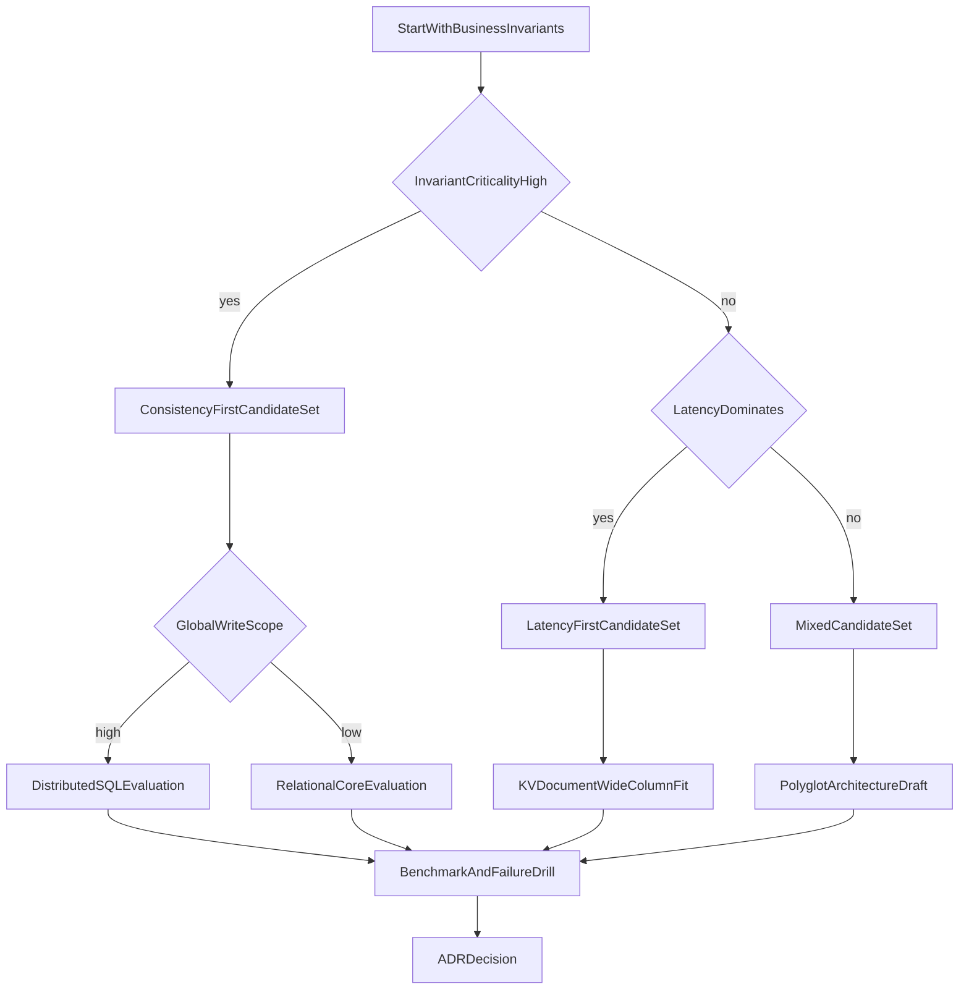
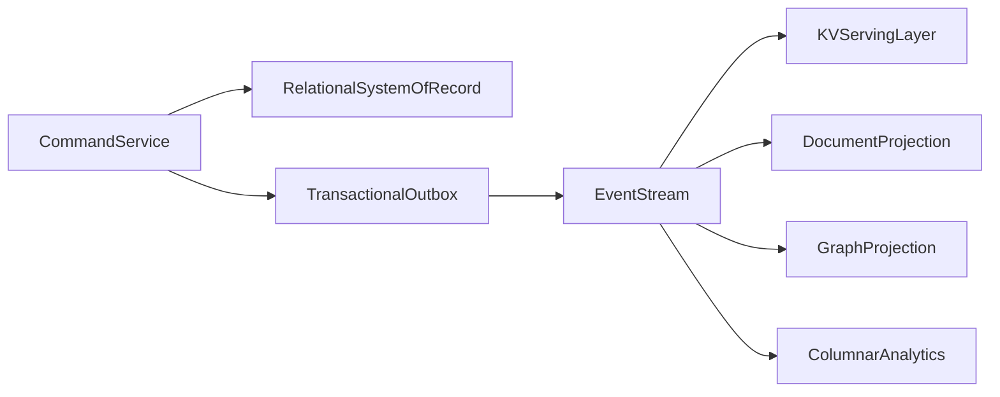

# Database Selection Playbook: Quantitative, Failure-Aware, Architecture-Grade

## 1. Purpose

This playbook defines a repeatable decision process for selecting databases based on workload, invariants, latency budgets, consistency contracts, and operational capacity.

Selection must be auditable, testable, and revisitable. Preference-based decisions are not acceptable for senior architecture.

---

## 2. Required Inputs Before Decision

Do not choose a database before collecting these inputs:

1. read/write ratio per critical endpoint
2. concurrency envelope and burst profile
3. p95/p99 latency targets by operation class
4. consistency requirement by business invariant
5. data growth projection and retention policy
6. failure tolerance objectives (RTO/RPO, stale-read tolerance)
7. team operational maturity and on-call capacity

Missing these inputs means decision quality is structurally compromised.

---

## 3. Multi-Gate Decision Workflow

### Gate Definitions

- **Gate 1:** if invariant breach is catastrophic, consistency-first candidates are mandatory.
- **Gate 2:** if user-experience depends on ultra-low latency and bounded inconsistency is acceptable, latency-first candidates are prioritized.
- **Gate 3:** if write ownership spans regions and strict ordering is needed, distributed consensus-backed systems must be evaluated.

---

## 4. Scoring Model with Hard Constraints

Use weighted scoring only after passing hard constraints.

### 4.1 Hard Constraints

A candidate is rejected immediately if it fails any:

- cannot meet invariant correctness requirements
- cannot meet p99 budget under realistic load
- cannot satisfy compliance/auditability requirements

### 4.2 Weighted Score

| Criterion | Weight | Evaluation Focus |
|---|---:|---|
| Correctness fit | 25% | invariant enforcement viability |
| p99 latency fit | 20% | tail behavior under mixed traffic |
| Write scalability | 15% | contention and partition scaling |
| Query flexibility | 10% | future access-pattern adaptability |
| Operational complexity | 15% | team ability to run it safely |
| Cost efficiency | 10% | infra + engineering operations cost |
| Reversibility | 5% | migration and lock-in risk |

Formula:

`total_score = sum(score_i * weight_i)`

Use score only among candidates that passed hard constraints.

---

## 5. Workload-to-Model Mapping

### 5.1 OLTP Dominant

- strict local invariants
- short transactional writes
- predictable point/range reads

Candidates:

- PostgreSQL / MySQL / distributed SQL depending on geography and consistency requirements

### 5.2 OLAP Dominant

- scan-heavy analytical queries
- aggregation and historical windows

Candidates:

- columnar warehouse/lakehouse

### 5.3 Low-Latency Key Serving

- key lookups dominate
- strict query flexibility not required

Candidates:

- key-value systems, frequently with cache patterns

### 5.4 Path-Centric Relationship Queries

- multi-hop traversal dominates product value

Candidates:

- graph database with supporting SoR and analytics systems

---

## 6. Consistency Policy by Endpoint Class

Do not apply one consistency setting globally.

Example policy classes:

- **Class A (critical):** balances, reservations, irreversible commitments
- **Class B (material):** inventory visibility, pricing updates
- **Class C (cosmetic):** feed counts, likes, non-critical counters

Map each class to explicit consistency and latency budget.

---

## 7. Failure-First Validation Protocol

Each shortlisted candidate must pass:

1. partition simulation
2. leader failover during write load
3. replica lag stress and stale-read checks
4. retry storm with idempotency validation
5. restore drill for backup recovery

A candidate that performs well only in healthy benchmarks is not production-ready.

---

## 8. Polyglot Persistence Blueprint

This pattern isolates concern-specific workloads while preserving explicit integration contracts.

---

## 9. ADR Output Requirements

Final decision must include:

- accepted and rejected candidates
- scored criteria and hard-constraint results
- failure drill evidence
- operational ownership and runbook readiness
- migration or rollback strategy

This turns database selection into a governed architecture artifact.

---

## 10. External References

- [PACELC Discussion by Daniel Abadi](https://dbmsmusings.blogspot.com/2010/04/problems-with-cap-and-yahoos-little.html)
- [Jepsen Analyses](https://jepsen.io/analyses)
